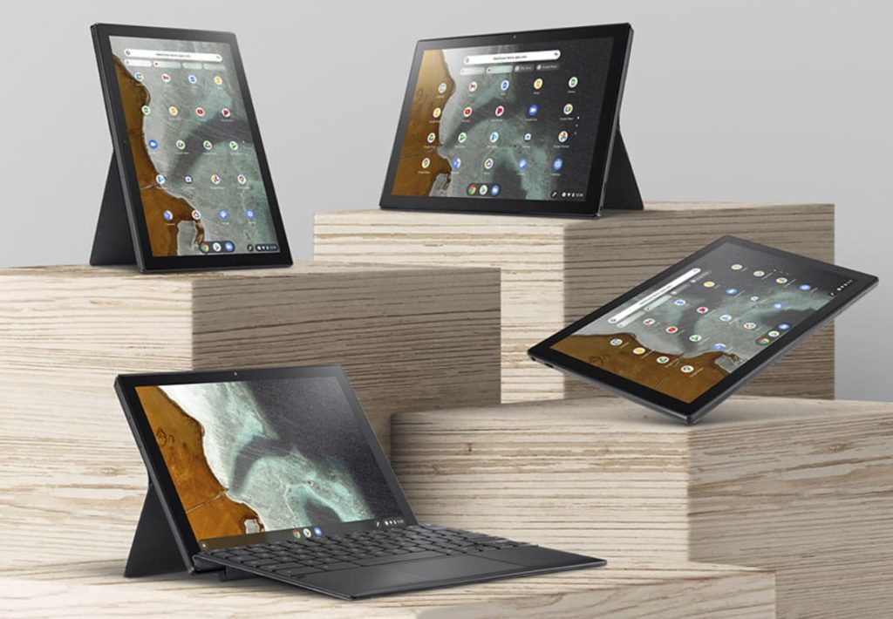

Chrome Unboxed received an anonymous tip that [Costco will be selling the Asus Chromebook Flip CM3](https://chromeunboxed.com/the-asus-chromebook-cm3-tablet-is-headed-to-costco-for-369/) in the US. The reported price is $369 for the expected base model, which has very similar hardware to the [Lenovo Duet Chromebook](https://www.aboutchromebooks.com/news/lenovo-ideapad-duet-chromebook-review-2020/ "Lenovo Duet Chromebook reviewed: Great for a secondary device, limited as a primary one"). Assuming the source and information are accurate, that price seems a bit high by comparison.

To be sure there are a few differences in the two products, which generally use the same internal hardware.

Lenovo Chromebook Duet and Asus Chromebook Flip CM3

The Lenovo model has a 10.1-inch display while the Asus offering bumps that slightly to 10.5-inches. You have to add your own USI stylus if you want to use one with the Lenovo Duet Chromebook. The Asus Chromebook Flip CM3 includes one that can be charged and stored in the device.

And while both have detachable keyboards and stands, only the Asus stand can be used in both landscape and portrait mode. The vertical stand support is a bonus. So too is the fact that the Asus keyboard magnetically attaches to the bottom screen bezel. That will add more stability on a lap.

Here's the thing though, again with the assumption that the pricing information for the CM3 is accurate: The Lenovo Duet Chromebook is on sale nearly three out of four weeks of every month. And it starts at a lower $279 price as well. That's a $90 difference.

When you can find a sale, which is quite often, you can get the higher end Lenovo model with 128 GB of storage for as low as $249. The pricing difference just got bigger.

What's even more worrisome to me is that [PC Canada is showing the Asus Chromebook Flip CM3 for sale at CAD $402](https://www.pc-canada.com/item/CM3200FVA-DS42T.html), although it's backordered. It's not the backordering that concerns me. It's the fact that the retailer is showing a base model with 32 GB of storage, not 64 GB or the option to upgrade to a 128 GB storage configuration. If there's a $369 base model of the CM3 with a scant 32 GB of storage capacity, that's a really tough sell. Remember, there's no microSD card slot for storage expansion.

I realize that until final official pricing is announced, this is all conjecture on my part. We'll have to wait and see what Asus decides of course. My hope is that the reported $369 Costco model is actually the top-end version.

But that still raises the question: Given the Lenovo Duet Chromebook typical sale pricing, what would you pay for a comparably equipped Asus Chromebook Flip CM3. Remember there are a few minor additions to the Asus over the Lenovo, so a premium cost would be warranted.
