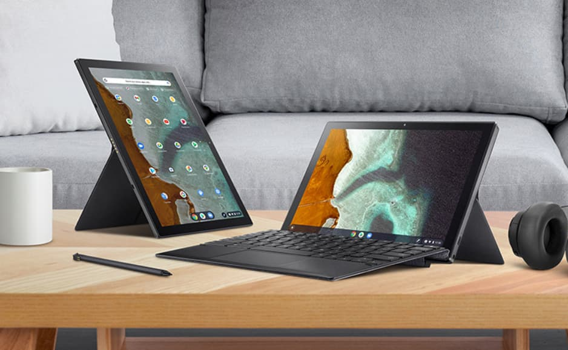

Earlier this month, some online retailers gave a preview of [a new Microsoft Surface-like Asus Chromebook](https://www.aboutchromebooks.com/news/asus-chromebook-flip-cm3000-tablet-vs-lenovo-duet-chromebook/ "Asus Chromebook Flip CM3000 tablet to take on the similar Lenovo Duet Chromebook") before Asus announced the device. With its own product page now, [the Asus Chromebook Flip CM3 tablet is official](https://www.asus.com/Commercial-Laptops/ASUS-Chromebook-Detachable-CM3-CM3000DVA/ "https://www.asus.com/Commercial-Laptops/ASUS-Chromebook-Detachable-CM3-CM3000DVA/") although Asus is still mum on pricing and availability.

[Chrome Unboxed eye-spied the new product page](https://chromeunboxed.com/asus-chromebook-detachable-cm3-official-landing-page "https://chromeunboxed.com/asus-chromebook-detachable-cm3-official-landing-page"), which confirms the leaked specifications. Asus is also showing off the versatility of that dual-folding kickstand cover, which actually one-ups Microsoft Surface devices. They can only use the kickstand in landscape mode.

In addition to the dual-orientation support, the Asus keyboard attaches to the bottom bezel of of the bezel. That helps with the typing experience. However, the keyboard stand isn't as versatile as Microsoft's when it comes to the display angle. You can see in the top picture it's a little more limited.

Here are the official specs, many of which are very similar to the [Lenovo Duet Chromebook](https://www.aboutchromebooks.com/news/my-pick-for-2020-chromebook-of-the-year/ "My pick for 2020 Chromebook of the year"):

<table><tbody><tr><td>CPU</td><td>

MediaTek 8183 Processor 2.0 GHz(1M Cache, up to 2.0 GHz, 8 cores)

&nbsp;
</td></tr><tr><td>GPU</td><td>

Arm Mali-G72 MP3

</td></tr><tr><td>Display</td><td>
10.5-inch, LCD, WUXGA (1920 x 1200) 16:10, Wide view,

Glossy touch display, LED Backlit, 320nits, sRGB: 118%
</td></tr><tr><td>Memory</td><td>4GB LPDDR4/4X on board, Memory Max Up to 4GB</td></tr><tr><td>Storage</td><td>64/128 eMMC</td></tr><tr><td>Connectivity</td><td>TBD</td></tr><tr><td>Input</td><td>Attachable keyboard, multitouch trackpad, dual microphones, 2MP / 8MP webcam</td></tr><tr><td>Ports</td><td>1 USB Type-C (2.0), built in microphone &amp; stereo speakers</td></tr><tr><td>Battery</td><td>27 WHr, claimed run-time of 12 hours</td></tr><tr><td>Weight</td><td>1.12 pounds</td></tr><tr><td>Software</td><td>Chrome OS automatic update expiration date: TBD but likely June 2028 or June 2029</td></tr></tbody></table>

A few hardware bits jump out at me here.

There's no mention of a microSD card slot so keep that in mind if you choose to buy this Chrome OS tablet. The 64 or 128 GB of eMMC storage you get is all you get.

The single USB-C port is used for charging the battery but it's an older generation of USB 2.0, so data transfers and external display features may be limited.

There won't be an option with more than 4 GB of RAM, at least at this point. I don't think that's a deal breaker for this type of device, however, it's worth noting. Also worth a mention: There are only two speakers; they're on the top of the device when in landscape mode.

That's fine except if you use portrait mode for video chats. In that case, all audio will be coming from a single side of the tablet.

On the plus side, that garaged USI stylus recharges inside the Asus Chromebook Flip CM3. Asus says 15 seconds will get you 45 minutes of usage. That's handy!

Now all we need to see is the price and availability information. I'm going to take a stab at the entry level model costing around $299 to $329. And I'd expect the upgraded model with double the storage and faster RAM to add a $50 premium.

What do you think the Chromebook Flip CM3 will or should cost with these configurations?
