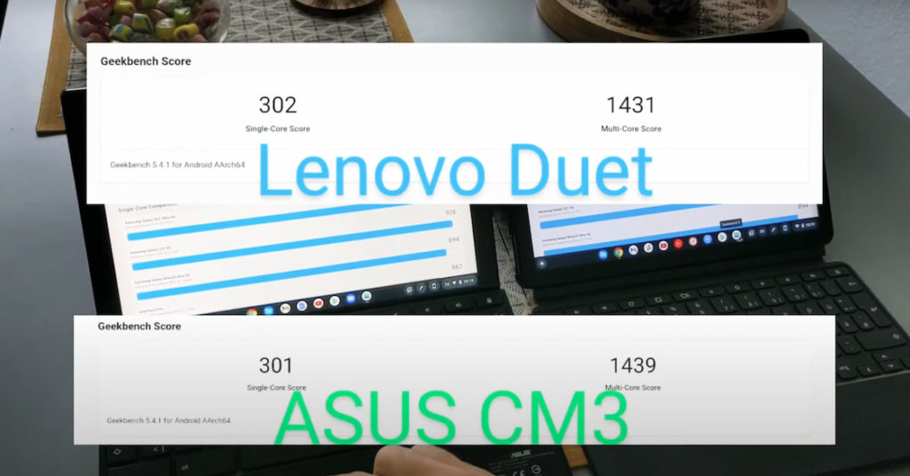
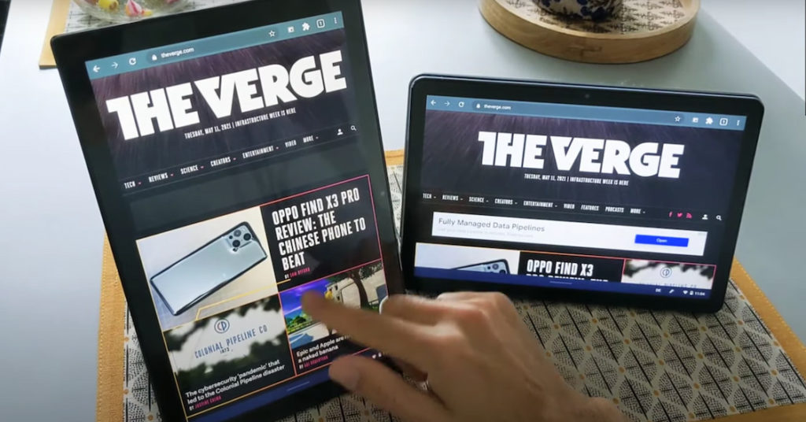

Last week, I shared an [Asus Chromebook Flip CM3 vs Lenovo Duet Chromebook video](https://www.aboutchromebooks.com/news/asus-chromebook-cm3-vs-lenovo-chromebook-duet-video/) first look from someone who has both devices. Over the weekend, he shared [another, more detailed video comparison](https://www.youtube.com/watch?v=z4EVLoR_ek0) between the two Chrome OS tablets.

This new video is rather lengthy but worth the watch if you're considering these two devices.

From what I can see, there are actually very few differences.

https://youtu.be/z4EVLoR\_ek0

## Performance is identical

For starters, the overall performance of both the CM3 and Duet Chromebooks was identical during benchmark testing.

This doesn't surprise me at all since the Helio P60T chipset in the Duet is essentially the same as MediaTek's MT8183. If you were holding out for the CM3 to get better performance than the Duet provides, there's no reason to do so.

That doesn't mean there aren't benefits to the Asus Chromebook Flip CM3, by comparison. It only means that if the few differences between it and the Lenovo Duet Chromebook are "must have's" for you, then perhaps the CM3 is the better, if more expensive, choice.

## Key differences are more about design choices

For example, the CM3 has a garaged stylus that recharges inside the tablet chassis. It also has a slightly larger 10.5-inch display. That doesn't sound like much of a size jump, but you can see how that extra screen space adds just a smidge more information to the display.

Look for it in various parts of the video to see what I mean. When both tablets are viewing the same content, you'll see more on the larger tablet.

I didn't realize it until after watching the video but the CM3 can charge quicker than the Duet Chromebook with the included power brick.

Asus is including a 45W USB-C charger with the CM3 tablet, while Lenovo only provides a 10W charger. Granted, you could use a third-party charger with the Duet to speed up the process. But with the Asus Chromebook Flip CM3, you can use what's included.

Speaking of charging, both devices run for about the same length of time on a single charge. That's because the difference in the battery capacity for both is nearly identical. The 7000 mAh battery in the Duet is only slightly less than the 7040 mAh power pack in the CM3.

## Which should you get?

Even though I haven't used the Asus Chromebook Flip CM3, I have a good idea of what to expect from it after watching this video. And internally, it's nearly identical to the Lenovo Duet Chromebook, which I have used. I named that device my choice for 2020 Chromebook of the Year, given the value it represents for the price.

So if you're comparing between the two devices, it really comes down to the "extra" features on the CM3 and if they're worth the extra price. I'm still assuming the expected priced of $369 applies to the CM3, as compared to the sub-$300 pricetag of the Lenovo Chromebook Duet.

I personally would go with the CM3 when it's available, based on what we know. You're getting a slightly larger display but not much more weight or bulk. In fact, when weighing both tablets with just their kickstand covers (i.e.: no attached keyboard), the larger CM3 weighs a little less than the smaller Duet.

You're also getting a pen that can be stored inside the device, additional speakers, and what I think is a much better keyboard experience.

That's not just because the keys are spaced out a little more but also because the keyboard attaches to the tablet in two ways: Once with POGO pins like the Duet and again with magnets in the bottom bezel of the display. And yes, the dual-hinged kickstand of the CM3 is another feature I like.

If I add up those design differences, they're worth the premium to me personally. You may not care about some or all of them, however.

In that case, why wait for the Asus Chromebook Flip CM3 to become available? Just grab a Lenovo Duet Chromebook and go.
