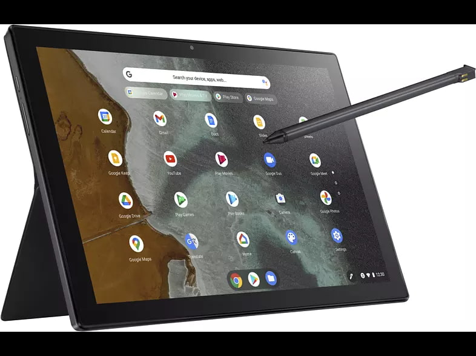
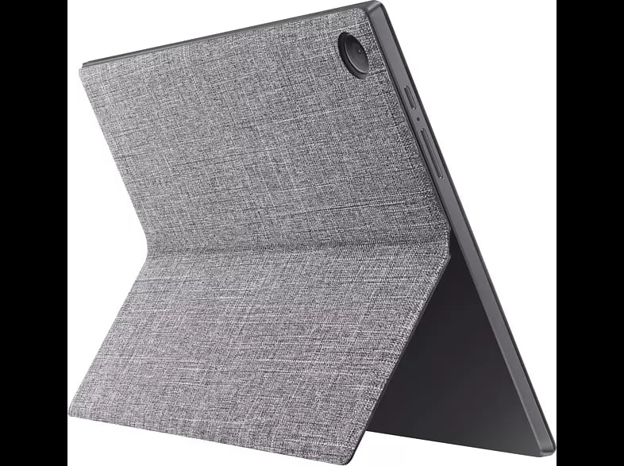
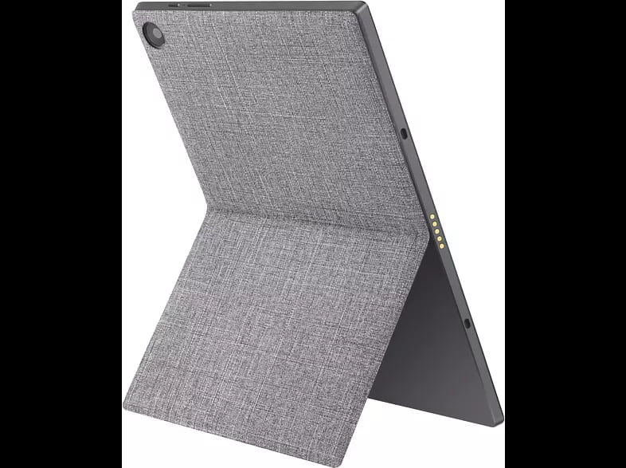
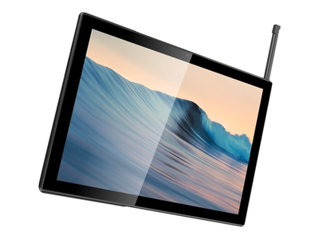

If you want a new Chrome OS tablet these days, you can choose any that you like as long as you choose the Lenovo Duet Chromebook. There simply aren't any options in this market; heck even [the Google Pixel Slate from 2018 is officially unavailable at this point](https://9to5google.com/2021/01/29/pixel-slate-out-of-stock-2/). Hold out a little while though and you might pull the trigger on a Lenovo Duet Chromebook lookalike in the Asus Chromebook Flip CM3000.

This new tablet has appeared before any official Asus announcement at a number of online retailers and [spotted by Chrome Unboxed](https://chromeunboxed.com/asus-chromebook-flip-cm3000-tablet-detachable-mediatek).

There are quite a few similarities between the upcoming Asus Chromebook Flip CM3000 and the Duet.

Both have a 1920 x 1200 touchscreen display, a MediaTek processor, 4 GB of memory, a single USB Type-C port, detachable keyboard, and kickstand. In fact, the kickstand accessory for the Flip appears to have the same fabric and color as the Duet.

The MediaTek MT8183 is basically the same chip inside the Lenovo Duet Chromebook, although it's branded with a different name. Both have 2 GHz clock speeds with a combination of four Cortex A-73 and four Cortex A-53 cores.

However, there are some _subtle_ differences, according to the specs shown by retailers.

The display of the Asus Chromebook Flip CM3000 is slightly larger and also dimmer than the one on the Lenovo Duet Chromebook.

That screen is 10.1-inches long and you'll get an extra 0.4-inches of screen space with the Asus. Although larger, it tops out at 320 nits of brightness as opposed to the 400 nit panel on the Duet.

And that detachable keyboard on the Flip? It appears to magnetically attach to both the bottom edge of the tablet and to the bottom screen bezel, similar to a Microsoft Surface keyboard.

That's much better for overall stability although it can still be wonky on a lap.

Oh and that fabric kickstand attachment appears to work both in landscape and in portrait mode based on retailer images. Clever, if true!

A USI stylus is also included with the tablet and it appears you can store the pen right in the device itself:

Other than those unique aspects, the rest of the specs are about what you'd expect for a Chrome OS tablet running on this MediaTek silicon: 128 GB of eMMC storage, a 2MP front camera, 8MP rear camera, WiFi 5, Bluetooth 4.2, and a two-cell 27WHr battery.

Note that there's no mention of a microSD card slot (just like the Lenovo Duet Chromebook) and that the single Type-C port uses USB 2.0, which is a bit of a bummer.

So when might this tablet contender appear and for how much?

Many of the online retailers show early February for estimated availability with pricing ranging from 361 to 449 Euros. I'm expecting U.S. pricing to be around $350 but that's just a guess. If that availability date is true, we might be hearing something official from Asus any day now.
