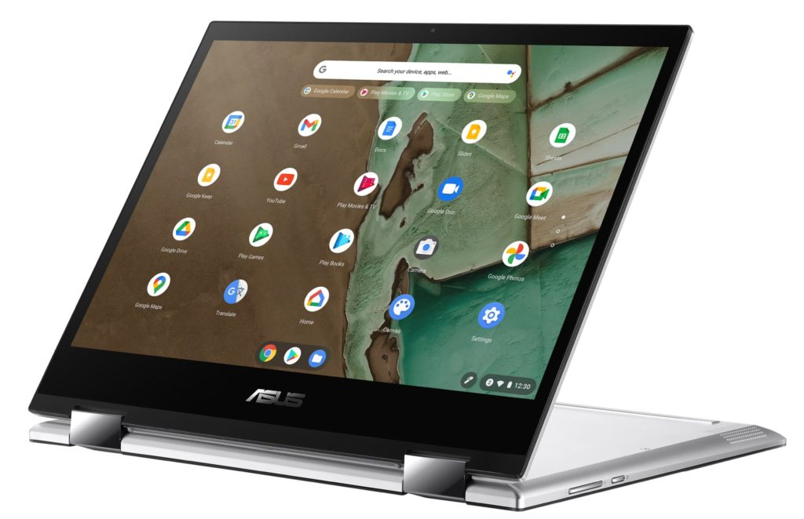
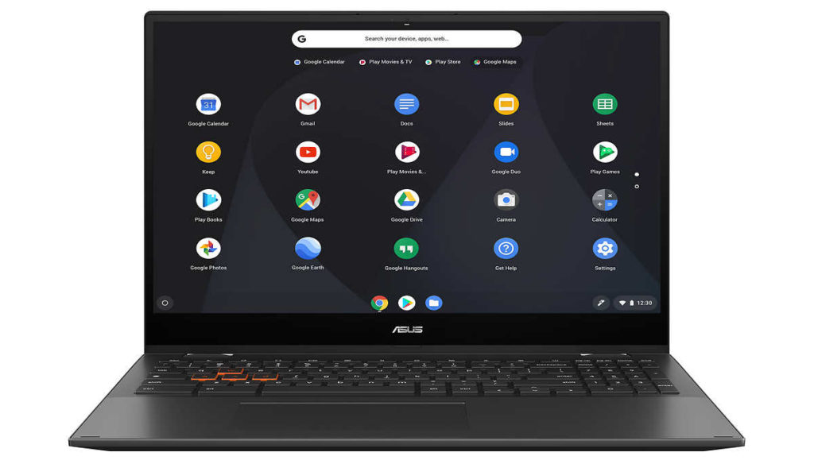
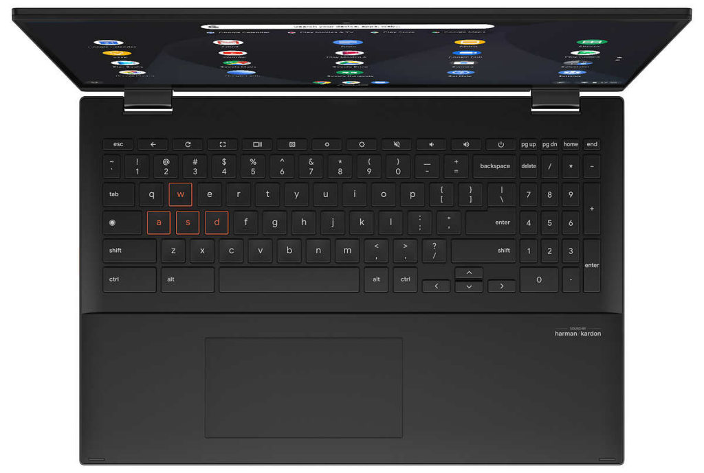

Some of you have been waiting to buy the latest Asus Chromebook Flip models and if you're a Costco member, you can choose between two of them. Today on the retailer's website, I found both the [Asus Chromebook Flip CM3200](https://www.costco.com/asus-12%22-touchscreen-cm3200-chromebook---mediatek-8183.product.100753158.html) and [CM 5500 devices](https://www.costco.com/asus-15.6%22-touchscreen-cm5500-chromebook---amd-ryzen-5-3500u---1080p.product.100753210.html) available to order, with pricing at $369.99 and $599.99, respectively.

First, don't confuse [the lower-priced CM3](https://www.aboutchromebooks.com/news/asus-chromebook-flip-cm3-convertible-specs-show-few-surprises/) with the CM3200. This model is a convertible version of the newest [Asus detachable Chromebook that I recently featured earlier this week](https://www.aboutchromebooks.com/news/asus-chromebook-flip-cm3-vs-lenovo-duet-chromebook-round-2-video/).

The Asus Chromebook Flip CM3200 has a larger 12-inch touchscreen compared to the smaller detachable device and has a 3:2 aspect ration. It uses the same MediaTek MT8183 processor as its little sibling but loses out when it comes to display resolution. You're looking at a 1366 x 912 panel with 220 nits of brightness here.

Here are the rest of the hardware specifications, which are quite similar to the Asus Chromebook Flip CM3:

<table><tbody><tr><td>CPU</td><td>MediaTek 8183 Processor 2.0 GHz(1M Cache, up to 2.0 GHz, 8 cores) &nbsp;</td></tr><tr><td>GPU</td><td>Arm Mali-G72 MP3</td></tr><tr><td>Display</td><td>12-inch, LCD, 1366 x 912 resolution, 3:2 aspect ratio, glossy display, 220nits, NTSC: 50%</td></tr><tr><td>Memory</td><td>4GB LPDDR4X on-board</td></tr><tr><td>Storage</td><td>64 eMMC plus microSD card expansion</td></tr><tr><td>Connectivity</td><td>WiFi 5, Bluetooth 4.2</td></tr><tr><td>Input</td><td>Keyboard and trackpad, 720p webcam</td></tr><tr><td>Ports</td><td>1 USB Type-C (2.0), 1 USB Type-A (2.0) built in microphone &amp; stereo speakers</td></tr><tr><td>Battery</td><td>32 WHr, claimed run-time of 16 hours</td></tr><tr><td>Weight</td><td>2.51 pounds</td></tr><tr><td>Software</td><td>Chrome OS automatic update expiration date: TBD but likely June 2028 or June 2029</td></tr></tbody></table>

The more expensive Asus Chromebook Flip CM5500 is the Ryzen-powered version of the company's new 15.6-inch Chromebook. You're paying $30 more for this over the 11th-generation Intel Core i3 configuration but without testing this Ryzen chip, I can't yet say if it's worth it.

In terms of ports, you get a nice assortment: 2 Type-C USB 3.2, 1 Type-A USB 3.2, an HDMI port, microSD card slot, and mic/headphone jack. There’s also a 720p webcam, support for WiFi 6, Bluetooth 5.0, and a USI stylus. The 3-cell 57 WHr battery is rated for up to 10 hours of run-time, at least on paper.

I'm not in the market for a large-screened Chromebook, but right now, either the Intel or the Ryzen version of this Chromebook would be my first look.

