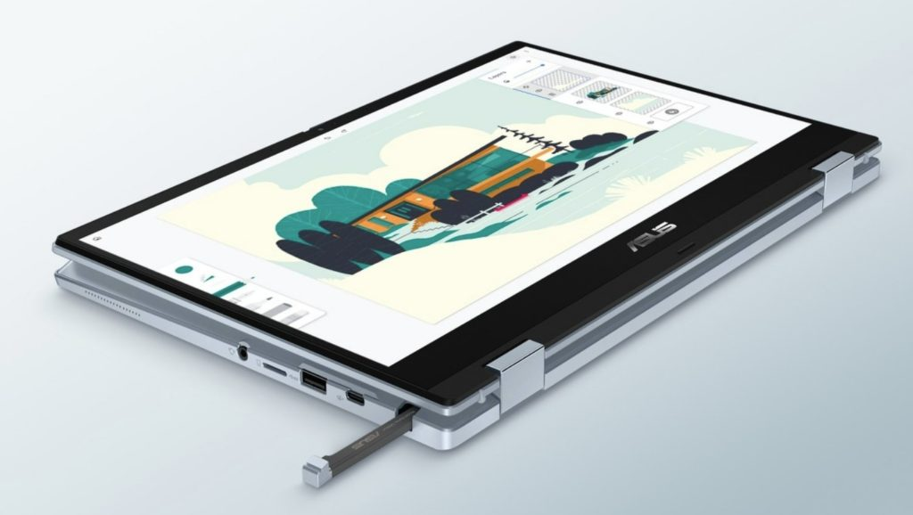

Quietly introduced this week, the Asus Chromebook Flip CX3400 is a [new convertible laptop looking to balance high CPU power with low fan noise](https://www.asus.com/Laptops/For-Home/Chromebook/ASUS-Chromebook-Flip-CX3-CX3400-11th-Gen-Intel/). That's because there is no fan inside this 2-in-1 Chromebook. The 14-inch laptop shares many qualities of the [higher-end, and high-priced, CX5400](https://www.aboutchromebooks.com/news/asus-chromebook-flip-cx5400-is-a-new-fanless-core-i7-convertible-for-1049-99/) from Asus but appears to lesson some hardware specifications. No pricing information is available but it should cost a little less than the CX5400 product line.

Let's start with a marketing video to get a good look at the device. If I didn't know any better, I'd say the Asus Chromebook Flip CX3400 looked very much like the currently available CX5400:

https://youtu.be/WzWAfdTYvv4

Indeed, the Asus Chromebook Flip CX3400 has a 14-inch, 1080p touch display and the same fanless 11th-generation Intel Core processor choices, as the currently available CX5400. There are a few small but important differences between them though.

The CX5400 has a single USB Type-A port, while the newer CX3400 has two of them but loses Thunderbolt support. The latter also starts with 4 GB of memory as opposed to 8 GB, although both can be configured with up to 16 GB.

And the 14-inch, 16:9 aspect ratio display may look the same on both devices but the CX3400 drops the brightness down to 250 nits. The CX5400 can output an additional 50 nits of brightness. Another less important difference is a world-facing camera on the new model. I don't find the value in that, but maybe you do.

Outside of that, both models include a garaged stylus, 720p webcam with privacy shutter, backlit keyboards, speedy NVMe SSD storage, microSD card slots, ruggedized features, and WiFi 6 / Bluetooth 5.2 for connectivity. The newer Asus Chromebook Flip CX3400 gets a slightly larger battery (50Whr vs 48 Whr) but I doubt it will run significantly longer on a charge.

Again, there's no price for the Asus Chromebook Flip CX3400 but with a few slightly inferior hardware bits, I'd hope it costs at least $150 to $200 less than the CX5400. Is there any interest in this Chromebook from folks who wanted the CX5400 but felt it was a bit out of budget range?
