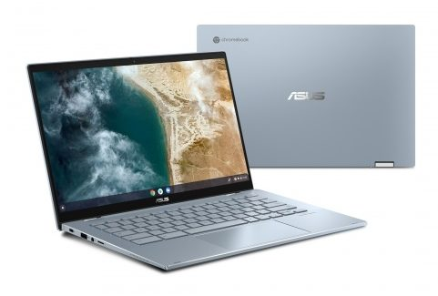
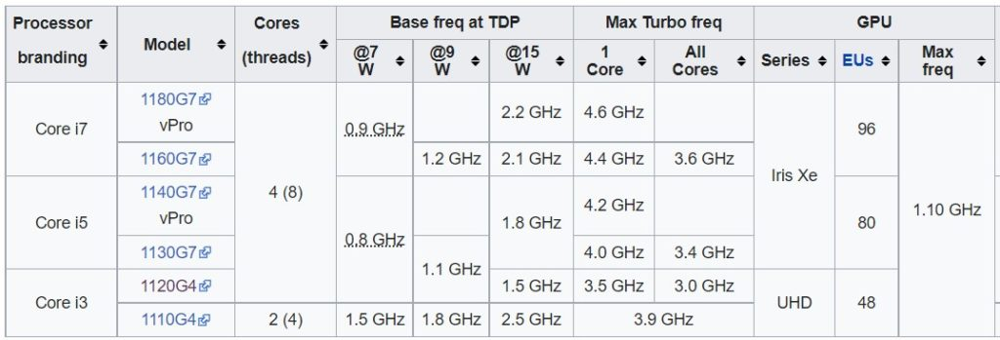
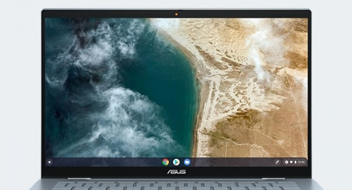
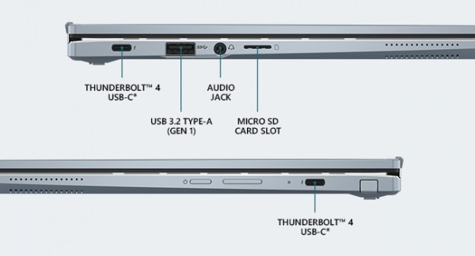

Did you catch my article last week on an "in development" [Asus Chromebook built on the Copano board](https://www.aboutchromebooks.com/news/copano-looks-to-be-a-14-inch-asus-chromebook-with-low-power-intel-tiger-lake-up4-cpu/)? That's where I first outlined the use of lower-powered 11th-gen Intel Core processors known as Tiger Lake UP4. Well, it's a safe bet that the Copano board and Core i7 is inside the [new Asus Chromebook Flip CX5400, which is coming soon for $1049.99](https://store.asus.com/us/item/202107AM140000007/laptopschromebook-ASUS-Chromebook-Flip-CX5%2C-14”-Touchscreen-Full-HD-NanoEdge-Display%2C-Intel®-Core™-i7-1160G7-Processor%2C-512GB-PCIe-SSD%2C-16GB-RAM%2C-Garaged-USI-Stylus%2C-Backlit-Keyboard%2C-Wi-Fi-6%2C-Chrome-OS%2C-CX5400FMA-DN76)

So there are a few unique aspects to this upcoming convertible Chromebook.

That Intel Core i7-1160G7 inside is one of them. Partially that's due so few Chromebooks with a Core i7 and partially because it appears the Asus Chromebook Flip CX5400 is fanless I don't see any vents in the images.

I wonder how the thermals will be handled in this case. Remember the [fan-free Core i5 Samsung Galaxy Chromebook and its issues due to heat](https://www.aboutchromebooks.com/news/samsung-galaxy-chromebook-2-review-roundup/)?

The difference is here is that Tiger Lake UP4 architecture keeps the chipset at a lower voltage; these are more like mobile processors than laptop CPUs in that regard. Hopefully, the lack of a fan won't be an issue.

With the Tiger Lake UP4 processor, the chip voltage can be set very low. Or at least lower than a standard Core i7 found in today's laptops.

You sacrifice some clock speed although some Turbo boosting is available. I suspect you won't enjoy that boost for long though since that will heat up the chip. The device will likely scale back and throttle performance.

Secondly, this Chromebook has a 14-inch display. That's not out of the ordinary, per se. But this is part of the CX5 lineup for Asus and the initial model had a 15.6-inch display.

I didn't expect a smaller screen option but maybe I missed something in the [Asus announcements from CES 2021.](https://www.aboutchromebooks.com/news/asus-makes-the-biggest-ces-2021-splash-with-three-new-chromebooks-cm5-cx9-and-flip-c536/)

Based on the chipset, likely lack of fan, and the full specs, this is the first time I've considered [replacing my 16 GB Acer Chromebook Spin 13](https://www.aboutchromebooks.com/news/acer-chromebook-spin-13-with-16-gb-ram-should-you-buy-one/). Take a look at these specs to see why:

- Intel® Core™ i7-1160G7 Processor 2.1 GHz (12M Cache, up to 4.4 GHz, 4 cores)
- 512GB PCIe NVMe M.2 SSD and 16GB RAM, Wi-Fi 6 (802.11ax) + Bluetooth 5.0
- 14-inch Touchscreen Full HD 1920x1080 NanoEdge Display with Garaged USI Stylus
- 360-degree hinge: flip the touchscreen display to tent, stand, and tablet mode
- 2x Thunderbolt™ 4 supports display & power delivery, 1x USB 3.2 Type-A (Gen 1)
- Micro SD Card reader plus an illuminated keyboard
- Built-in array-speakers powered by Harman Kardon at only 3.10 lb

Asus claims up to 10 hours of runtime on this new Chromebook and even with a more power sipping Core i7, I can understand why. I'd be happy with a full 8 hours, personally.
