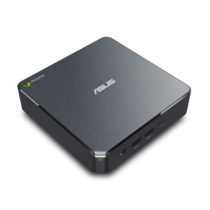

Asus announced a refresh of its Chromebox lineup at January's CES event with the promise of availability in the first half of 2018. The new Chromebox 3 models are available from at least one online vendor (thanks George for the tip!) and [pricing starts at a reasonable $239 for the base model at Promevo](https://shop.promevo.com/index.php/chromeboxes/asus-chromebox-3-n017u-90ms01b1-m00170-intel-celeron.html).

That price will only get you an Intel Celeron processor but it's a big step up from the prior base: This is the [seventh-generation chip Intel launched in 2017](https://ark.intel.com/products/96507/Intel-Celeron-Processor-3865U-2M-Cache-1_80-GHz) compared to the [2013 processor](https://ark.intel.com/products/75608/Intel-Celeron-Processor-2955U-2M-Cache-1_40-GHz) in the prior Asus Chromebox.

Other specs include 32GB of local flash storage with a microSD slot for expansion, 4GB of memory, five USB ports, HDMI out, 802.11ac Wi-Fi, Bluetooth 4.2 LE and an Ethernet jack. You'll need to add your own keyboard, mouse (and display obviously) since it doesn't appear Asus is including input devices.

For $429, you get the same device with two key changes: A bump to the seventh-generation [Intel Core i3-7100 processor](https://ark.intel.com/products/95442/Intel-Core-i3-7100U-Processor-3M-Cache-2_40-GHz) and one of the five USB ports is USB-C. A jump to $479 gets you this configuration with double the memory: 8GB.

Big spenders can drop $699 for an [eighth-generation Intel i7-8550U](https://ark.intel.com/products/122589/Intel-Core-i7-8550U-Processor-8M-Cache-up-to-4_00-GHz) model with the 8GB memory option. Note that _all_ of the configurations currently shown provide 32GB of storage; there doesn't seem to be an option with more capacity.

I think most Chrome OS owners lean towards the mobile experience of a Chromebook, but for desktop users, these appear fairly capable. However, you might want to consider the [Acer CXI3 Chromebox line](https://www.aboutchromebooks.com/news/new-acer-chromebox-cxi3-models-available-for-pre-order-start-at-298/) though as they will have 64 GB storage options and include input devices.

As far as Android app support, the new [Asus Chromebox 3 doesn't yet appear on the list](https://www.chromium.org/chromium-os/chrome-os-systems-supporting-android-apps), so we'll have to see if Google adds them. They should be technically capable of running Android apps but unless you have a compatible touchscreen monitor you might not even care. Even if you do, reaching out to a desktop monitor for touch-capable apps isn't ideal. For a business that wants to use Android apps in kiosk mode, however, such support would be ideal.
