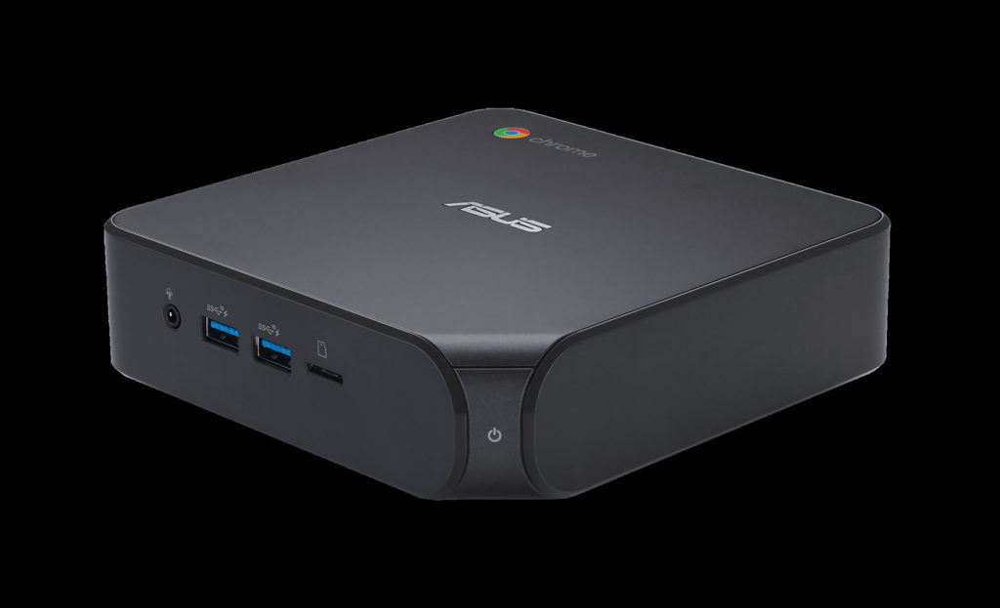
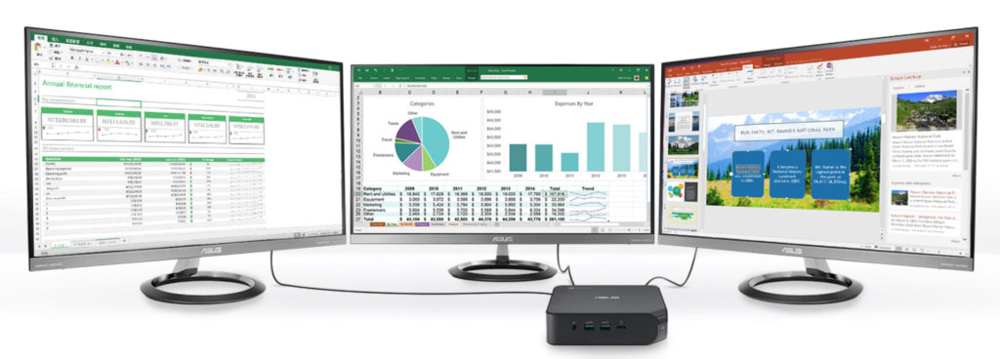

It definitely seems to me that Chromeboxes are on a two-year refresh cycle. The [last one was in 2018 with 8th-Intel chips](https://www.aboutchromebooks.com/news/asus-chromebox-3-available-for-pre-orders-starting-at-239-and-shipping-in-mid-may/) and this year, we're seeing new models with 10th-gen processors. The latest is the [Asus Chromebox 4](https://www.asus.com/Displays-Desktops/Mini-PCs/Chrome-OS-devices/ASUS-Chromebox-4/), which follows the [HP Chromebox G3 that went on sale last month](https://www.aboutchromebooks.com/news/hp-chromebox-g3-price-specifications-availability/). And like most Chromeboxes, there are few differences between different branded models.

The predecessor to the Asus Chromebox 4 had a starting price of $239 back in 2018. This refreshed model will set you back $50 more, as the base configuration with Intel Pentium Celeron costs $289. That's a tad more than HP's Chromebox G3, which starts at $257.

So what do you get for your extra money?

Obviously, the more capable 10th-generation Intel processors, which are the aforementioned Celeron 5205U, Core i3-10110U, Core i5-10210U, or Core i7-10510U. Wireless connectivity is boosted as well with support for 802.11ax networks, aka: WiFi 6. Bluetooth 5.0 and Gibagit wired ethernet support is also on board. Memory choices are either 4- or 8GB while there are four different storage options:

- 32G eMMC
- 64G eMMC
- 128GB M.2 SATA SSD
- 256GB M.2 SATA SSD

Being a Chromebox, there's no lack of ports and slots. A pair of USB Type-A3.1 Gen2 and microSD card reader are on the front, while the back adds a trio of USB Type-A 3.1 and one USB 3.2 Type-C jacks, as well as a pair of full-sized HDMI outputs. Asus says you can power three 4K displays with the HDMIs and the Type C output.

Asus will begin selling the new Chromebox 4 next month. There's no information yet on the different configuration pricing; only the base model. The company will offer a bundle package that includes a Chrome OS wired keyboard and mouse.

Since most Chromeboxes get a refresh around the same time, there isn't much to differentiate between them, whether you're considering one from Acer, Asus or HP. I wonder if Asus missed an opportunity to stand out a little, given that its base price point is above the HP Chromebox G3.

The [company announced 11th-gen Intel laptops back in September](https://press.asus.com/PressReleases/p/ASUS-Unveils-New-Laptop-Lineup-with-11th-Generation-Intel-Core-Processors-and-Premiers-First-Laptop-Verified-as-an-Intel-Evo-Platform-Design#.X7ge-mjYpew), so maybe Asus should have broken the cycle by using newer chips this time around. That would be a nice differentiation from the other brands and help justify a higher cost.
