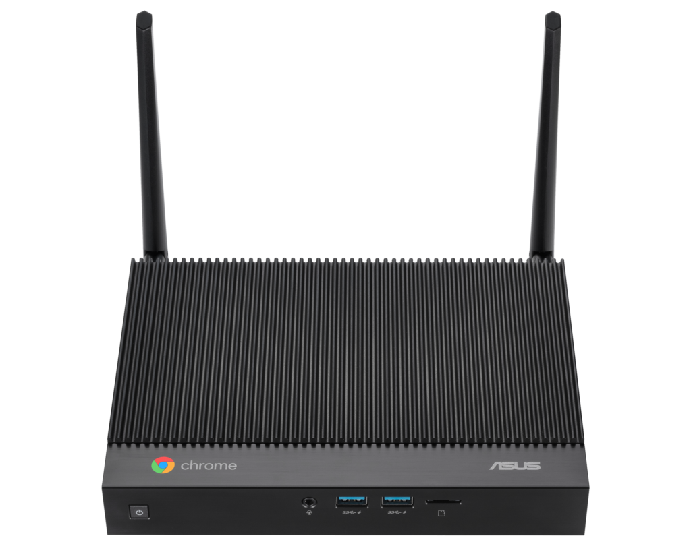
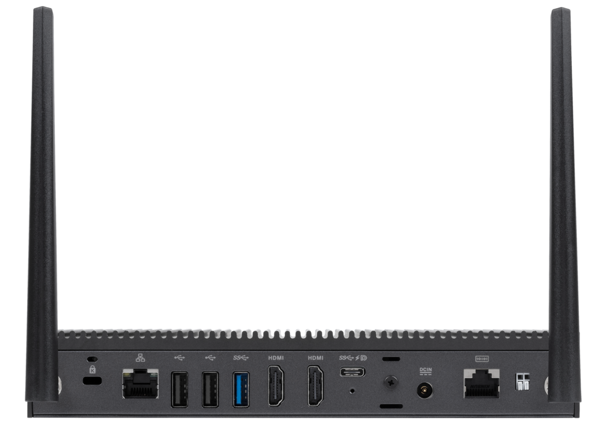

Thanks to one of my [newsletter subscribers](https://mailchi.mp/555032463821/welcome), I see that I missed a CES 2021 announcement. Aside from [three new Chromebooks](https://www.aboutchromebooks.com/news/asus-makes-the-biggest-ces-2021-splash-with-three-new-chromebooks-cm5-cx9-and-flip-c536/), Asus introduced a [redesigned Chromebook that can be configured with 10th-gen Intel processors](https://www.asus.com/Displays-Desktops/Mini-PCs/Chrome-OS-devices/ASUS-Fanless-Chromebox/). All models are fanless, which is surprising for a desktop computer. The Asus fanless Chromebox launches next month with a starting price of $399, with higher configuration pricing to be announced.

A sub-$400 entry price is appealing, but of course, you'll get the minimum or base hardware configuration. That includes a 1.9GHz Intel Celeron 5205U processor, 4 GB of memory, and 32 GB of local storage.

Other options include your choice of a 2.1GHz Intel Core i3-10110U or 1.8GHz Intel Core i7-10510U processor, up to 128 GB of storage, and 8 GB of DDR4 memory. Asus says that the fanless Chromebox can support up to three 4K external monitors, but I wouldn't try that with the base model.

Regardless of the internal configuration you're interested in, all models share a pair of wireless antennas and the same ports on the front: A pair of USB 3.1 Gen2 Type-A ports, a headphone jack, and a microSD card slot for memory expansion.

The rear of the base configuration houses two more USB Type-A 2.1 ports, another USB Type-A (3.2 Gen1), one USB Type C 3.2, two full-sized HDMI outputs, the power port, an RS232 interface (really!), wireless antenna ports, and an ethernet jack.

The back of the secondary configuration has three same pair of HDMI outputs, power, ethernet jack, RS232 and wireless antenna inputs. However, the USB ports are a little different: three USB 3.2 Gen2 Type-A ports and one USB 3.2 Type-C. Note that regardless of model, the USB Type-C supports DisplayPort and power delivery. All models include WiFi 6 (2x2) and Bluetooth 5.0.

Personally, I would have liked to see a USB Type-C port with power delivery on the front of the device, but that's just me. And the fact that the Chromebox doesn't have that certainly wouldn't stop me from considering a purchase.

Like many prior Chromeboxes, you can mount this one to the back of a monitor using a new lockable VESA mount. This also explains the optional movable antennas: When mounted behind a monitor, you can optimize your wireless signals.

Although the 10-th gen Intel processors won't offer a massive performance boost over the 8th-gen chips in predecessor Chromeboxes, this Chrome OS desktop was due for a refresh and the newer chips are welcome.

They also push the automatic software updates from Google out to June 2028, so for a relatively low investment, you'll get 7.5 years of support if purchased next month.

If I hadn't [built a Windows PC gaming machine (with a massive set of fans)](https://www.kctofel.com/so-i-hit-the-nvidia-rtx-3080-lottery/) last summer, I would strongly consider one of these devices for my home office. I'm interested in the Core i7 configuration price while also wishing it could be had with 16 GB of memory as [I heavily use coding apps in Linux](https://www.aboutchromebooks.com/news/can-you-learn-to-code-in-a-college-computer-science-program-with-a-chromebook/) alongside Chrome OS for hours each day. Then again, the Asus fanless Chromebox has two memory slots, so maybe, just _maybe_, a pair of 8 GB memory sticks would work.

Without the fans, this Chromebox will likely get hot; even with the aluminum chassis that could help dissipate heat. However, it's one less moving part to break over the long term, so I like the design choice.
