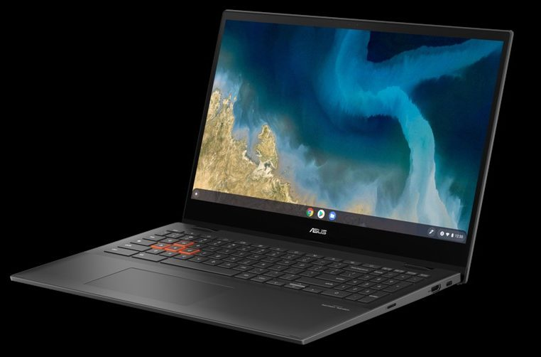
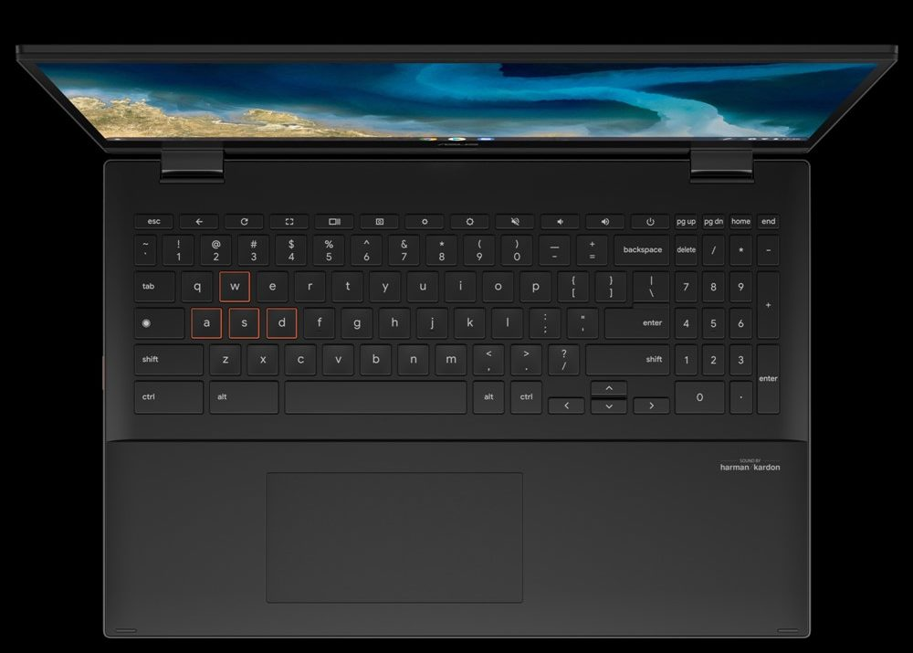
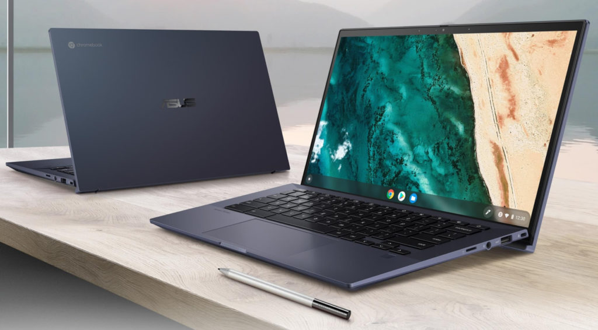
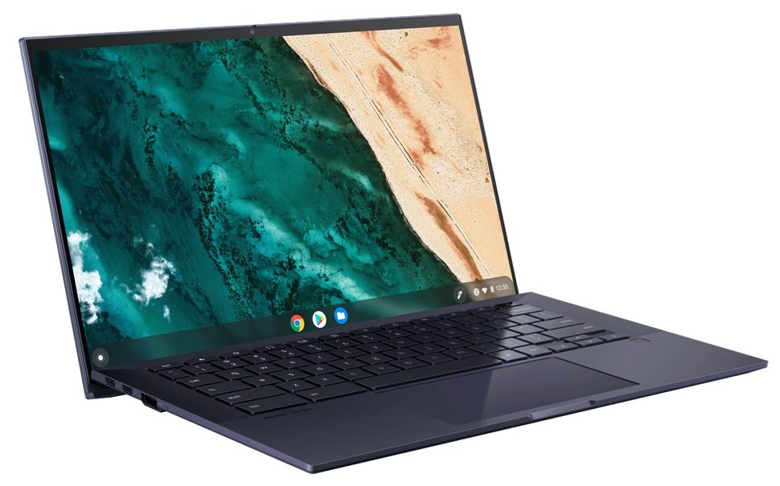
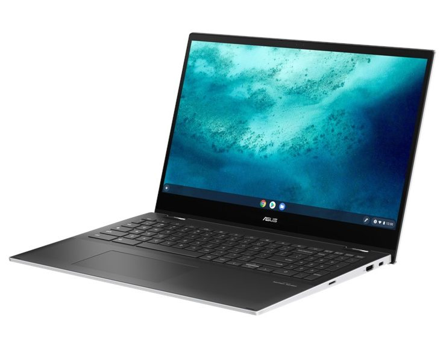
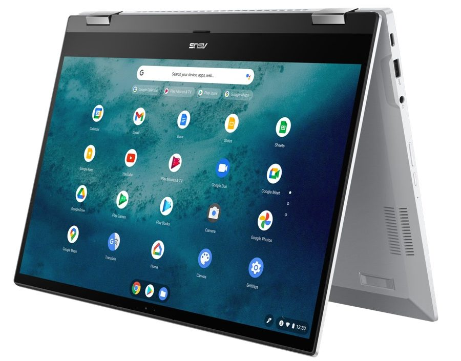

[Dell made a minor tweak to an existing Chromebook](https://www.aboutchromebooks.com/news/dell-updates-its-chromebook-3100-to-include-an-lte-option/), HP and Lenovo came up empty and both [Samsung](https://www.aboutchromebooks.com/news/ces-2021-samsung-galaxy-chromebook-2-price-release-date-specifications/) and [Acer](https://www.aboutchromebooks.com/news/ces-2021-acer-chromebook-spin-514-amd-ryzen-price-specifications-release-date/) announced their new devices before CES 2021. That left Asus to bring some device news and it delivered big on the final day of the event. [Asus introduced three new Chromebooks](https://press.asus.com/PressReleases/p/ASUS-Presents-Be-Ahead-Launch-Event-at-CES-2021#.YAMva_HYpew), one powered by AMD's Ryzen chipset and the other two using 11th-gen Intel chips.

Let's start with the [Asus Chromebook Flip CM5](https://www.asus.com/us/Laptops/ASUS-Chromebook-Flip-CM5-CM5500FDA/) since it's one of the few devices using AMD processors and one of the even fewer Chromebooks with a 15.6-inch display.

That large 60Hz IPS touch panel has a 1080p resolution and a 16:9 aspect ratio. So you'll get good viewing angles, but the 45% NTSC color accuracy is on the average side.

The Asus Chromebook Flip CM5 comes with your choice of AMD Ryzen 3 3250C or Ryzen 5 3500C processors, each having its own AMD Radeon Vega graphics processor. Non-upgradable memory choices range between 4, 8, and 16 GB. All configurations use speedy M.2 PCI-e Gen3 storage in capacities of 128, 256, or 512 GB, depending on the configuration.

In terms of ports, you get a nice assortment: 2 Type-C USB 3.2, 1 Type-A USB 3.2, an HDMI port, microSD card slot, and mic/headphone jack. There's also a 720p webcam, support for WiFi 6, Bluetooth 5.0, and a USI stylus. The 3-cell 57 WHr battery is rated for up to 10 hours of run-time, at least on paper.

Overall, it's an attractive package, complete with a Mineral Gray aluminum-alloy metal lid chassis and, in a nod to gamers, orange WASD keys. Asus says the Chromebook Flip CM5 also meets MIL-STD 810H3 military standard, so it should be solid and sturdy.

Given the large display, wider keyboard to include a full number pad, and whopping 5.68-inch glass trackpad, this is no lightweight device, weighing in at 4.17 pounds.

Moving on to the Intel-based devices, the [Asus Chromebook CX9](https://www.asus.com/us/Laptops/ASUS-Chromebook-CX9-CX9400CEA/) is a thin and light offering meant for work, weighing 2.3 pounds.

There are three 11-th gen Intel processors to choose from: one of two different Core i5 chips and a Core i7, each with Intel Iris Xe graphics. The specific choices are Intels i5-1135G7, i5-1145G7, or i7-1185G7 chipsets. Memory is either 8 or 16 GB, while storage starts at 128 GB with options all the way up through 4TB, [according to Android Police](https://www.androidpolice.com/2021/01/13/asus-reveals-three-new-chromebooks-including-one-for-gamers/).

I wouldn't even want to guess on the cost of that and I think it's a bit of overkill for a Chromebook. I could see 1TB as the maximum for a select few people but 4TB?

You're looking at, literally, a 14-inch 1080p touch panel with USI stylus support. Asus hasn't provided details on the color gamut or brightness and since this isn't a "Flip" model, the display doesn't fold back beyond a traditional clamshell.

Ports include a pair of USB Type-C / Thunderbolt 4 ports, one on each side, a Type-A port, HDMI out, microSD card slot, and a combo headphone/microphone jack.

A nice touch is the physical privacy shutter on the 720p webcam. WiFi 6 is included, and although Asus didn't mention Bluetooth, I suspect it has 5.0 included.

Lastly is the [Asus Chromebook Flip C536](https://edgeup.asus.com/2021/the-fast-and-friendly-chromebook-flip-c536-powers-up-chrome-os-with-11th-gen-intel-core-cpus/), which is an Intel-powered version of the CM5. You get a choice of 11th-gen Intel processors: the Core i3 1115G4, Core i5 1135G7, or Core i7 1165G7, while memory choices are limited to either 8 or 16GB. No 4GB base models here.

Based on the specs, this is the same 15.6-inch display, keyboard layout, and port selection as the CM5. Asus is claiming 12 hours of run-time and the same weight as this CM5.

Unfortunately, none of these devices have prices or release dates as of yet. That's often the case with CES announcements but it's a little disappointing.

However, these all bring a newer, more modern design (at least in my opinion) as compared to the last few Acer Chromebooks to hit the market. I'm looking forward to taking one of them for a spin; particularly the CM5 and its AMD Ryzen processors inside.

