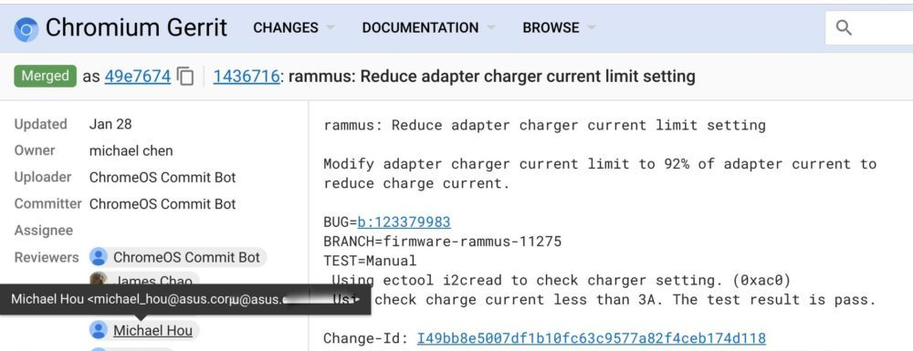

The [Pixel Slate is my cup of tea](https://www.aboutchromebooks.com/news/how-to-code-on-a-chromebook-crostini-pixel-slate/), but if it isn't yours there could be another Chrome OS tablet to choose from with the same Intel chips. [MySmartprice found some recent Geekbench browser benchmarks of a device dubbed "Google Rammus"](https://www.mysmartprice.com/gear/google-rammus/) with a motherboard code-named "Shyvana". Rammus itself isn't new; [that code name surfaced last summer on Chrome Unboxed](https://chromeunboxed.com/news/new-kaby-lake-chromebook-rammus-could-be-asus-next-flagship/). This is the first time I've seen Shyvana, however.

The benchmark results surfaced yesterday and show [a tested device having the same Intel Core i7-8500Y](https://browser.geekbench.com/v4/cpu/11868841) processor as the high-end Pixel Slate model, along with 8 GB of memory and running Android 9 Pie within Chrome OS, just like the Pixel Slate does. There are also [results for a Core m3-8300Y model](https://browser.geekbench.com/v4/cpu/11868840), indicating there might be a range of configurations.

Aside from that, there's nothing else to be gleaned from these results. That doesn't mean we can't take some educated guesses though.

I suspect this device won't be Google-branded if it even comes to market. Instead, I'm thinking this Chrome tablet will be from Asus, who just got into the tablet game with its [Asus Chromebook Tablet CT100](https://www.aboutchromebooks.com/news/asus-chromebook-tablet-ct100-specifications/). Why? Because [several](https://chromium-review.googlesource.com/c/chromiumos/platform/factory/+/1436656) [recent](https://chromium-review.googlesource.com/c/chromiumos/third_party/coreboot/+/1400321) code commits from Rammus have [approvers from Pegatron](https://chromium-review.googlesource.com/c/chromiumos/overlays/board-overlays/+/1442022), which was spun out of Asus and still builds many of their devices. Additionally, there are [also recent Rammus commits with an approver from Asus](https://chromium-review.googlesource.com/c/chromiumos/platform/ec/+/1436716); note that I've hidden the full address.

_**Update**: Chrome Unboxed notes that the Asus Chromebook C434, announced at CES 2019 earlier this month [is built on the Rammus board](https://chromeunboxed.com/asus-debuts-a-worthy-successor-the-the-chromebook-flip-c302/)._

One other interesting tidbit: Unlike the Pixel Slate, aka: Nocturne, which has a 3000 x 2000 display, [Rammus shows as supporting up to a 1920 x 1080 at the moment](https://chromium.googlesource.com/chromiumos/platform/bmpblk/+/master/images/boards.yaml). That could change but if it doesn't, it _suggests_ to me that either this tablet device will likely be less expensive than the Pixel Slate due to a lower panel cost and/or the screen will be smaller than the 12.5-inch Pixel Slate screen. The [Asus Chromebook C434](https://www.aboutchromebooks.com/news/asus-chromebook-c434-vs-flip-c302-acer-chromebook-spin-13/) has a 1920 x 1080 display as well, by the way.

Given that there is a working device that can run the Geekbench browser test, I wouldn't be surprised if we see a product launch sooner rather than later for this device.

This is pure speculation based on the limited data, of course, so more to follow as information is found.
