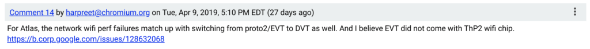

Last April, [I noted a new Chrome OS board dubbed Atlas](https://www.aboutchromebooks.com/news/chromium-code-suggests-4k-chromebook-code-named-atlas-in-the-works/) and there was plenty of speculation - including mine - that we'd see this device become the Pixelbook successor in 2018. That didn't happen as the [Pixel Slate arrived in October](https://www.aboutchromebooks.com/reviews/google-pixel-slate-review/). I don't expect Atlas to surface at this week's Google I/O either, even though it's been worked on for a year.

First, Google typically doesn't release new Chromebooks at Google I/O. Instead, since it's a developer conference, Google focuses on software and services, so we're sure to hear more about Chrome OS. I anticipate that the "Beta" tag will come off of [Project Crostini](https://www.aboutchromebooks.com/tag/project-crostini), or Linux, on Chromebooks. And I wouldn't be surprised to see a demonstration of Android emulation in Android Studio on a Chromebook as well.

More importantly, though is the actual progress of Atlas. We've already seen [a video showing the device under testing](https://www.aboutchromebooks.com/news/google-atlas-chromebook-first-look-video/) and as recently as last month, [Atlas was mentioned in the EVT and DTV stages](https://bugs.chromium.org/p/chromium/issues/detail?id=946686#c14).

If those terms don't mean anything to you, [this link describes the EVT, DVT and PVT stages of a hardware product](https://medium.com/@chris_boucher/the-different-engineering-validation-stages-in-a-nutshell-evt-dvt-pvt-41d1b4b2bc4a). Essentially, these are validation testing phases for engineering, design, and production. You don't produce tens of thousands of a hardware product before passing the first two stages. As a result, Atlas simply doesn't appear ready for production nor a launch announcement this week.

I still believe that Atlas is the next Google-branded Chromebook, likely a refresh of the Pixelbook. And there is still _plenty_ of time to complete DVT and EVT steps for a likely October launch event; that's the typical "new hardware from Google" time frame, although the Pixel 3a and 3a XL phones are likely exceptions this week.

What do we know or suspect about Atlas so far then?

It will [likely support a 4K display,](https://www.aboutchromebooks.com/news/chromium-code-suggests-4k-chromebook-code-named-atlas-in-the-works/) could be [a detachable device](https://www.aboutchromebooks.com/news/more-evidence-suggests-atlas-is-a-4k-detachable-chromebook-tablet/) (although I'm now leaning towards a 2-in-1 convertible since the Pixel Slate exists), should use [an IMX208 front camera sensor](https://www.aboutchromebooks.com/news/4k-atlas-chromebook-detachable-imx208-1080p-front-camera/) for full-HD video chat, [support fast NVMe storage](https://www.aboutchromebooks.com/news/atlas-chromebook-pixelbook-2-nvme-ssd/) like the highest priced Pixelbook and [should offload sensor data to an Intel Sensor Hub co-processor](https://www.aboutchromebooks.com/news/atlas-chromebook-battery-boost-co-processor-intel-sensor-hub-ish/).

While it would be nice to see a Pixelbook successor sooner rather than later, the time just isn't right for Atlas to make an appearance at Google I/O.
