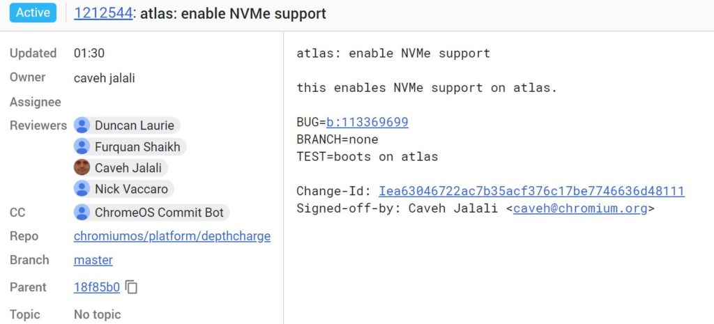

If you weren't sure which upcoming Chromebook will be the Pixelbook 2, there's another tidbit of information that might help. Or it might confuse matters even more: The [4K Atlas Chromebook will have speedy NVMe support for its local storage](https://chromium-review.googlesource.com/c/chromiumos/platform/depthcharge/+/1212544) based on a piece of Chrome OS code committed this week.

Atlas is the second Chromebook in the works to work with NVMe, which stands for Non Volatile Memory express. [Nocturne](https://www.aboutchromebooks.com/news/nocturne-to-be-a-chrome-os-detachable-with-high-res-display-and-fingerprint-reader/), also a contender to debut at the [#MadeByGoogle event on October 9](https://www.aboutchromebooks.com/news/pixelbook-2-atlas-nocturne-madebygoogle-event-october-9/), also supports NVMe. The I/O specification relates to Solid State Disk storage and typically has much faster read and write speeds compared to eMMC storage. The [two less expensive Google Pixelbook models use eMMC](https://www.aboutchromebooks.com/news/pixelbook-emmc-or-ssd-storage/) while the top-end model is equipped with NVMe.

Choosing NVMe for Atlas will certainly boost the price (and performance) of the detachable Chromebook, meaning it will be a high-end Chromebook. That alone doesn't mean it will be the Pixelbook but it surely increases the chances of this as a possibility. Even so, it _appears_ to me that the code for Nocturne is further along than it is for Atlas. And at this point, just a month before the Google event, that would actually indicate Nocturne is a stronger Pixelbook 2 candidate.

I'm still going with my gut -- for now, anyway -- that we might see more than one new #MadeByGoogle Chromebook next month. Maybe Nocturne and Atlas both debut but one is more of a tablet at launch, meaning the keyboard base is an optional add on.
