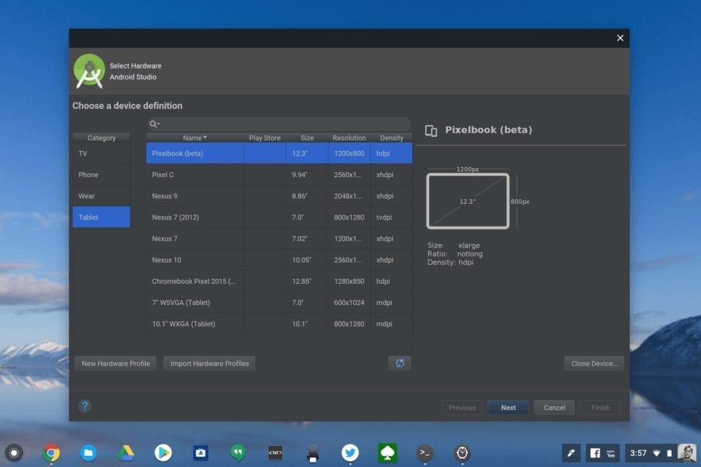

Last week a number of outlets reported on [new Geekbench benchmarks referring to a tested Chromebook dubbed Atlas](https://9to5google.com/2019/07/25/benchmarks-atlas-pixelbook-2-pixel-slate/). Most of us who have been [following the Atlas board strongly suspect this will be the next Pixelbook](https://www.aboutchromebooks.com/news/atlas-chromebook-pixelbook-2-nvme-ssd/), which for simplicity, I'll refer to as the Pixelbook 2 for now.

The recent public benchmarks show the Atlas board tested with both the Intel Core i5-8200Y and Core i7-8500Y chipsets. Is it possible that the Pixelbook 2 will be made available with these processors? Sure, anything is possible until Google introduces a Pixelbook successor.

But I don't think this will be the case, at least not completely, for a few reasons. Let me explain my thought process, which of course is logical deduction combined with speculation on my part; both of which are arguable of course.

First, let's consider the Intel Core i5-8200Y and Core i7-8500Y processors. These are the same low-power chips used in the Pixel Slate. [I bought the Core i5-8200Y configuration](https://www.aboutchromebooks.com/reviews/google-pixel-slate-review/) and use it daily. It's more than enough power for a large percentage of Chromebook users. Yet there are times that I could use a little more horsepower [when coding, for example](https://www.aboutchromebooks.com/news/how-to-code-on-a-chromebook-crostini-pixel-slate/).

Indeed, this is partially why [the Pixel Slate doesn't appear on Google's list of recommended devices for those who build Android apps](https://www.aboutchromebooks.com/news/android-studio-chrome-os-chromebook-recommendation-google-io-2019/). If you're going to run Android Studio, Google says you should have the more [powerful Core i5 U-series chips, or better](https://developer.android.com/studio/index.html#Requirements).

Chrome OS and Android emulation

While most people don't code on a Chromebook, this is still an important point to bring up. Why? Because when Google discusses Android Studio on a Chromebook, [it shows to the current Pixelbook,](https://www.aboutchromebooks.com/news/project-crostini-linux-chromebooks-gpu-acceleration-date/) even though there are other capable devices that can run this development tool. This shouldn't surprise you: The Pixelbook is often front and center for on-stage demos at Google I/O and other developer events.

So riddle me this, Batman: Does it make sense for Google to build the Pixelbook 2 and not showcase it at future developer events because it's underpowered? That's not likely. Add to the fact that Googlers themselves who create and extend Google's own Android apps either use Macs or Chromebooks.

That's all I saw when I worked at Google with both the Chrome and Android teams. Occasionally, I saw a high powered HP back when the HP Chromebook 13 G1 was the Pixelbook's only real competitor, but otherwise, it was Mac or Chromebook and most of those Chromebooks were Pixelbooks.

Let's get back to the benchmarks though. Not the recent ones, but [the ones I reported on in May](https://www.aboutchromebooks.com/news/pixelbook-2-benchmarks-8th-gen-intel-gpu-specifications-release-date/).

At that time, a Google Pixelbook appeared with a [Core i5-8250U](https://browser.geekbench.com/v4/cpu/13053838) and [Core i7-8550U](https://browser.geekbench.com/v4/cpu/13053837); exactly the types of processors I'd expect for reasons mentioned above. Yes, the board on these was listed as "eve", which is the current Pixelbook board. But that actually makes sense to a point: Until you have Atlas boards built, if you want to quietly test Chrome OS performance on a Pixelbook successor, you could simply use the old board name so as not to tip your hand on future products.

To be sure, if Google chooses U-Series processors for the Pixelbook 2, it will have to leave room for a fan. The Y-Series chips found in the Pixel Slate and the current Pixelbook don't require a fan. And the current Pixelbook is 0.4-inches in height, which doesn't leave much room for a fan.

Keep in mind, however, that the latest MacBook Pro 13-inch from Apple has an Intel Core i5-8257U processor that requires a fan and is 0.59-inches thick. I don't know that Google can easily squish a fan inside the Pixelbook 2 if it keeps the same dimensions as the original, but it wouldn't take much of a chassis expansion to add a fan, particularly since the design of the Pixelbook motherboard is so darn small, to begin with.

Pixelbook motherboard (Credit: IFixit)

Look, I'm not saying that every Pixelbook 2 configuration will have the more powerful U-Series processors. It could well turn out that Google decides to over lower-priced models with still capable Y-Series chips.

But my gut says that at least two configurations will have higher-performing U-Series chips for developer and internal Googler appeal. Turning the Pixelbook line into a low-cost-**_only_** option undoes all of the premium branding that the Google hardware team has built up over the past several years.

And it puts on-stage Android development presentations at risk by using an underpowered device. The other alternative would be for Google to run such demos on a U-Series Chromebook from Acer, Dell, HP or Lenovo; something that I really don't think would happen at a Google event.

Chime in on my logic and tell me if you agree or not.
