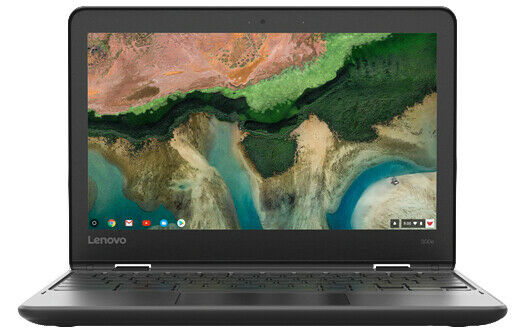

It wasn't that long ago that I put [a list together of the scant number of Chromebooks with integrated LTE](https://www.aboutchromebooks.com/news/want-an-lte-chromebook-here-are-your-current-options/). Now I have another one for that list, courtesy of AT&T. The U.S. carrier announced [pre-orders for the Lenovo 300e Chromebook LTE](https://about.att.com/story/2021/lenovo_connected_laptops.html?CJPID=100122946&EI=20130822074250E&CI=CJ_AFFINITY&RI=CJ1&RD=37922) on Monday.

The Lenovo 300e Chromebook LTE can be ordered on September 10 at a retail price of $419.99. Availability online and in select stores on the 28th. I'll get to the device details in a second because first, I want to highlight what I sense is a trend. At least in the U.S.

AT&T is offering this LTE Chromebook with a 36-month plan if you'd prefer, the same as it does with the [Samsung Galaxy Chromebook Go with mobile broadband](https://www.aboutchromebooks.com/news/samsung-galaxy-chromebook-go-with-5g-lte-lands-at-att/). That doesn't get you any break on your monthly data plan for the device, but it does help tackle your monthly budget. You can pay the carrier $11.67 a month over three years for this device.

I don't know if these devices are locked to AT&T's network. If they're not, then a data SIM from Google Fi or some other carrier may work, which might save you money.

AT&T says, "We make it easy to attach unlimited plans to the laptops which will create a unique, unbounded experience for customers, with access to the internet anywhere the network is available." And that simplicity will cost you $20 a month to add this LTE Chromebook to your existing unlimited plan.

Back to the device.

The Lenovo 300e Chromebook LTE is a fairly entry-level device as you could guess by the price tag. There's been a non-LTE model with a $299.99 retail price for some time, although it appears as "discontinued" on the Lenovo site.

I'm assuming the LTE version has the same specs which means a MediaTek processor

[It appears that this model has an AMD 3105Ce processor](https://www.lenovo.com/us/en/coming-soon/300e-AMD-G3/p/22ED03E3EA3), 11.6-inch 1366 x 768 resolution touch display, 4 GB of memory, \]32 GB of eMMC storage, WiF 6, and an optional stylus. It's a ruggedized, water-resistant model ideally suited for the classroom.

This probably isn't going to make waves in the consumer space based on the specs and design. But I don't mind. I don't particularly need mobile broadband in my Chromebook, but others say they do. The more options out there for that crowd, the better!

_Update: Copy reflects a new "coming soon" 3rd gen model of this Chromebook. Thanks to atlman in our comments for spotting and sharing the information._ _Post updated at 10 pm EDT on August 23, 2021._
