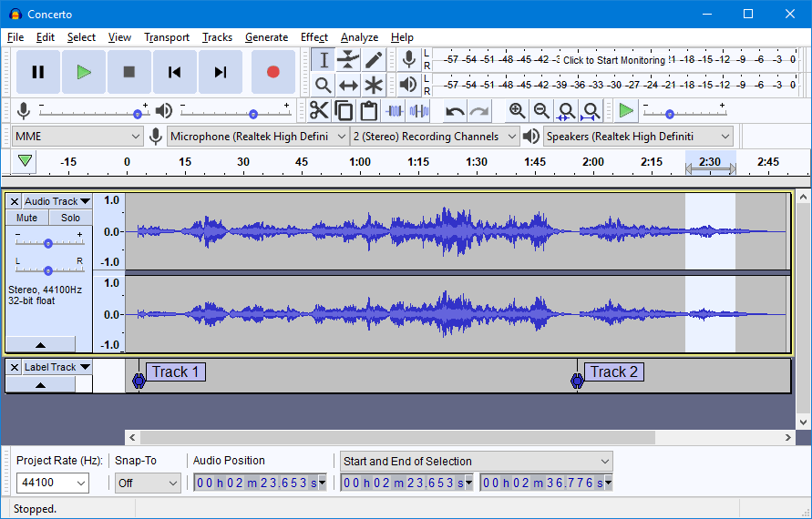

I may be one of the few that wants to record audio using a Linux app on my Chromebook, but I'm going to share this news anyway. The effort to bring [audio capture support to Project Crostini](https://www.aboutchromebooks.com/news/microphone-camera-skype-video-chats-linux-for-chromebooks-project-crostini/) that started in February is nearly ready for testing, at least on a limited basis.

An [update to the open bug for audio capture in Linux on Chromebooks](https://bugs.chromium.org/p/chromium/issues/detail?id=932268#c15) explains that for now, a command line argument when starting the Linux container manually will be used to capture test information:

> vm\_tools: enable audio capture with vmc command option  
>   
> This change allows a user to start a VM with audio capture enabled using an option in \`vmc start\`. The option in vmc can open up this feature to a  
> broader set of testers and help us collect user feedback reports.

I've tried to start my conainer with the new --enable-audio-capture argument using the Dev Channel of Chrome OS 79 but the extra parameter isn't yet recognized. Hopefully, it arrives in the next Dev Channel update for Chrome OS.

My specific need for audio capture is when using [Audacity](https://www.audacityteam.org/), an open-source audio editing tool available for Linux, as well as Windows and macOS.

I record [two](http://www.mobiletechroundup.com) [podcasts](https://iotpodcast.com) each week and since I can't easily capture my conversation on a Chromebook, I use a secondary machine. I know there are Android apps and other audio capture alternatives, but I've been using Audacity to record and edit my podcasts since 2006; I'd rather not change my workflow at this point.

Others may want audio input support in Linux on Chromebooks for voice chats in Discord or other apps, such as Skype. I'm sure I'm in the minority here, but I'm excited to see progress on this feature.
