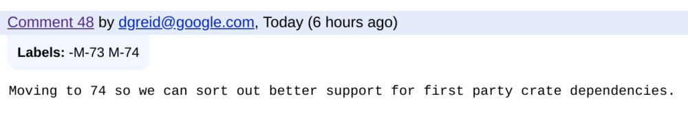

There was some good progress on [adding basic audio playback in the Linux container of a Chromebook](https://bugs.chromium.org/p/chromium/issues/detail?id=781398) this month and I had high hopes we'd see the feature soon. Unfortunately, it looks like this functionality has been pushed from version 73 of Chrome OS to version 74.

With the [Chrome OS calendar](https://chromiumdash.appspot.com/schedule) showing that the Stable Channel of 73 is slated for March 19, this means that we're looking around April 30 for a Stable release that will allow Linux apps to playback audio in Project Crostini.

Of course, new features start out in the Canary, Dev and Beta Channels before hitting Stable, so early adopters _could_ see audio support in Linux as early as next month.

Here's the commit change from earlier today showing both the change in target versions and the reason:

I can't claim to understand all the inner workings of how the Chromium team is implementing audio support in Crostini, however, it appears to be some code shift to Rust crates -- [essentially Rust libraries or binaries](https://doc.rust-lang.org/book/ch07-01-packages-and-crates-for-making-libraries-and-executables.html) -- and dependencies required for that change. That's an educated guess on my part, though. Regardless of the reason, don't expect the Linux apps on your Chromebook to support sound any time soon.

Luckily, my programming efforts aren't impacted by this missing feature: I'm still [all in on using Crostini on my Pixel Slate for a Comp Sci coding class](https://www.aboutchromebooks.com/news/how-to-code-on-a-chromebook-crostini-pixel-slate/) this semester.

I would like to use my Slate for the two weekly podcasts I do, however. I use the open source Audacity app, along with Skype, to record and edit those, but if I can't hear the playback, I can't use a Chromebook for podcasting without changing a 13-year old optimized workflow.
