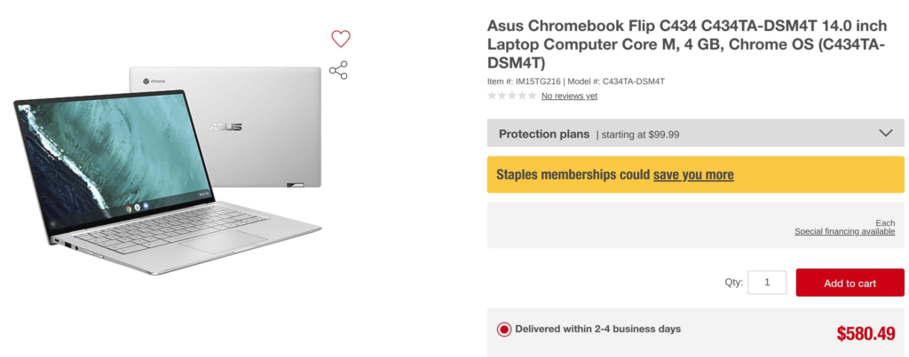
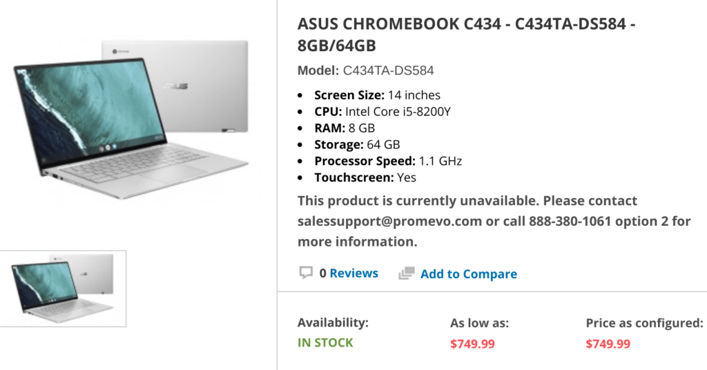

A few weeks ago, the [Asus Chromebook Flip C434 appeared on Promevo's site](https://www.aboutchromebooks.com/news/asus-chromebook-flip-c434-availability-price-specs-promevo/) and today it's Staples' turn: The retailer has a listing for the [2-in-1 Chromebook with a price of $580.49](https://www.staples.com/asus-chromebook-flip-c434-c434ta-dsm4t-14-0-inch-laptop-computer-core-m-4-gb-chrome-os-c434ta-dsm4t/product_IM15TG216). Staples says it offers delivery of the Flip within a few business days but when I added the device to my cart, it said "out of stock." I'd expect that to change in the coming weeks.

Note that both retailers are preparing to offer the base model of the Asus Chromebook Flip C434 with an Intel Core i3-8100Y processor, 4 GB of memory and 64 GB of eMMC storage. The full complement of options that Asus will make available include:

- Intel Core M3-8100Y, 2C/4T, 1.1GHz (4MB cache, up to 3.4GHz)
- Intel Core i5-8200Y, 2C/4T, 1.3GHz (4MB cache, up to 3.9GHz)
- Intel Core i7-8500Y, 2C/4T, 1.5GHz (4MB cache, up to 4.2GHz)
- 14” LED-backlit IPS NanoEdge display, 100% sRGB, 1920 x 1080 with 5mm bezels and a 360-degree hinge
- Up to 8GB LPDDR3
- Up to 128GB eMMC
- MicroSD card reader, 802.11ac Wi-Fi, Bluetooth 4.0
- Two USB Type-C ports, one USB Type-A port (all ports are USB 3.1)
- Backlit keyboard and multi-touch trackpad
- HD webcam, presumably 720p based on the lack of a “FullHD” mention
- 48 WHr battery, no estimated run-time yet
- 3.2 pounds

Note too that Promevo's price for this base model is $569.99, which is the target cost Asus said it was aiming for.

Speaking of Promevo, it now shows the [Core i5 model of the Asus Chromebook Flip C434 with 8 GB of memory as well, for a price of $749.99](https://shop.promevo.com/index.php/asus-chromebook-c434-c434ta-ds584-8gb-64gb.html). I had suggested that based on the $569.99 entry level price, the i5 edition would likely cost around $769, so it wasn't too far off. And I'm happy to be wrong when the actual price of a device is less than my educated guess.

Like Staples, Promevo is only preparing for orders, unfortunately, expecting the Asus Chromebook Flip C434 to be available on or around April 1.
