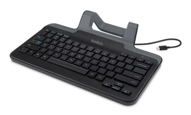
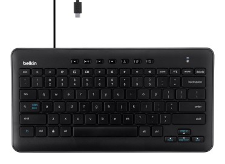

The [two USB keyboards Belkin announced for Chrome OS tablets in June](https://www.aboutchromebooks.com/news/acer-chromebook-tab-10-usb-keyboard-stand-belkin/) are now available for purchase. The [basic keyboard option is $39.99](https://www.belkin.com/us/p/P-B2B190/), while [the keyboard with integrated tablet stand costs $49.99](https://www.belkin.com/us/p/B2B191/).

Belkin did loan me the higher priced model, which I'm putting through the paces with an Acer Chromebook Tab 10 for a few days, so stay tuned for my impressions.

One thing I will note though: Although these keyboards were made for Chrome OS, you won't find dedicated keys for the Google Assistant or the Chrome OS launcher. And if you want the traditional top row Chrome OS keys, you may want the non-stand model: The other edition only has a few of the function keys found on a traditional Chromebook. Regardless, these are both reasonably priced.

The Acer Chromebook Tab 10 easily fits in the stand model but the keyboard should _also_ work with a larger Chrome OS tablet such as the HP Chromebook X2 or the [Google Pixel Slate](https://www.aboutchromebooks.com/tag/pixel-slate).

I popped the similarly sized Microsoft Surface Pro in the stand and it works just fine, although I can't use it to type: Microsoft's slate doesn't have USB Type-C support. You'd also be limited to a single display angle in that case since the stand isn't adjustable.
