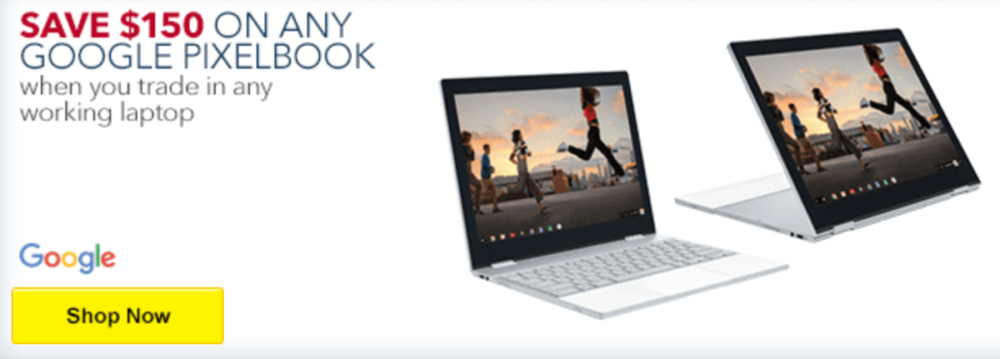
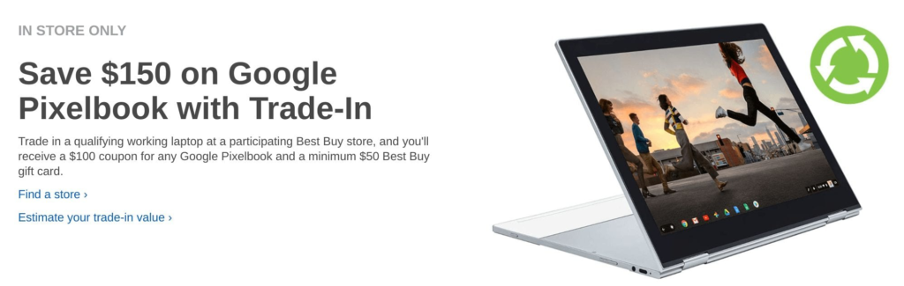

Scanning the weekly Best Buy ad uncovered this gem of a deal for those interested in a new Google Pixelbook. Through May 5, 2018 if you trade-in a working laptop -- an old Chromebook, maybe? -- Best Buy will [put a Pixelbook in your hands and $150 back in your pocket](https://www.bestbuy.com/site/clp/pixelbook-trade-in-offer/pcmcat1521496422462.c?id=pcmcat1521496422462).

The deal is a little unique because it actually provides two discounts. You'll get $100 for your trade-in towards the Pixelbook, which starts at $999, and then a $50 Best Buy gift card to make up the difference.

The Best Buy ad doesn't say if you can immediately apply the gift card towards the Pixelbook or not; you'd probably have to check in store. And it's possible your trade is worth less than the $100, so I wouldn't bring in an old hunk of junk that's 10 years old.

I suspect most Chromebook buyers will pass on this deal because there's a sentiment that [Chromebooks should be inexpensive](https://aboutchromebooks.com/opinion/why-people-wrongly-assume-chromebooks-have-to-be-inexpensive/). There's merit to that argument for certain markets and for certain use cases, of course.

If you're buying hundreds of devices for schools, for example, or you just browse the web with a few tabs open at a time, spending upwards of $1,000 doesn't likely make sense. If you're going to be [coding](https://aboutchromebooks.com/how-to/how-to-code-on-a-chromebook-using-python-and-a-raspberry-pi/), running high-quality Android apps or working with scores of open tabs on a daily basis though, the extra horsepower and higher-quality display of a high-end Chromebook might be worth the investment.
