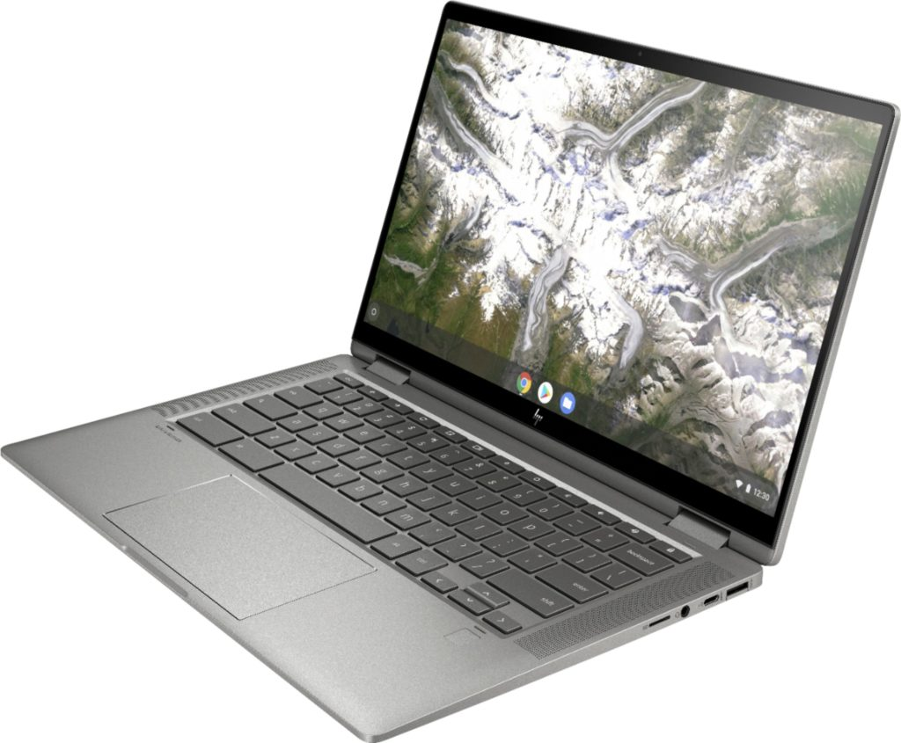

Announced with a price range of $499 to $629 last month, the [next 14-inch iteration of Chromebooks for HP](https://www.aboutchromebooks.com/news/premium-hp-chromebook-x360-14c-launching-this-month-models-priced-from-499-to-629/) is an updated take on the prior model. And through July 19, you can get an upgraded $629 model for a discounted price of $499, _**and**_ save an additional $100 on top of that. All you have to do is sign up for the free Best Buy Member Deals program and you'll [get a solid mid-range HP Chromebook X360 14c model for $399](https://www.bestbuy.com/site/hp-2-in-1-14-touch-screen-chromebook-intel-core-i3-8gb-memory-64gb-emmc-flash-memory-mineral-silver/6407695.p?skuId=6407695).

If you recall when HP announced the starting price of $499 for this 14-inch 2-in-1, I said to pay attention to the device specifications. That base model uses a dual-core [Intel Pentium Gold 6405U](https://ark.intel.com/content/www/us/en/ark/products/197888/intel-pentium-gold-6405u-processor-2m-cache-2-40-ghz.html) processor, 4 GB of memory and 64 GB of local storage. Buy getting the $629 special deal, this HP Chromebook X360 14c gets beefier hardware: a 10th-generation dual-core [Intel Core i3-10110U](https://ark.intel.com/content/www/us/en/ark/products/196451/intel-core-i3-10110u-processor-4m-cache-up-to-4-10-ghz.html) processor, 8 GB of memory and the same 64 GB of eMMC storage.

It's a no-brainer to me if you're in the market for a 14-inch Chromebook right now and want to keep the purchase price to under $400.

[Get this HP Chromebook X360 14c deal](https://www.bestbuy.com/site/hp-2-in-1-14-touch-screen-chromebook-intel-core-i3-8gb-memory-64gb-emmc-flash-memory-mineral-silver/6407695.p?skuId=6407695 "Get this HP Chromebook X360 14c deal")

Along with the updated processor and memory, this model has a 14-inch IPS 1920×1080 touch panel with an average but decent 250 nits of brightness and 45% NTSC support. It also has WiFi 6 and Bluetooth 5 support, plus a trio of USB ports: 2 SuperSpeed Type-C and one SuperSpeed Type-A. The keyboard is backlit and you can add additional local storage via a memory card slot. The 2-in-1 laptop supports an optional USI stylus and charges over USB-C with an included 45W charger. And it has a handy fingerprint sensor under the right corner of the keyboard as well.

Although this exact model doesn't appear on [Google's Chrome OS Automatic Update page](https://support.google.com/chrome/a/answer/6220366?hl=en), a similar HP Chromebook x360 14c will get software updates through June 2024. Earlier this year, Google suggested that [all new Chromebooks going forward would receive software updates for eight years](https://www.aboutchromebooks.com/news/google-announces-8-years-of-chrome-os-software-updates-aue-for-new-chromebooks/), so I suspect the 2024 is actually shown incorrectly and that support will be through 2028. Last year's 14b model, for example, shows as getting Chrome OS updates through June 2026, so I wouldn't be concerned about support on this model.

Is this the best 14-inch Chromebook you can buy?

I'd say no since there are Chrome OS laptops with the same, or similarly-sized, screens that are brighter or can display a wider range of colors. And those options may have more local storage or a Core i5 processor as well. But you aren't touching any of those for under $499, let alone $399.

[Get this HP Chromebook X360 14c deal](https://www.bestbuy.com/site/hp-2-in-1-14-touch-screen-chromebook-intel-core-i3-8gb-memory-64gb-emmc-flash-memory-mineral-silver/6407695.p?skuId=6407695 "Get this HP Chromebook X360 14c deal")
