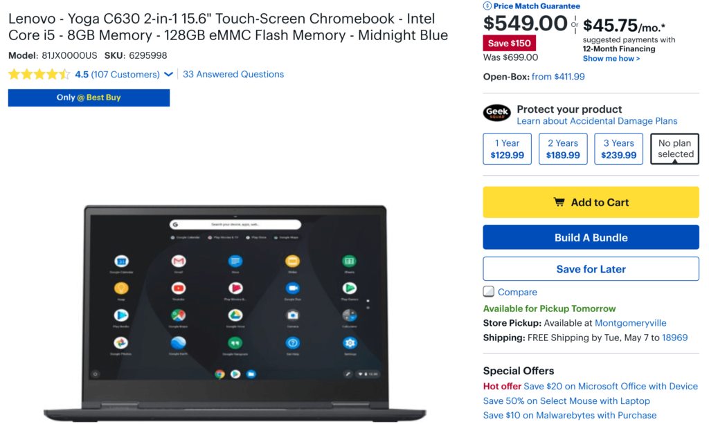
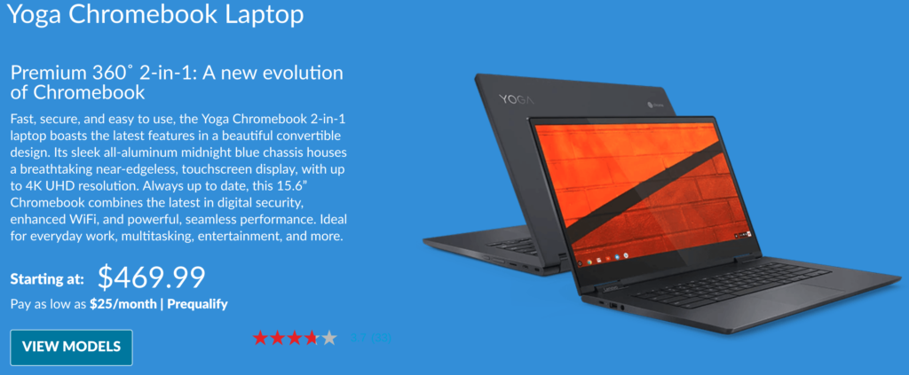

There are [45 different Chromebooks on sale this week at Best Buy](https://www.bestbuy.com/site/searchpage.jsp?_dyncharset=UTF-8&id=pcat17071&iht=y&keys=keys&ks=960&list=n&qp=currentoffers_facet%3DCurrent%20Deals~On%20Sale%5Eparent_operatingsystem_facet%3DOperating%20System~Chrome%20OS&sc=Global&st=chromebook&type=page&usc=All%20Categories), with discounts ranging from $20 to $150. On the latter end of that scale is the [Lenovo Yoga Chromebook C630 for $549](https://www.bestbuy.com/site/lenovo-yoga-c630-2-in-1-15-6-touch-screen-chromebook-intel-core-i5-8gb-memory-128gb-emmc-flash-memory-midnight-blue/6295998.p?skuId=6295998), down from the $699 suggested retail price. That's [$50 less than Lenovo's direct price](https://www.lenovo.com/us/en/laptops/lenovo/lenovo-n-series/Yoga-Chromebook/p/88YGCC61096) for a nearly identical model.

Here are the full specs that both of the devices share, regardless of where you buy from:

- 8th-Generation Intel Core i5-8250U processor (which uses a fan for cooling)
- Integrated Intel UHD Graphics 620
- 15.6-inch 1920 x 1080 IPS touch panel
- 8 GB of memory
- 128 GB of eMMC storage
- Bluetooth 4.1
- 802.11ac Wi-Fi (2 x 2 MIMO)
- 720p HD camera
- 2 USB Type-C ports, 1 USB Type-A port
- MicroSD card slot

The _only_ difference - besides the $50 price tag - is that the less expensive Best Buy model doesn't have a backlit keyboard. That requirement is a personal choice as some can live without it; for them, the Best Buy price is a great deal. For others who need to see their keyboards in dimly lit locations, you'll have to pay the $50 premium this week.

There actually is a _third_ option worth considering that includes a backlit keyboard: [Lenovo has discounted the Core i3 model to $469.99](https://www.lenovo.com/us/en/laptops/lenovo/lenovo-n-series/Yoga-Chromebook/p/88YGCC61096).

You'll be able to see your keys in the dark but you'll sacrifice slightly on the processor as well as local storage due to the 64 GB eMMC drive. Then again, you can use a low-cost microSD card if you need more space for local data.

If you do want a backlit keyboard and don't mind 64 GB of storage paired with a still-capable Core i3 processor - likely good enough for typical Chromebook usage - this might be your best bet. Note that all models run in the U-Series Intel processors, which require a fan to dissipate heat, although it should only run under a heavy load.
