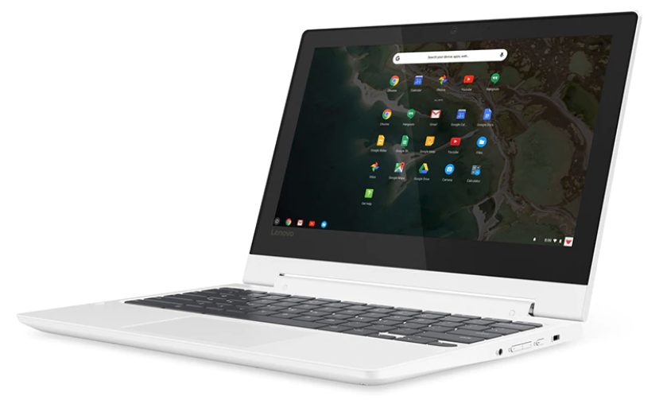
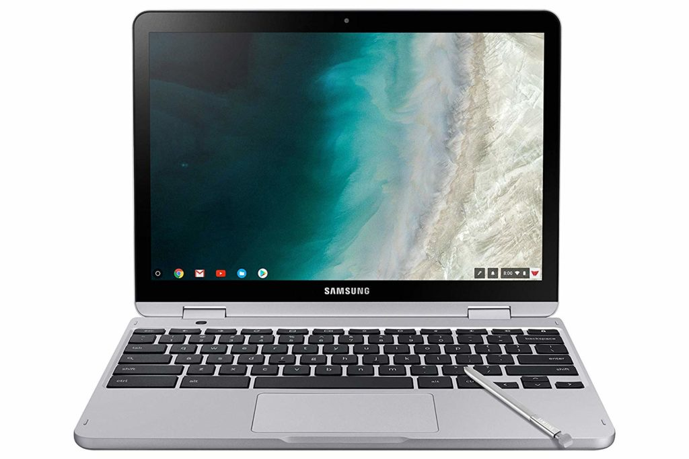
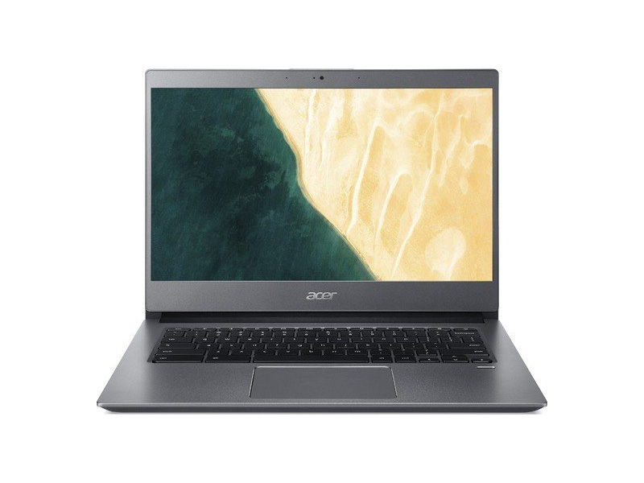
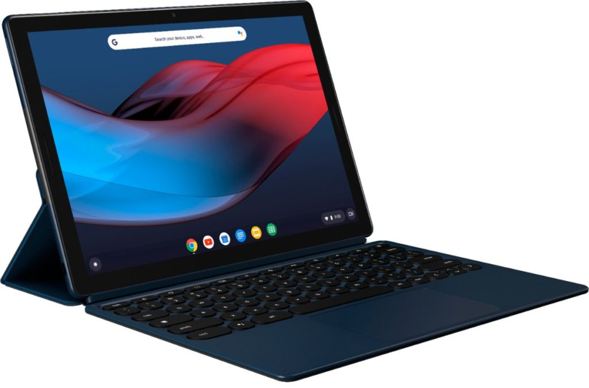

[Following up on Black Friday discounts](https://www.aboutchromebooks.com/news/black-friday-2019-chromebook-deals-worth-buying-for-budget-upgraders-or-new-chrome-os-users/), some of which are still available and appear below, come the Cyber Monday specials on Chromebooks. Like the list I posted for Black Friday, I'm not pointing out any deals for relatively older Chromebooks, mainly because they'll have 2.5 or fewer years of Chrome OS update support left.

And also like the list from Friday, I’ve only listed the major specifications to get you started. Click the relevant product link for additional information such as the included ports, case materials, weight, and other information.

All savings are calculated from the MSRP.

Lenovo Chromebook C330

[Lenovo Chromebook C330: $179 ($100 savings)](https://www.bestbuy.com/site/lenovo-2-in-1-11-6-touch-screen-chromebook-mt8173c-4gb-memory-32gb-emmc-flash-memory-blizzard-white/6296001.p?skuId=6296001)

MediaTek MTK 8173C CPU, 11.6″, 720p touchscreen, 4GB RAM, 32GB  
storage, memory slot, 2-in-1, no backlit keyboard, 10-hour claimed battery life, good for basic use and/or students. Chrome OS support ends June 2025.

Acer Chromebook Spin 11

[Acer Chromebook Spin 11: $219 ($110 savings)](https://www.bestbuy.com/site/acer-spin-11-2-in-1-11-6-touch-screen-chromebook-intel-celeron-4gb-memory-32gb-emmc-flash-memory-obsidian-black/6175410.p?skuId=6175410)

Intel Celeron N3350 CPU, 11.6″ 720p touchscreen, 4GB RAM, 32GB  
storage, memory slot, 2-in-1, no backlit keyboard, 10-hour claimed battery life, good for basic use and/or students. Chrome OS support ends June 2024.

[HP Chromebook X360 14b: $249 ($130 savings)](https://www.bestbuy.com/site/hp-2-in-1-14-touch-screen-chromebook-intel-celeron-4gb-memory-32gb-emmc-flash-memory-natural-silver-ceramic-white/6367729.p?skuId=6367729)

Intel Celeron N4000 CPU, 14" 720p touchscreen, 4GB RAM, 32GB  
storage, memory slot, 2-in-1, no backlit keyboard, supports USI digital pens, 12.5-hour claimed battery life, good for everyday browsing, and a few Android apps running simultaneously. Chrome OS support ends June 2026.

Samsung Chromebook Plus v2

[Samsung Chromebook Plus V2: $329 ($170 savings)](https://www.amazon.com/Samsung-Chromebook-Plus-Camera-Chrome/dp/B07J1SY5QQ/)

Intel Celeron 3965Y CPU, 12.2″ 1920×1200 touchscreen, 4GB RAM, 32GB  
storage, memory slot, 2-in-1, no backlit keyboard, included digital stylus, 10-hour claimed battery life, good for everyday browsing, a few Android apps, and notetaking. Chrome OS support ends June 2024. (Note: [You can spend $69 more and get 64GB of internal storage](https://www.amazon.com/dp/B07J215RPT/ref=twister_B07KJX74NH?_encoding=UTF8&psc=1).)

Acer Chromebook 715

[Acer Chromebook 715: $299 ($100 savings)](https://www.walmart.com/ip/Acer-Chromebook-715-15-6-Full-HD-Touchscreen-Intel-Core-i3-8130U-4GB-DDR4-128GB-eMMC/435795966)

Intel Core i3-8130U CPU, 15.6″ 1080p touchscreen, 4GB RAM, 128GB  
storage, memory slot, clamshell, no backlit keyboard, dedicated numeric keypad, 12-hour claimed battery life, good for everyday browsing, Android apps, and light Linux use. Chrome OS support ends June 2025.

Google Pixel Slate and Keyboard  

[Google Pixel Slate, included keyboard and pen: $449 ($648 savings)](https://www.bestbuy.com/site/google-pixel-slate-12-3-tablet-64gb-midnight-blue/6306459.p?skuId=6306459)

Intel Core m3-8100Y CPU, 12.3″ 3000×2000 touchscreen, 8GB RAM, 64GB storage, detachable tablet, backlit keyboard, digital pen, 12-hour claimed battery life, good for everyday browsing, Android apps, and Linux use but not for developers. Chrome OS support ends June 2026. (Note: [You can upgrade to a Core i5 and double the storage for an additional $200](https://www.bestbuy.com/site/google-pixel-slate-12-3-tablet-128gb-midnight-blue/6306462.p?skuId=6306462))

Asus Chromebook C425

[Asus Chromebook C425: $279 ($170 savings)](https://www.walmart.com/ip/FHD-Storage-4-Way-Processor-RAM-OS-C425-ASUS-Intel-4GB-128GB-Chrome-Chromebook-14-Core-Silver-NanoEdge-m3-8100Y-Clamshell-eMMC-Laptop-KB-Backlit-C425/584873797)

Intel Core m3-8100Y, 14″ 1080p non-touchscreen, 4GB RAM, 128GB  
storage, clamshell with a 180-degree hinge, backlit keyboard, 12-hour claimed battery life, good for everyday browsing, Android apps, and Linux use but not for developers. Chrome OS support ends June 2026. (Note: [a version with 8GB of RAM and 64GB of storage is available from Amazon for $319](https://www.amazon.com/ASUS-Chromebook-Clamshell-Processor-C425TA-DH384/dp/B07VT254P6/ref=sr_1_1_sspa?keywords=asus%2Bchromebook%2Bc425&qid=1575229428&smid=ATVPDKIKX0DER&sr=8-1-spons&spLa=ZW5jcnlwdGVkUXVhbGlmaWVyPUEzNUoxVURXNE5PTVk3JmVuY3J5cHRlZElkPUEwNTQ0MTg3M0dPMVI0MFBSUVY0VyZlbmNyeXB0ZWRBZElkPUEwODMwMjI3M1VKREVPUk9MVklTUiZ3aWRnZXROYW1lPXNwX2F0ZiZhY3Rpb249Y2xpY2tSZWRpcmVjdCZkb05vdExvZ0NsaWNrPXRydWU&th=1), a $180 savings)

Which to buy?

If your budget allows for it, I’d probably consider either the Pixel Slate bundle first but if you’d rather not have a Chrome OS tablet — even with the included keyboard and pen.

As long as you don't mind not having a touchscreen the Asus Chromebook C425 is a great deal for the hardware; it's also $50 less than it was for Black Friday. If you do need a touchscreen, you're getting a lot of Chromebook in the Asus Chromebook 715 on the cheap as well.
