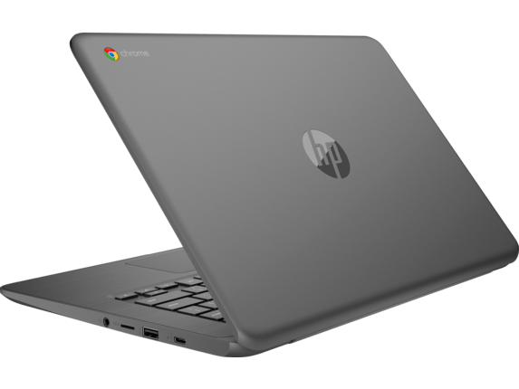

<iframe style="width:120px;height:240px;" align="right" marginwidth="0" marginheight="0" scrolling="no" frameborder="0" src="//ws-na.amazon-adsystem.com/widgets/q?ServiceVersion=20070822&amp;OneJS=1&amp;Operation=GetAdHtml&amp;MarketPlace=US&amp;source=ac&amp;ref=qf_sp_asin_til&amp;ad_type=product_link&amp;tracking_id=aboutchromebo-20&amp;marketplace=amazon&amp;region=US&amp;placement=B07GLV1VC7&amp;asins=B07GLV1VC7&amp;linkId=c0ed912d04709fafc7ae99d21400f590&amp;show_border=true&amp;link_opens_in_new_window=true&amp;price_color=333333&amp;title_color=0066c0&amp;bg_color=ffffff"></iframe>

Here in the US we're in the three day holiday weekend and while most folks are relaxing, vacationing or spending time with friends and family, a few minutes on online shopping can save you a bunch on a new Chromebook.

To make it a little easier and quicker (so you can get back to the holiday!), I've rounded up a bunch of good deals. I've also grouped them by budget and use-case categories to make it even faster.

These are grouped in order by what I'd consider the best bang for the buck based on capabilities and age of each model.

Keep in mind that there's no "best" device for everyone, so consider your own requirements and budget.

**Entry level under $275**

- [$199 HP Chromebook 14](https://www.bestbuy.com/site/hp-14-chromebook-amd-a4-series-4gb-memory-amd-radeon-r4-32gb-emmc-flash-memory-hp-textured-finish-in-chalkboard-gray/6333551.p?skuId=6333551) ($269 MSRP): 14-inch 768p touchscreen display, AMD A4-9120C, 4GB of RAM, 32GB of storage.
- [$129 Dell Chromebook 11 3181](https://www.bestbuy.com/site/dell-11-6-chromebook-intel-celeron-4gb-memory-16gb-emmc-flash-memory-black/6293618.p?skuId=6293618) ($179): 11.6-inch 768p touchscreen display, Intel Celeron N3060, 4GB of RAM, 16GB of storage.
- [$179 Acer Chromebook 15](https://www.bestbuy.com/site/dell-11-6-chromebook-intel-celeron-4gb-memory-16gb-emmc-flash-memory-black/6293618.p?skuId=6293618) ($229 MSRP): 15.6-inch 768p touchscreen display, Intel Celeron N3060, 4GB of RAM, 16GB of storage.

**Mid-range daily drivers between $275 and $399**

- [$399 HP Chromebook X360 14](https://www.bestbuy.com/site/hp-2-in-1-14-touch-screen-chromebook-intel-core-i3-8gb-memory-64gb-emmc-flash-memory-white/6301869.p?skuId=6301869) ($599 MSRP): 14-inch 1080p touchscreen display, Intel Core i3-8130U, 8GB of RAM, 64GB of storage.
- [$329 Acer Chromebook Spin 15](https://www.bestbuy.com/site/acer-spin-15-2-in-1-15-6-touch-screen-chromebook-intel-pentium-4gb-memory-32gb-emmc-flash-memory-sparkly-silver/6294312.p?skuId=6294312) ($399 MSRP): 15.6-inch 1080p touchscreen, Intel Pentium N4200, 4GB of RAM, 32GB of storage.
- [$399 HP Chromebook X2](https://www.bestbuy.com/site/hp-2-in-1-12-3-touch-screen-chromebook-intel-core-m-4gb-memory-32gb-emmc-flash-memory-white/6240850.p?skuId=6240850) ($599 MSRP): 12.3-inch 1080p touchscreen detachable display, Intel Core m3-7Y30, 4GB of RAM, 32GB of storage.
- [$258 Poin2 Chromebook 14](https://amzn.to/2K4Mmub) ($330 MSRP): 14-inch 1080p touchscreen, MediaTek 8173, 4GB of RAM, 32GB of storage.

**Power users with $400 or more to spend**

- [$689 Lenovo Yoga Chromebook C630](https://www.lenovo.com/us/en/laptops/lenovo/lenovo-n-series/Yoga-Chromebook/p/88YGCC61096#tab-currentmodels) ($900 MSRP): 15.6-inch 4K touchscreen, Intel Core i5-8250, 8GB of RAM, 128GB of storage
- [$558 Lenovo Yoga Chromebook C630](https://www.lenovo.com/us/en/laptops/lenovo/lenovo-n-series/Yoga-Chromebook/p/88YGCC61096#tab-currentmodels) ($720 MSRP): 15.6-inch 1080p touchscreen, Intel Core i5-8250, 8GB of RAM, 128GB of storage
- [$459 Lenovo Yoga Chromebook C630](https://www.lenovo.com/us/en/laptops/lenovo/lenovo-n-series/Yoga-Chromebook/p/88YGCC61096#tab-currentmodels) ($599 MSRP): 15.6-inch 1080p touchscreen, Intel Core i3-8130, 8GB of RAM, 64GB of storage
- [$449 Dell Inspiron Chromebook 14](https://www.bestbuy.com/site/dell-inspiron-2-in-1-14-touch-screen-chromebook-intel-core-i3-4gb-memory-128gb-emmc-flash-memory-urban-gray/6299820.p?skuId=6299820&ref=212&loc=1&ref=212&loc=1&ds_rl=1260666&ds_rl=1260576&ds_rl=1266837&ds_rl=1266837&gclid=Cj0KCQjwz6PnBRCPARIsANOtCw2Px7lNq0Ik4XAtYJjGdelDGrM_FfLERd2-z87caDTjRScQsDR5zz8aAnU8EALw_wcB&gclsrc=aw.ds) ($549 MSRP): 14-inch 1080p touchscreen, Intel Core i3-8130, 4GB of RAM, 128GB of storage
- [$600 Acer Chromebook 13](https://us-store.acer.com/laptops/chromebook-spin-13-cp713-1wn-37v8) ($700 MSRP): 13.5-inch QHD touchscreen, Intel Core i3-8130, 4GB of RAM, 128GB of storage
