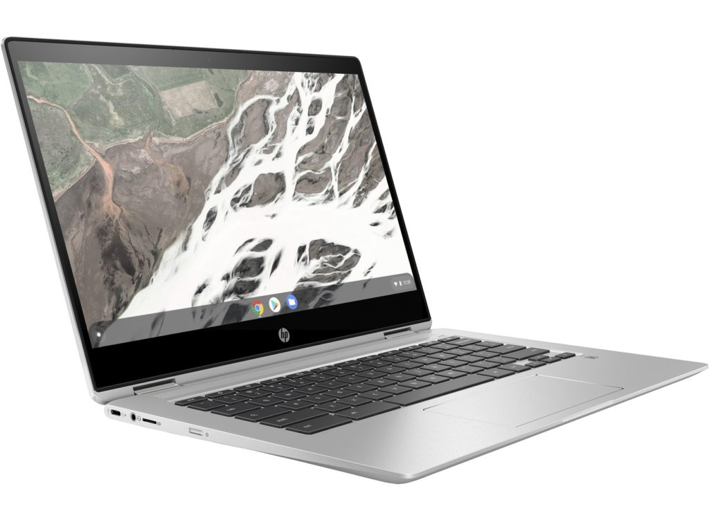

It's been an exciting 2019 for Chromebooks as we've passed the [10th anniversary of Chrome OS](https://www.aboutchromebooks.com/news/chrome-os-is-10-years-old-heres-the-first-demo-from-2009/) and have a broad range of devices to choose from. And if you've waited to get your first Chromebook or you're upgrading an older one, Black Friday sales are your best bet for a great deal.

Here's a roundup of some of the better deals that have at least four more years of [Chrome OS software update support](https://www.aboutchromebooks.com/news/chrome-os-software-support-dates-extended-for-more-than-130-chromebooks/). I've skipped any deals on Chromebooks that have internal hardware that's just too old or don't have enough remaining software support in my opinion.

To keep this list somewhat concise, I've only listed the major specifications to get you started. Click the relevant product link for additional information such as the included ports, case materials, weight, and other information.

All savings are calculated from the MSRP.

Lenovo Chromebook C340

[Lenovo Chromebook C330: $179 ($100 savings)](https://www.bestbuy.com/site/lenovo-2-in-1-11-6-touch-screen-chromebook-mt8173c-4gb-memory-32gb-emmc-flash-memory-blizzard-white/6296001.p?skuId=6296001)

MediaTek MTK 8173C CPU, 11.6", 720p touchscreen, 4GB RAM, 32GB  
storage, memory slot, 2-in-1, no backlit keyboard, 10-hour claimed battery life, good for basic use and/or students. Chrome OS support ends June 2025.

Acer Chromebook Spin 11

[Acer Chromebook Spin 11: $219 ($110 savings)](https://www.bestbuy.com/site/acer-spin-11-2-in-1-11-6-touch-screen-chromebook-intel-celeron-4gb-memory-32gb-emmc-flash-memory-obsidian-black/6175410.p?skuId=6175410)

Intel Celeron N3350 CPU, 11.6" 720p touchscreen, 4GB RAM, 32GB  
storage, memory slot, 2-in-1, no backlit keyboard, 10-hour claimed battery life, good for basic use and/or students. Chrome OS support ends June 2024.

HP Chromebook X360 14

[HP Chromebook X360: $349 ($250 savings)](https://www.bestbuy.com/site/hp-2-in-1-14-touch-screen-chromebook-intel-core-i3-8gb-memory-64gb-emmc-flash-memory-white-gold/6365772.p?skuId=6365772)

Intel Core i3 8130U CPU, 14" 1080p touchscreen, 8GB RAM, 64GB storage, memory slot, 2-in-1, backlit keyboard, 14-hour claimed battery life, good for most people save for power users and/or developers. Chrome OS support ends June 2025.

Samsung Chromebook Plus V2

[Samsung Chromebook Plus V2: $329 ($170 savings)](https://www.amazon.com/Samsung-Chromebook-Plus-Camera-Chrome/dp/B07J1SY5QQ/)

Intel Celeron 3965Y CPU, 12.2" 1920x1200 touchscreen, 4GB RAM, 32GB  
storage, memory slot, 2-in-1, no backlit keyboard, included digital stylus, 10-hour claimed battery life, good for everyday browsing, a few Android apps, and notetaking. Chrome OS support ends June 2024. (Note: [You can spend $69 more and get 64GB of internal storage](https://www.amazon.com/dp/B07J215RPT/ref=twister_B07KJX74NH?_encoding=UTF8&psc=1).)

Acer Chromebook 715

[Acer Chromebook 715: $299 ($100 savings)](https://www.walmart.com/ip/Acer-Chromebook-715-15-6-Full-HD-Touchscreen-Intel-Core-i3-8130U-4GB-DDR4-128GB-eMMC/435795966)

Intel Core i3-8130U CPU, 15.6" 1080p touchscreen, 4GB RAM, 128GB  
storage, memory slot, clamshell, no backlit keyboard, dedicated numeric keypad, 12-hour claimed battery life, good for everyday browsing, Android apps, and light Linux use. Chrome OS support ends June 2025.

Google Pixel Slate with keyboard

[Google Pixel Slate, included keyboard and pen: $449 ($648 savings)](https://www.bestbuy.com/site/google-pixel-slate-12-3-tablet-64gb-midnight-blue/6306459.p?skuId=6306459)

Intel Core m3-8100Y CPU, 12.3" 3000x2000 touchscreen, 8GB RAM, 64GB storage, detachable tablet, backlit keyboard, digital pen, 12-hour claimed battery life, good for everyday browsing, Android apps, and Linux use but not for developers. Chrome OS support ends June 2026. (Note: [You can upgrade to a Core i5 and double the storage for an additional $200](https://www.bestbuy.com/site/google-pixel-slate-12-3-tablet-128gb-midnight-blue/6306462.p?skuId=6306462))

Asus Chromebook C425

[Asus Chromebook C425: $329 ($120 savings)](https://www.walmart.com/ip/FHD-Storage-4-Way-Processor-RAM-OS-C425-ASUS-Intel-4GB-128GB-Chrome-Chromebook-14-Core-Silver-NanoEdge-m3-8100Y-Clamshell-eMMC-Laptop-KB-Backlit-C425/584873797)

Intel Core m3-8100Y, 14" 1080p non-touchscreen, 8GB RAM, 64GB  
storage, clamshell with a 180-degree hinge, backlit keyboard, 12-hour claimed battery life, good for everyday browsing, Android apps, and Linux use but not for developers. Chrome OS support ends June 2026.

Which to buy?

If your budget allows for it, I'd probably consider either the Pixel Slate bundle first but if you'd rather not have a Chrome OS tablet -- even with the included keyboard and pen -- I think the HP Chromebook X360 14 is a stellar deal as well, with the larger Acer Chromebook 715 closely behind.

The Asus Chromebook C425 isn't a bad pick either but lacks a touchscreen. The other models aren't bad, and most are less expensive, however, they are a bit older and don't have the performance and power of my recommended trio.
