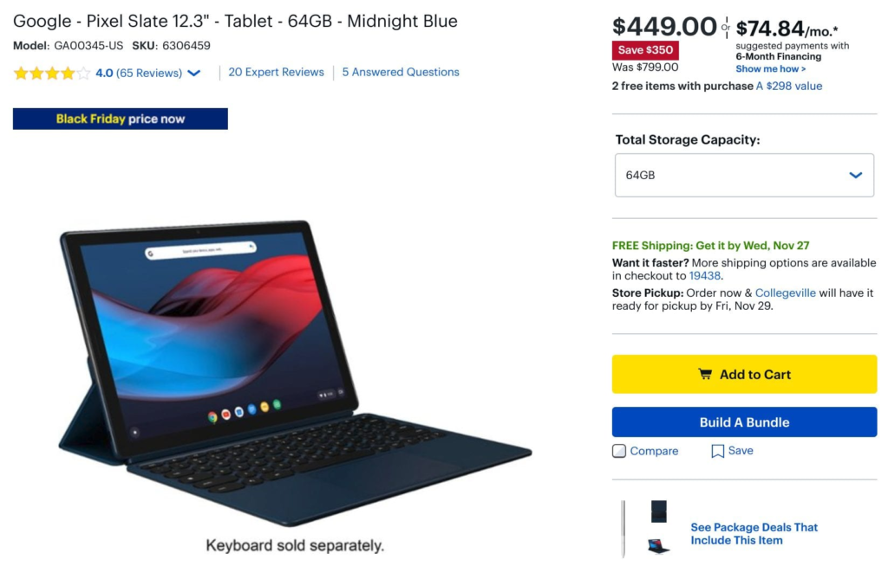

If you want a Chrome OS tablet, I don't think you'll see a better deal any time soon on the Pixel Slate bundle deals that went live today. You can choose either the Core m3, i5 or i7 Pixel Slate, each with a $350 discount **and** get both a free Pixel Slate keyboard and Pixelbook pen.

[This deal went live today in the U.S. at Best Buy](https://www.bestbuy.com/site/google-pixel-slate-12-3-tablet-64gb-midnight-blue/6306459.p?skuId=6306459), although there's a similar deal at the Google Store with just one difference that I'll mention in a bit.

With the bundle, for example, you can choose the base Core m3 model of the Pixel Slate, which typically retails for $799, and snag it for $449. That alone is a super deal but Best Buy also includes the $199 Google Pixel Slate Keyboard and the $99 Google Pixelbook Pen.

So for just a little more than half-price of the typical Pixel Slate cost, you're getting the Slate, keyboard, and stylus. For most Chromebook users, [I'd say this model is more than adequate](https://www.aboutchromebooks.com/reviews/google-pixel-slate-review/) with its 8 GB of memory and 64 GB of storage.

Folks who plan to rely on Linux apps for a good portion of their day may want to consider stepping up to the Core i5; it has the same 8 GB of RAM but doubles the local storage capacity and adds a slight bit more CPU performance.

I mentioned the [Google Store as having a very similar deal](https://store.google.com/product/pixel_slate). And it does, but with one difference. You still get the Pixel Slate, keyboard and pen, however, you can choose which keyboard you want: Either the Google Pixel Slate keyboard or the Brydge G-Type keyboard. If you plan to use your Pixel Slate on a desk for most or all of the time, I like the latter. But if you want a comfortable device to use on your lap, I'd go with the Brydge.

In either case, you're getting a solid device at a bundled price I never expected to see.

Should you be concerned that Google won't be making Chrome OS tablets in the future? I don't see why because that has nothing to do with the Chrome OS tablet they make _now_.

The [Pixel Slate will have Chrome OS software updates through June 2026](https://www.aboutchromebooks.com/news/chrome-os-software-support-dates-extended-for-more-than-130-chromebooks/), meaning it will continue to get new features, security patches, and other software improvements. And all of those software bits are needed for the many 2-in-1 Chromebooks on the market since they all run in a tablet-only mode when the keyboard is folded behind the display.
