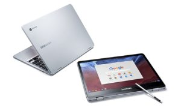
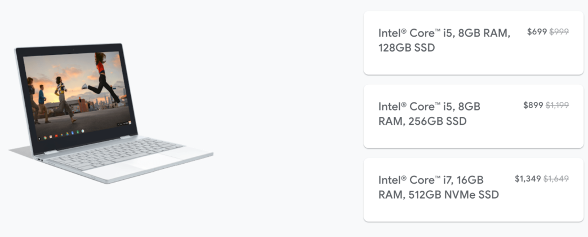
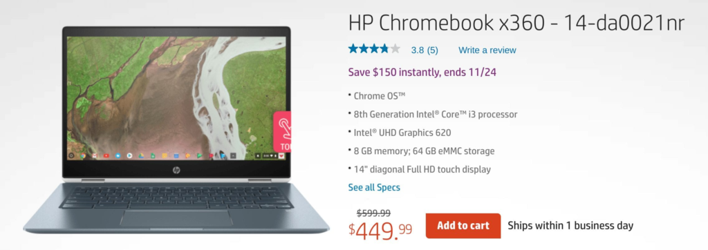
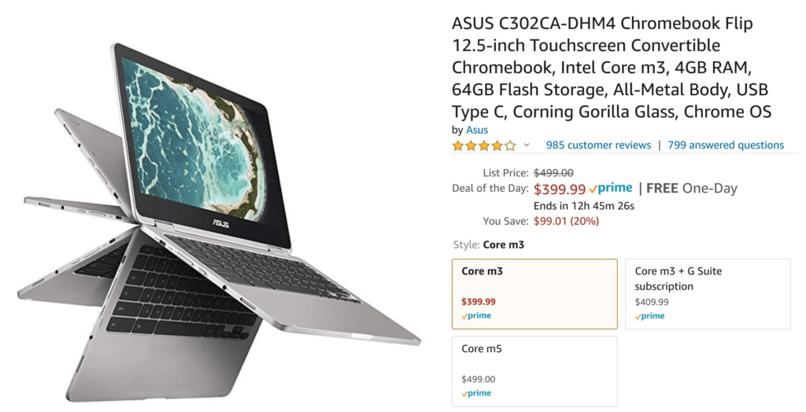

Now's a great time to be in the Chromebook buyer's market and not just because we're entering the Black Friday sales season. There's much wider range of Chromebooks at nearly every budget; more so than any year I can remember.

Here are some of the Black Friday deals I've found so far, including a few that are already available. I'll add more to this list if I come across any more throughout the week, so check back!

I already pointed out [Samsung's Chromebook Plus v2 and Chromebook Pro sale prices](https://www.aboutchromebooks.com/news/early-black-friday-deals-samsung-chromebook-plus-v2-and-pro-discounts/), which are currently available to save you up to $150 off. My recommendation of the four choices is the [$449.99 Samsung Chromebook Plus v2](https://www.samsung.com/us/computing/chromebooks/12-14/samsung-chromebook-plus-xe520qab-k02us/); it seems to offer the most bang for the buck.

Although you can't get a deal on the [$899 Acer Chromebook Spin 13 I recently reviewed](https://www.aboutchromebooks.com/reviews/acer-chromebook-spin-13-review-vs-pixelbook/), there are several other models that will be discounted at various retailers:

- [Acer Chromebook 15 CB515-1HT-P39B](https://www.amazon.com/Acer-Chromebook-CB515-1HT-P39B-Pentium-Storage/dp/B076V3YMRY) is normally $399.99 but will be $299.99 on Amazon this Friday only.
- [Acer Chromebook 11 CB3-132-C4VV](https://www.amazon.com/Acer-Chromebook-Celeron-Storage-CB3-132-C4VV/dp/B0795W86N4) will be on the Amazon Treasure Truck for Cyber Monday, normally priced at $219.99 on sale for $119.99.
- [Acer Chromebook R13 CB5-312T-K5X4](https://www.costco.com/Acer-R13-Touchscreen-2-in-1-Chromebook---1080p.product.100321190.html) will be $100 off at Costco, priced at $299.99 from 11/21 to 11/26. Note that this [ARM-powered Chromebook recently gained Project Crostini support for Linux apps](https://www.aboutchromebooks.com/news/project-crostini-brings-linux-apps-to-the-arm-based-acer-chromebook-r-13/) in the Dev Channel of Chrome OS 72.

For those looking to score a deal on the Google Pixelbook, this is the best pricing I've ever seen for the 2017 model, which is my daily driver. Well, at least until I get my Pixel Slate, that is. Starting today and running through November 28, [Google is directly selling all three Pixelbook models at a $300 discount](https://store.google.com/product/google_pixelbook) and zero percent financing over 24 months. I've also seen this price cut at Best Buy and other retailers.

Speaking of Best Buy, the big box store has [a dozen Chromebooks on sale for Black Friday](https://www.bestbuy.com/site/promo/black-friday-laptop-computer-deals-1?qp=operatingsystem_facet%3DOperating%20System~Chrome%20OS) and you don't have to wait to take advantage of them. Here's a sample:

- The new [Dell Inspiron Chromebook 14 is $499.99](https://www.bestbuy.com/site/dell-inspiron-2-in-1-14-touch-screen-chromebook-intel-core-i3-4gb-memory-128gb-emmc-flash-memory-urban-gray/6299820.p?skuId=6299820), saving you a $100 for the Core i3 2-in-1 laptop with 8GB 4GB of RAM, 128 GB of storage and 1080p touchscreen.
- The [HP Chromebook X2 tablet](https://www.bestbuy.com/site/hp-2-in-1-12-3-touch-screen-chromebook-intel-core-m-4gb-memory-32gb-emmc-flash-memory-hp-matte-finish-in-ceramic-white-and-oxford-blue/6240850.p?skuId=6240850) with detachable keyboard, Core m3, 4GB of memory and 32GB of storage is also $499, down from its $599 price.
- The capable but bare-bones [Dell Inspiron 11.6" Chromebook](https://www.bestbuy.com/site/dell-inspiron-11-6-chromebook-intel-celeron-4gb-memory-32gb-emmc-flash-memory-black/6293621.p?skuId=6293621) with Celeron, 4GB of RAM, 32GB of storage and 720p display is a bit old but at $149.99 is good enough for basic browsing on a budget.

WalMart also has a basic 2-in-1 device available for [$50 off with the Lenovo Chromebook S330](https://www.walmart.com/ip/Lenovo-Chromebook-S330-14-0-Notebook-Chrome-OS-MediaTek-MT8173c-Quad-core-processor-4GB-Memory-32GB-EMMc-SSD-Storage-Business-Black/206750547) but you may not find it in stores. If you don't mind ordering for delivery the MediaTek MT8173c-powered Chromebook with 4GB of RAM and 32GB of storage and 14-inch display -- 720p only though -- is $199.99.

Aside from these specific deals I highlighted, I saw a number of super low-cost [Chromebook sales at Target, which has a pair of older HP choices for $199.99](https://weeklyad.target.com/search?code=Target-20181117&lnk=PreviewtheBlack&page=1&keyword=chromebook), and an [Acer 14 NX.GC2AA.007 14-inch Chromebook also for $199.99](http://weeklyad.staples.com/staplessd/weeklyad?storeid=2399481#!/) (down from $299.99) at Staples.

Clearly, many of these sales are on older, less expensive devices, but there are a few mid-range and high-end options too. Have you seen any other Chromebook deals? Drop 'em in the comments!

**Another deal found:**

The HP Chromebook X360, which has very similar specifications to the HP Chromebook X2, is [on sale directly from HP for $449](https://store.hp.com/us/en/pdp/hp-chromebook-x360-14-da0021nr), which is $150 off. Thanks for the tip, George!

**[One day only deal (11/23) on the Asus C302 from Amazon:](https://www.amazon.com/C302CA-DHM4-Chromebook-12-5-inch-Touchscreen-Convertible/dp/B01N5G5PG2/ref=sr_1_23_sspa?s=pc&ie=UTF8&qid=1543000391&sr=1-23-spons&keywords=Chromebook&psc=1) $99.01 off:**

 

_Updated on November 19 at 10:51am: Corrected Dell deal at Best Buy to show 4GB, not 8GB, of memory._
