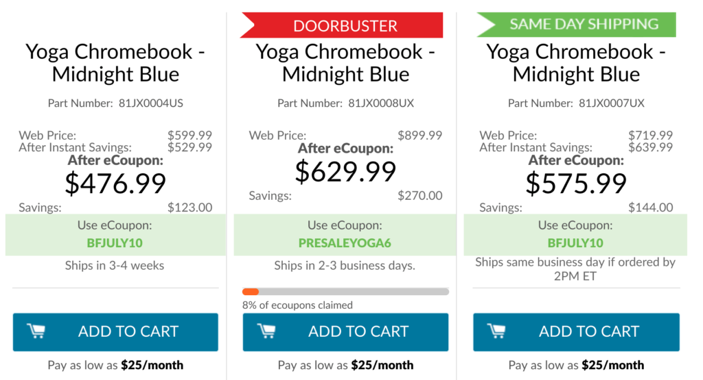

While everyone is getting ready for Amazon's Prime Day to start on Monday, Lenovo is jumping the sale gun with Black Friday in July pricing. All three of the [Lenovo Yoga Chromebook C630 2-in-1 laptops are discounted from 10 to 30 percent](https://www.lenovo.com/us/en/laptops/lenovo/lenovo-n-series/Yoga-Chromebook/p/88YGCC61096), with the largest discount on the 4K model.

Since the Lenovo site is showing these models out of order, at least in my opinion, here's a clarification of the prices; I've bolded differences as compared to the middle configuration.

- $476.99: **Intel Core i3**, 8 GB RAM, **64 GB storage**, 1920 x 1080 display
- $579.99: Intel Core i5, 8 GB RAM, 128 GB storage, 1920 x 1080 display
- $629.99: Intel Core i5, 8 GB RAM, 128 GB storage, **3840 x 2160 display**

Note that the two least expensive options a reduced with the Black Friday in July code. The 4K pricing has a special discount code and as of this writing, you can see that 8 percent of those have been claimed, so I wouldn't wait if you want that particular device at a 30 percent discount.

All three models share these features: Bluetooth 4.1, 802.11ac Wi-Fi (2 x 2 MIMO), 720p HD camera, 2 USB Type-C ports, 1 USB Type-A port, a backlit keyboard, and MicroSD card slot.

With the 15.6-inch display across the lineup, if you're looking for a small, light Chromebook, this isn't the one for you. For those that don't mind toting a larger, 4.2-pound Chromebook - or plan to mainly use it on a desk - the Lenovo Yoga Chromebook C630 should handle just about anything you need it to.
