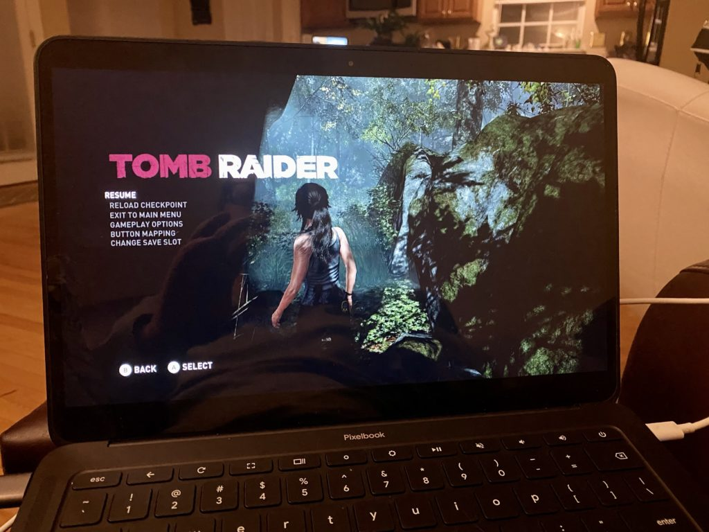
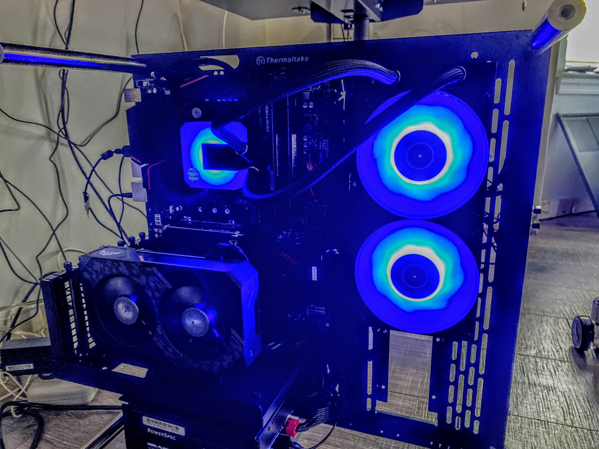
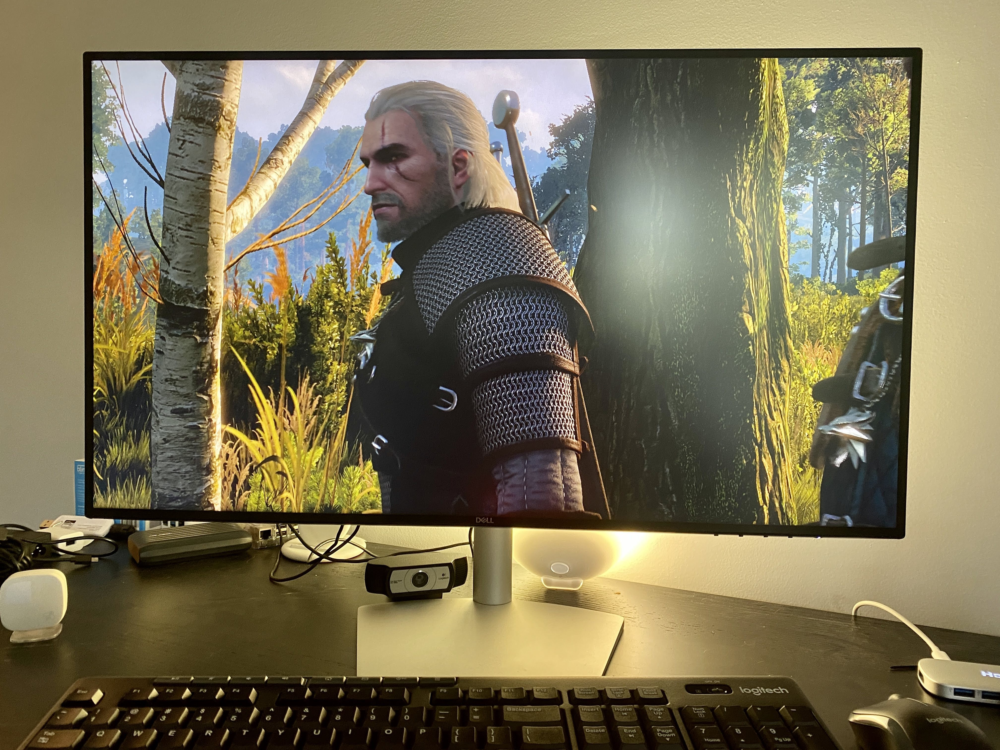

Another week brings another perk to Chromebooks, following on [last week's deal for 100 GB of Dropbox storage](https://www.aboutchromebooks.com/news/how-to-get-100-gb-of-free-dropbox-storage-for-a-year-on-your-chromebook/). This week you can [snag three free months of Stadia Pro, which is a value of $29.97 at the Chromebooks Perks site](https://www.google.com/chromebook/perks/?id=stadia.pro.2020). And even if you bought a super inexpensive, low-end Chromebook that was released on or after July 2017, you can get this deal and stream playable video games from Stadia.

That's the kicker to this deal: It's only available for people who bought Chromebooks released after that date. So if you haven't upgraded in a while, you're out of luck, although I'd still hit the Chromebook Perks page and try anyway.

Since games are streamed, [it really doesn't matter what kind of processor or how much memory you have in your Chromebook](https://www.aboutchromebooks.com/news/google-stadia-turns-every-chromebook-into-a-pc-gaming-rig/): All the heavy lifting is done in the cloud on Google's Stadia servers. The more important aspects are how fast is your internet connection and the ping or latency time between you and the Stadia servers.

I did pony up for the Google Stadia's Founders Edition, which gave me Stadia Pro free for three months, as well as the Stadia controller. But I've dropped the $9.95 subscription plan once, came back for another month, and then killed it again.

I will take advantage of this offer though because it doesn't matter if you've had a free Pro trial in the past or not.

Stadia works well for me on my Chromebooks and even in 4K HDR resolution for most games on my HDTV with the Chromecast Ultra that was also part of the Founders Edition package. Technically most games are't running native 4K but at a lower resolution that's scaled up to 4K. Even so, they look good.

On the smaller screen of a 1080p or better resolution Chromebook, they still look good since even though there are fewer pixels than on a 4K TV, they're packed in tighter.

So why have I flip-flopped with Stadia Pro a few times now? If I just wanted to game by myself with some of the free Pro titles or the few games that I did buy at a discount, I probably would stick with the service. It gives me flexibility to play anywhere and adds extra value to my Chromebooks.

But my son is into games that aren't yet available for Stadia and he was badgering me to play with him. So I spent far more money than a Stadia Pro subscription and [built a gaming PC](https://www.kctofel.com/2020-06-28-should-everyone-build-their-own-pc-at-least-once/), which I've already [upgraded](https://www.kctofel.com/2020-07-17-this-68-storage-upgrade-was-well-worth-it-even-if-it-was-twice-the-cost-of-an-ssd/) three times in [the past month](https://www.kctofel.com/2020-07-31-I-was-so-wrong-dont-build-your-own-PC/) with a faster NVMe drive, an industrial open-air wall-mountable case and a liquid CPU cooler.

Yes, it would have been cheaper to just stick with Stadia Pro (by a long shot!) but I do enjoy gaming with my son and some of my college friends. Besides, I do love me some Witcher 3!

My PC build expenses actually underscore the value of a Stadia Pro subscription, though.

You don't **_have_** to buy a PC, build your own gaming rig, or purchase a console. Nor do you have to spend extra money adding to or upgrading any of those devices; Google will upgrade its Stadia servers over time to handle the latest software and gaming requirements. However, you are limited to the available game titles, which has been steadily growing each month.

Even if you're not a gamer or you're just a casual one, you can't beat this deal if you have an eligible Chromebook purchase. Stadia Pro members get free games each month, although you can only play them while you're a subscriber, and discounts on game purchases, which you can play even on the free 1080p Stadia plan.

Note that you will need [a supported USB or Bluetooth game controller from this list](https://support.google.com/stadia/answer/9578631?hl=en): DualShock 4, Xbox One, Xbox Elite, XBox Adaptive, Xbox 360 or Switch Pro Controller.
