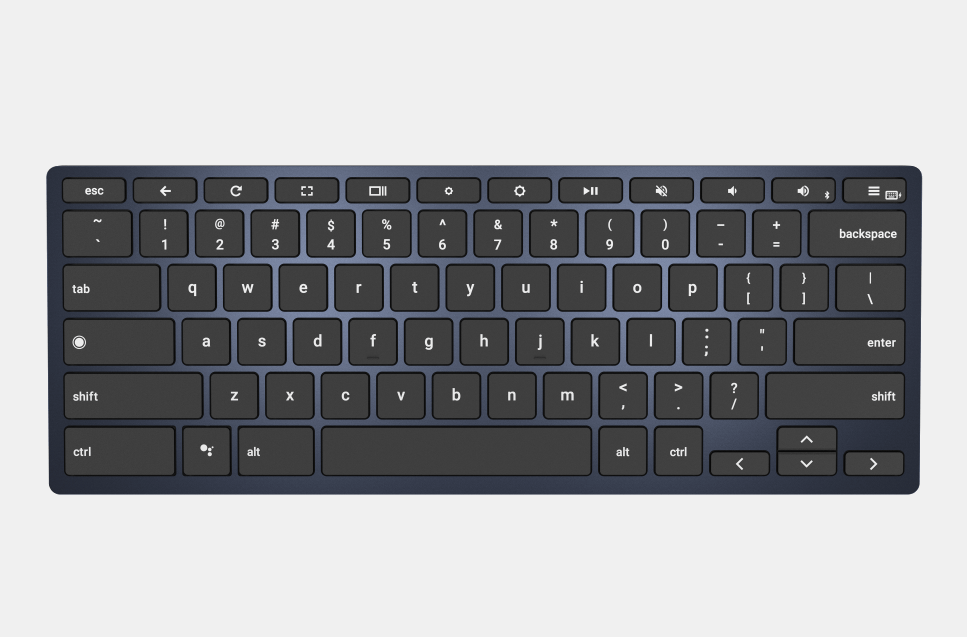
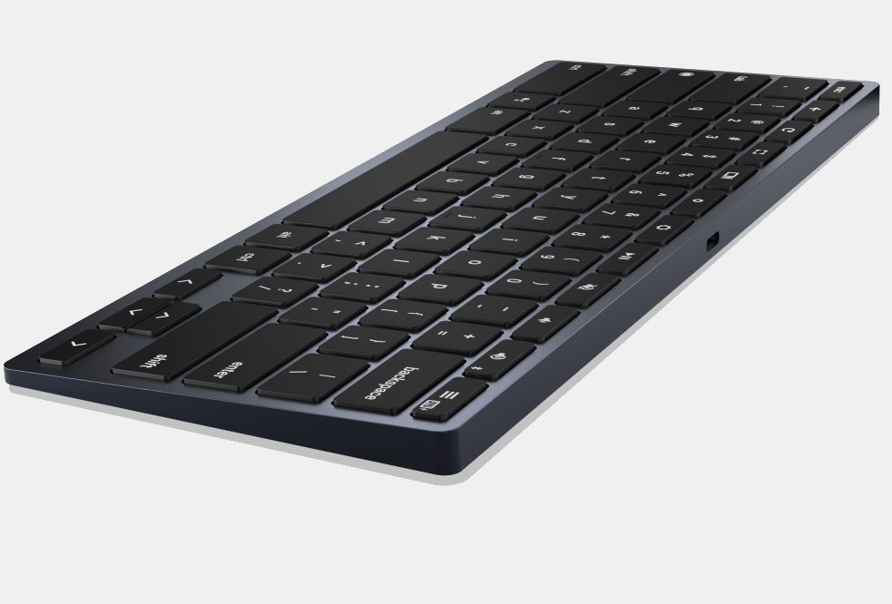
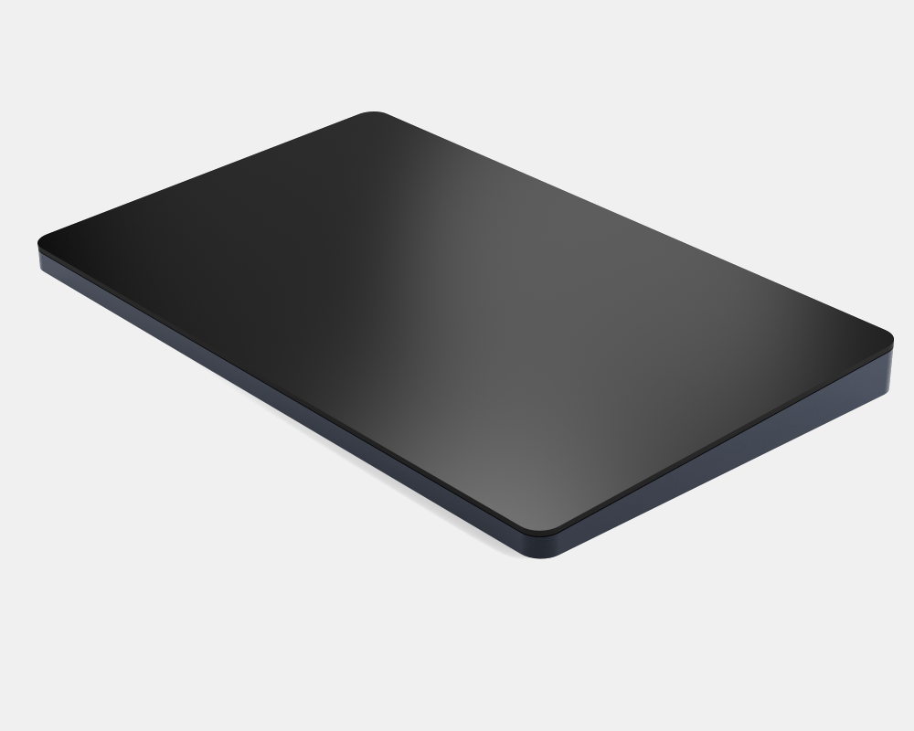

In January at the Consumer Electronics Show, I got an early look at the Brydge C-Type keyboard for Chrome OS and it's now available. You can order the [Brydge Type-C dual-connectivity keyboard now for $99](https://www.brydge.com/products/c-type-wireless-keyboard-for-chrome), with shipments starting on May 17.

If the Type-C looks like Brydge's own Type-G, that's because it's essentially the same design and the company [worked directly with Google to make both keyboards](https://www.aboutchromebooks.com/news/brydge-wallaby-goanna-keyboards-for-chrome-os-pixelbook-nocturne-tablets/). The Type-G appeared at the same time as the Google Pixel slate and Google's own keyboard for that tablet.

While I opted for the Google Pixel Slate Keyboard for my tablet - even though its design does make for some lapability challenges - many Brydge Type-G owners are happy with their choice.

And in my short type with the Type-C at CES, I was impressed. I'll have to get a review unit for a fuller opinion but the Type-C provided a solid typing experience, has a backlit keyboard and works either over USB-C or Bluetooth. Note that you also get a dedicated Google Assistant key. Brydge says to expect up to six months of typing on a single charge.

Assuming my first impressions hold true with the shipping units, the Brydge Type-C wireless keyboard could be ideal for Chromeboxes or Chrome OS tablets.

By the way, there's a matching Brydge Type-C wireless trackpad as well; that's listed as "coming soon".

Thanks to George for the tip!
