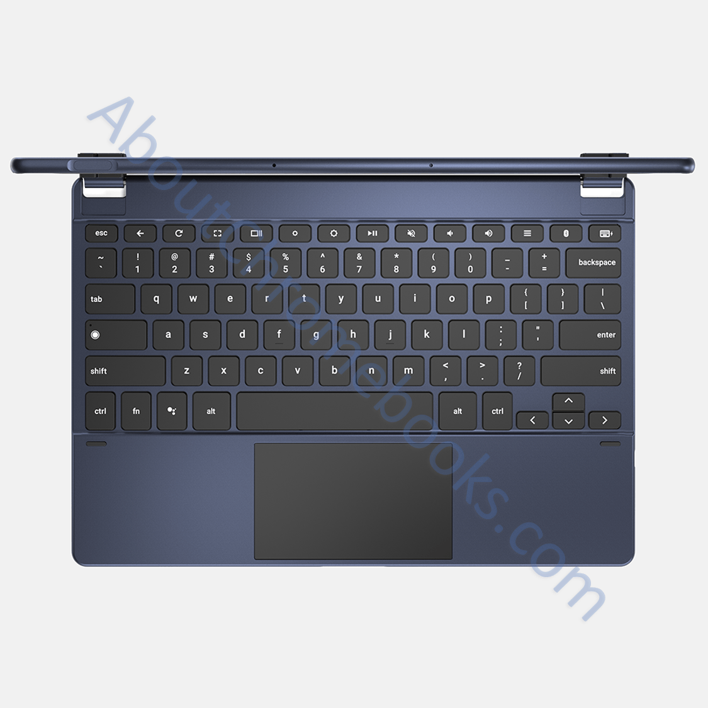
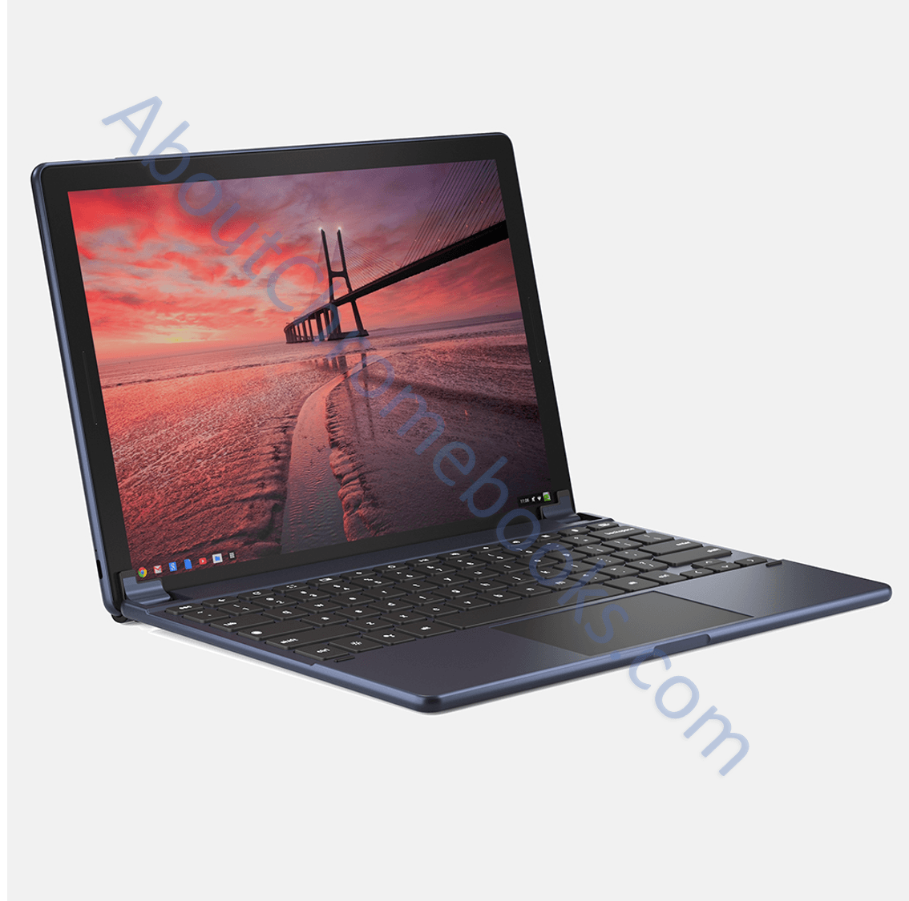
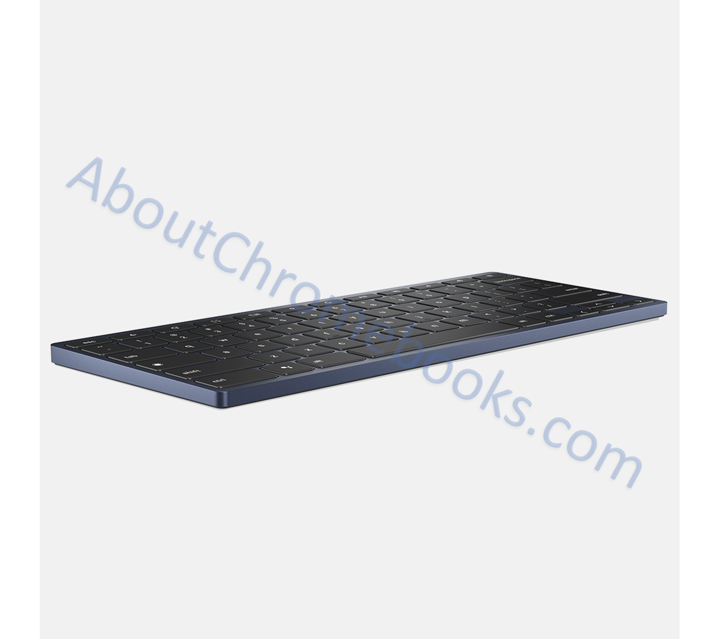
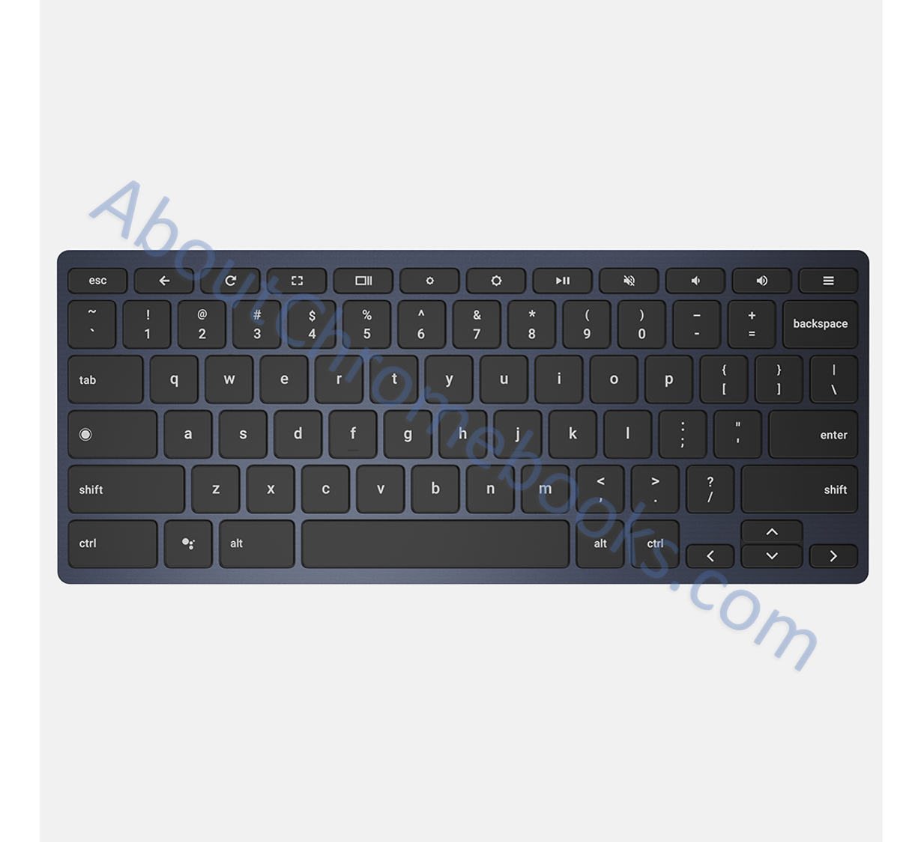

Earlier today I noted that Chrome OS would be supporting [a range of interchangeable keyboards for Chrome tablets](https://www.aboutchromebooks.com/news/interchangeable-chrome-tablet-keyboard-bases-google-assistant-key/). This is great news because it will bring choices and options to what I expect will be a number of Chrome tablets in the coming months. Or even in the coming weeks since [Google is holding an event on October 9 where a detachable or tablet is widely expected](https://www.aboutchromebooks.com/news/pixelbook-2-atlas-nocturne-madebygoogle-event-october-9/).

I thought that is odd that the Chrome OS code for these keyboards changed recently: Brydge, a maker of third-party keyboard bases for the iPad, was originally mentioned. Later, Brydge was swapped out for the name Wallaby, so I did some digging. My research yielded not one, but _**two**_ Brydge keyboards coming for Chrome OS.

Say hello to Wallaby and Goanna:

\[caption id="attachment\_1727" align="aligncenter" width="1125"\] Wallaby keyboard from Brydge top view with Assistant and Hamburger keys\[/caption\]

\[caption id="attachment\_1726" align="aligncenter" width="1134"\] Wallaby Bluetooth keyboard from Brydge angled\[/caption\]

\[caption id="attachment\_1730" align="aligncenter" width="1245"\] Goanna Bluetooth keyboard angled from Brydge\[/caption\]

\[caption id="attachment\_1731" align="aligncenter" width="1209"\] Goanna Bluetooth keyboard top view from Brydge\[/caption\]

I was unable to find any pricing information on these but my gut says we'll know that soon. If nothing else, I figure Google will mention these keyboards at the October 9 event, even if pricing and availability info will later follow. It appears both use Bluetooth for connectivity to a Chrome tablet: The Goanna wireless keyboard is.... well, wireless.... and the top-down image of Wallaby shows a gap between the display and base. If Wallaby used pogo pins to connect the display to the keyboard, there wouldn't be a gap.

One last thought: Is this an _actual_ Chrome tablet in the Wallaby pictures? [It appears to be just that and I have more thoughts here](https://www.aboutchromebooks.com/news/first-look-chrome-os-pixelbook-tablet-nocturne-madebygoogle/).
