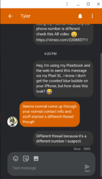

When I'm out and about with my Chrome, I often carry an iPhone. Sure, I use Android too: I have about a dozen Android phones from the past few years to choose from and I swap my SIM around regularly. But when I have both the Google laptop and Apple's handset, people often come up to me and ask: "How can you use an iPhone with a Chromebook?"

The answer is pretty simple to be honest, although you _**do**_ give up a few features. I use Google's apps on the iPhone and don't sync any of my data to iCloud.

What this does is give me a similar experience on my handset, regardless of which phone I'm carrying. And it keeps all of my data in sync between the Chromebook and my phone. Because all of the Google mobile apps I use -- such as Drive, Docs, Sheets, Photos (which syncs your iOS device photos to Google's cloud), Google+, Keep, YouTube, Hangouts, Contacts, Assistant, and Home, to name a few -- are tied to my Google account, the data on my phone is always the same as the data on my Chromebook.

The one app I don't use too much on the iPhone is Chrome, mainly because you can't set it to be the default browser in iOS. So that's a bit of a hitch in my workflow when it comes to bookmarks, the [Continue Reading function in Chrome OS](https://www.aboutchromebooks.com/news/chrome-os-dev-channel-69-update-android-features-project-crostini-smart-text/), and saving articles for offline reading in the browser. To get around the latter issue, I add Evernote to the mix: Between the Evernote extension for Chrome and the ability to share web pages to Evernote in either iOS or Android, I'm pretty much covered. _(Note: This article was originally published in 2018, prior to when Apple allowed you to set third-party apps as a default.)_

And with Google recently adding [Phone Hub functionality](https://www.aboutchromebooks.com/news/better-together-bringing-instant-tethering-voice-calls-and-easy-unlock-to-chromebooks/), I also miss out on some goodies there with my iPhone. I don't mind not being able to instantly tether my Pixelbook to my iPhone because it's pretty simple to enable the hotspot mode in iOS.

But [Android Messages for Web](https://www.aboutchromebooks.com/news/android-messages-for-web-works-great-on-a-chromebook/)? That's not happening either. I may opt to send text messages in Hangouts at some point because that app works seamlessly on either phone.

In fact, I use Hangouts for chatting with folks even when I have **no** phone with me because those chats also appear on my Apple Watch. I have the LTE version and often run out of the house without a phone for an hour or two at a time. Chats from Hangouts appear on my Apple Watch as notifications that I can immediately respond to. I generally do that by voice. It works great, to be honest.

I'm sure there are some other gotchas if you want to use an iPhone with a Chromebook. I use an iOS widget for the Google app, for example, tapping it once to have the Google Assistant listen for voice commands. But for me, that and other little workarounds are relatively minor.

I'm _not_ suggesting you should drop your Android device if you're a Chromebook user. Phone hardware and platforms are personal choices, so use what you want to use.

However, if you thought that you essentially had to use an Android phone because you have a Chromebook, that's not really the case. Just skip Apple iCloud and the iOS native apps where there's a Google equivalent, sign in with your Google account credentials, and you're good to go.

_Update: This article was originally published in August of 2018. It has been updated with a note to reflect that Apple removed one of the iPhone limitations mentioned._
