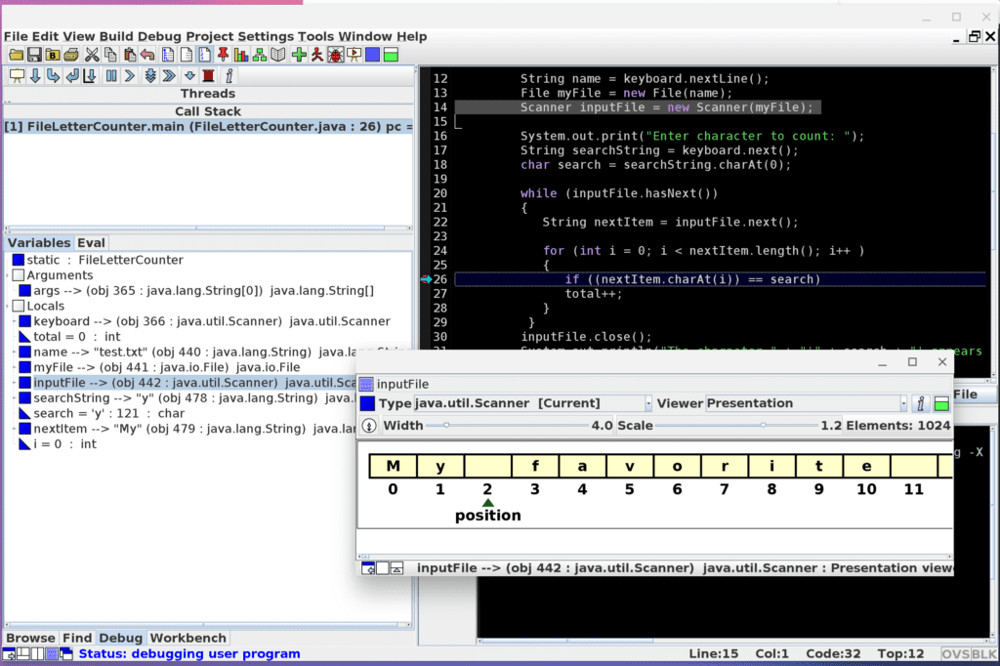

On the Chrome-related sub-Reddit pages, not a week goes by where I don't see someone asking if they can use a Chromebook for their college Computer Science program. I'm betting it's one of the most common questions on those forums.

There's no black and white correct answer to this question as I'd say, "It depends."

I'll go over why that is mainly from my own experiences now that I've completed five of ten courses for a Software Engineering Certificate from my local community college: In four of those five courses, I did use a Chromebook without any issues. And I'm currently taking my sixth class, once again using a Chromebook.

First, let me baseline my thoughts here.

The program of study I'm in is likely very different than most others. If you're going to study Computer Science at a four-year school, you're going to have more computing classes than I am, for example. And as a result, the breadth of software tools you'll need may require traditional desktop applications. You should definitely find out what software you'll need for your program of study and buy the right tool for the task.

In my case, I've had three Java courses: An intro class, object-oriented programming, and data structures/algorithms. These covered the basics and even an entry-level Chromebook costing $250 or so could handle the load.

That's partly because these courses aren't intended for you to write programs with thousands of lines of code and partly because the Java programming tool my school uses doesn't require high-end compute power.

We use [jGRASP, which is a coding environment built by Auburn University that's easy to install on a Chromebook running Linux](https://www.jgrasp.org/). Our school allows for other integrated development environments but prefers jGRASP because it has fantastic visualization tools for debugging.

For example, you can actually see the contents of a data structure or other object in real-time as you step through Java code one line at a time:

Here's another example of when I was learning about linked lists; its easy to see which element links to:

Linked Lists in Java on a Chromebook

I've since moved on to other programming tools for Java (and Python) but if you want a lightweight learning environment for basic programming classes, jGRASP combined with a Chromebook will easily meet your needs. Even a device with a new Pentium and 4 GB of memory will suffice at this point.

Although source code control isn't officially taught in my program, I have [installed and use Git for all of my code](https://git-scm.com/). Again, even a basic Chromebook that supports Linux can easily handle Git in a terminal for version control.

There are several desktop clients for Git and most of these too are fairly lightweight. You don't need a desktop-class processor or 16 GB of memory to use GitKraken, for example, which provides a nice visual interface over using Git in a command-line interface:

My school's course of study also includes one semester of Linux, an introduction to getting around the file system, configuring the environment and learning about different text editors, for example.

Here too, a basic Chromebook will suffice because you have a full Debian Linux distro installed when you enable Linux on a Chromebook. Currently, you get the Stretch version of Debian but [that's about to change with an upgrade to Debian Buster](https://www.aboutchromebooks.com/news/chrome-os-80-for-debian-10-buster-linux-crostini-upgrade/).

Regardless of the version, everything needed for a solid understanding of Linux is there: Vim and vi, the Aptitude package manager, as well as all of the standard native commands built into Linux. Of course, you can install your own shell or file manager of choice, including those with a graphical user interface.

When it comes to using what I'd call a "first-class" integrated development environment, that's when an entry-level Chromebook isn't likely to cut it. You'll want a higher-powered processor and at least 8 GB of memory, which puts you in the $350 (on sale) to $500 price range.

I'm talking about apps such as Eclipse, IntelliJ, Android Studio and Microsoft Visual Studio Code here, all of which I've installed at one time or another on various Chromebooks.

The first three are what I'd call "heavy", meaning that they'll work with 8 GB of memory and a decent Intel Core processor but more power will speed up your coding and compiling experience. And you're going to want more than a paltry 32 GB of storage that's inside most entry-level Chromebooks. If you're frugal on data storage, a 64 GB Chromebook will work but at 128 GB of memory would be ideal.

Microsoft Visual Studio Code is my current tool of choice for coding on a Chromebook for many reasons. But in terms of hardware requirements, it doesn't require much: [Microsoft recommends a 1.6GHz or better processor and one gigabyte of RAM](https://code.visualstudio.com/docs/supporting/requirements). Obviously, that's the minimum and while it does run on a budget Chromebook with Pentium and 4 GB of memory, I'd still spend a little more to beef those attributes up. Disk space is less of an issue here as the app has a disk footprint of just 200 MB.

For comparison purposes, Google recommends an Intel Core i5 U-Series (or better) processor, 8 GB of RAM and 4 GB of disk space [to run Android Studio](https://developer.android.com/studio). And again, this is the bare minimum.

Using Visual Code on a Chromebook, there isn't much I can't do save for an enterprise-class application. For example, to archive episodes for the MobileTechRoundup podcast that I used to record weekly, I had no problem developing and running an app to download them. I'm currently storing them locally but plan to use some Google Drive APIs to put them in my Drive account.

This wasn't a complex or large app but it works, and I was able to use an entry-level Chromebook for it.

My current class is in web development where we're coving the basics of HTML and CSS, along with a light sprinkling of JavaScript. A Chromebook is ideal for this because it's a low-compute activity and because the Chrome Developer Tools are fantastic.

Some folks in my class are using a basic text editor but I turned again to Visual Code due to certain extensions it offers as well as integration with Git. My favorite extension is called [Live Server](https://marketplace.visualstudio.com/items?itemName=ritwickdey.LiveServer): It creates a local web server right on my Chromebook that updates my web page in progress whenever I save a file in Visual Code:

This class doesn't focus on design, at least in terms of creating graphics for a web site. If it did, I'd probably try to use Gimp on Linux although it's easy to argue that the Adobe Creative Suite or some similar software not available on Linux would be better.

All in all, I've been thrilled using a Chromebook for my Computer Science classes. I get fantastic battery life, have plenty of excellent Linux-based development tools and don't need to spend a thousand dollars or more on the laptops I see others buying. Setup and updates are faster and I generally have less maintenance or downtime as well.

I was even able to use a Chromebook for a more complex group project one semester. My team and I used a Raspberry Pi with an RF attachment to read blood sugar and insulin levels from a diabetes medical device.

The project took that data, sent it to the cloud in a MongoDB database and Heroku web app, parsed the data using Python code and then put the relevant data into a Google Sheet, which created a real-time graph using Google Datastudio. We even went a step further having a Wi-Fi-connected light bulb turn red or green based on the data and then supply insulin automatically based on user settings.

Having said that, there are scenarios where a Chromebook just won't cut it for some Computer Science programs. My recommendation is to ask professors, teaching assistants and upper-class students in your program what software tools they needed.

A perfect example is a database class I took where I simply couldn't use my Chromebook because the entire course focused on Microsoft SQL Server.

For that, I essentially **_had_** to use one of the Windows machines in the classroom to create my databases, populate tables with data and then run various queries. You may find that some specific app, service or software for your course of studies means you'll need something other than Linux.

If not, and the tools needed for your courses are relatively light, spending $250 to $350 on a Chromebook could work well. And if you can stretch the budget for one with a better display, more memory and storage, or a stronger processor, that's even better to get you through your Computer Science program.

Multiple Chrome tabs, a PWA, Google Play Music Android app and Linux humming along.

I've piqued the interest of some of my professors by using a Chromebook in my Computer Science classes. So much so that they've asked me to show them the experience and suggest minimum hardware requirements for a coding Chromebook so they can recommend them to students who just don't have the budget for a solid Windows PC or Mac.

I'm putting that list together now and I welcome any input from other students learning to code with a Chromebook. Or even from any full-time developers!
