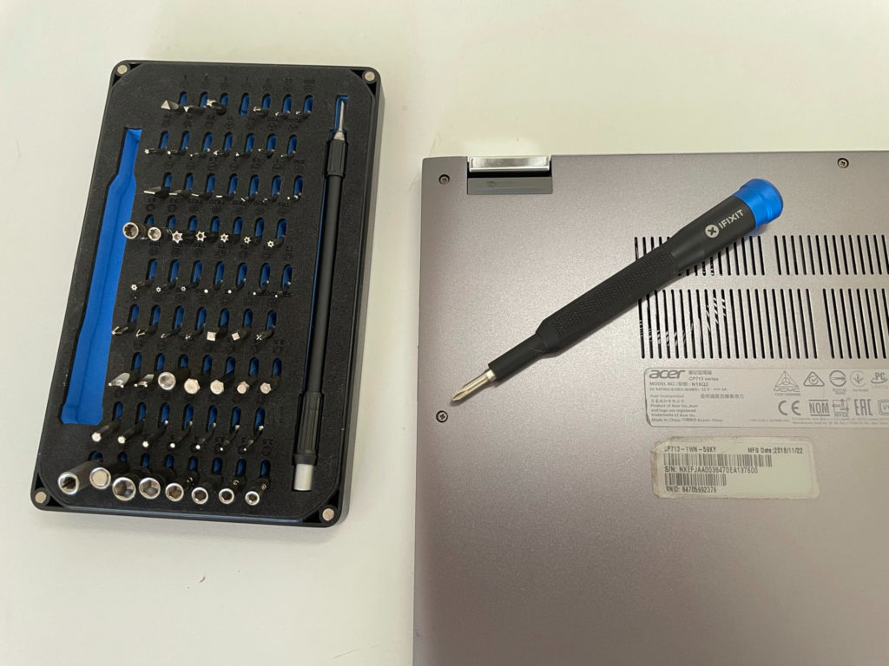
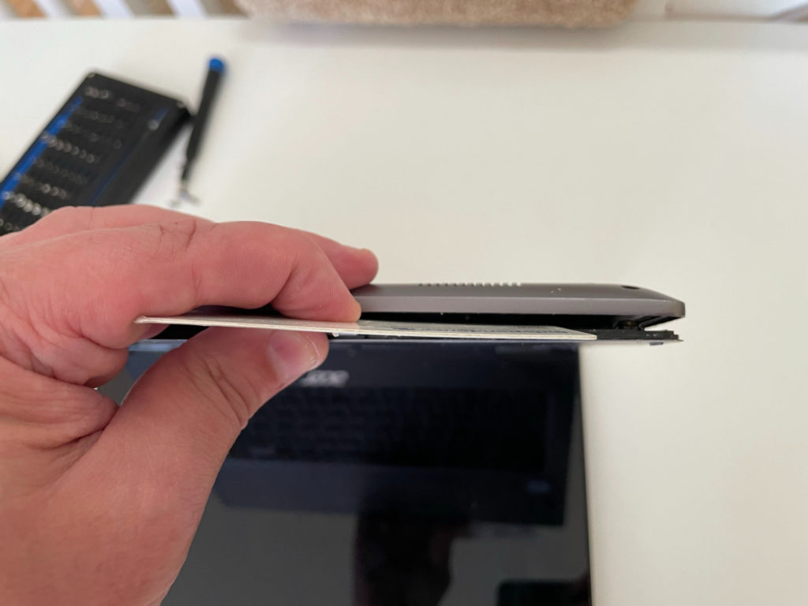
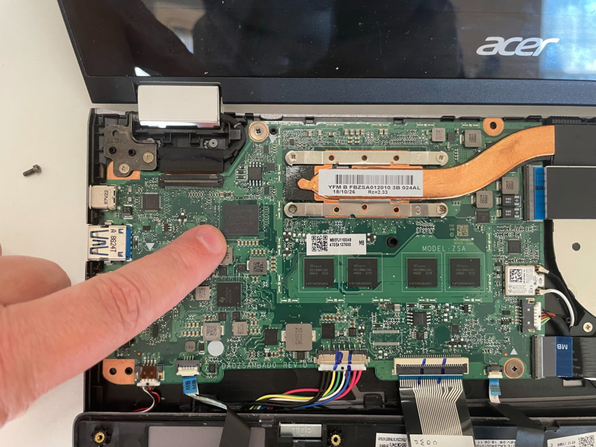
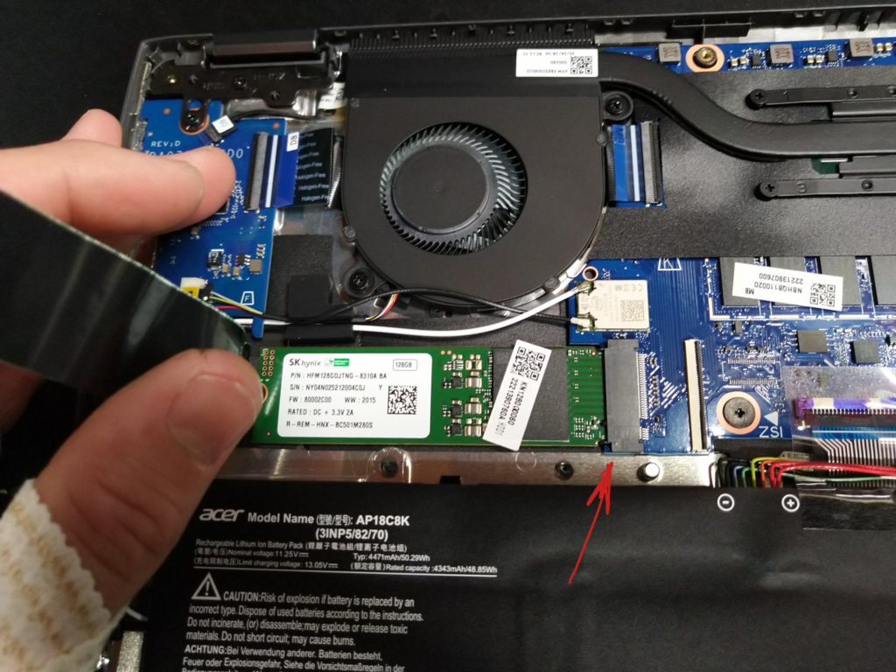

Earlier this week, I shared thoughts on how [my Chromebook might be able to get me through a Masters in Computer Science program](https://www.aboutchromebooks.com/news/linux-on-chromebooks-just-might-get-me-through-a-masters-in-computer-science/). With a Core i5 [and 16 GB of memory, my Acer Chromebook Spin 13](https://www.aboutchromebooks.com/news/acer-chromebook-spin-13-with-16-gb-ram-should-you-buy-one/) has plenty of horsepower, but not enough storage for working with large sets of data. That had me thinking of a question I repeatedly get here: Can you upgrade SSD on a Chromebook?

A reader reached out to me suggesting to upgrade the meager 128 GB of SSD with an M.2 drive. And in theory, that sounds great.

**_But_**, the only Chromebooks that would support such an SSD storage upgrade would already have to use the M.2 hardware specification. And I see no mention of M.2 on the specs of my Chromebook. You'll have to check your own model, of course.

Just to be sure, however, I opened up my Acer Chromebook Spin 13.

It was actually quite easy as I have a good driver set ([the $35 iFixit Mako](https://amzn.to/3vCM2Hk)) and I have experience building computers. I'm not suggesting that you should follow this example; you don't want to break your hardware and if you do, I'm not responsible!

Note that you should remove the battery cable from any Chromebook you have internal access to. And don't leave a power cord plugged in either.

After removing all of the screws on the back chassis, I used a thin plastic rewards card to gently pry the chassis from the keyboard.

With the chassis and keyboard detached, I can now see the motherboard and components inside the Acer Chromebook Spin 13.

And right away, I can see that there isn't an M.2 interface to plug in a larger, faster SSD drive. In fact, I can see the soldered storage on the board, as shown below, and the four soldered RAM chips in the middle as well.

So the specification sheet didn't lie. There is no M.2 interface in the Acer Chromebook Spin 13.

About the only thing I could actually replace is the battery, which is a simple pull of a cable to remove as the battery isn't glued down. My battery is fine though, so I buttoned up the Chromebook in just a few minutes.

Now every Chromebook model is different. Some newer devices, such as the Acer Chromebook Spin 713 (the successor to my device) does use M.2 for storage. Indeed, [a Redditor swapped in a 1 TB M.2 SSD in his Spin 713 last year](https://www.reddit.com/r/chromeos/comments/hjfsj1/i_put_a_1tb_drive_in_my_acer_713/).

Here's a picture of his opened Chromebook showing the M.2 slot that my laptop doesn't have. I annotated the image so you can see the new SSD board and M.2 interface where it's installed.

Once he replaced the storage, he had to get Chrome OS on the SSD, which is done by using [downloadable Chrome OS recovery images](https://www.aboutchromebooks.com/news/why-every-chromebook-owner-should-carry-a-usb-key-or-sd-card-with-them/). These are the images provided by Google in case your software has ever gone bad. After Chrome OS is on the new drive, he just boots up and has access to the larger storage capacity.

Mostly, you'll find upgradeable storage options on higher priced, relatively new Chromebooks. Don't expect to find one in your Celeron or Pentium-based Chromebook, for example. And if you have a high-end Chromebook from more than 2 years ago, like I do, you'll likely be out of luck as well.

In that case, you can always do what I originally plan to do: Attach a large capacity SSD over USB-C or get a large microSD card, even if it's not as speedy as a "true" SSD drive.
