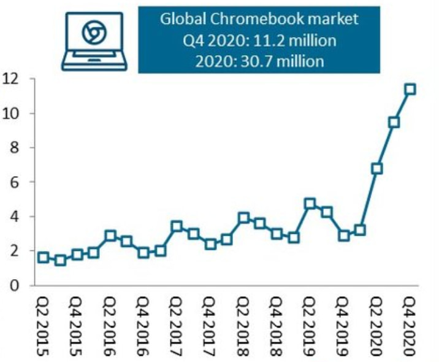
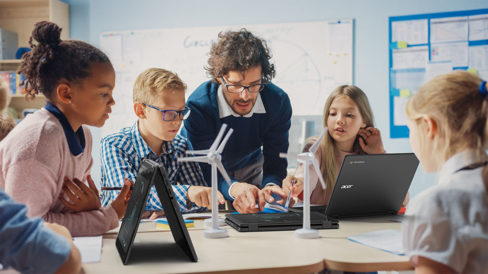
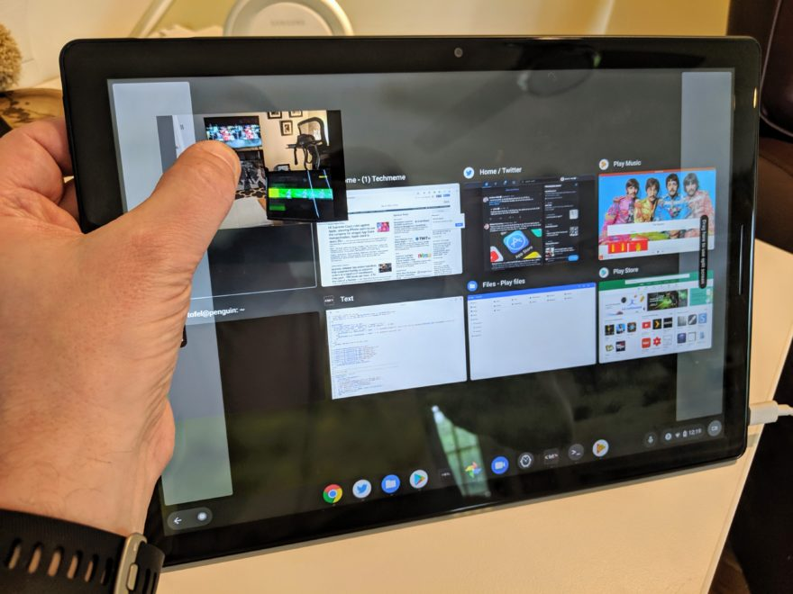
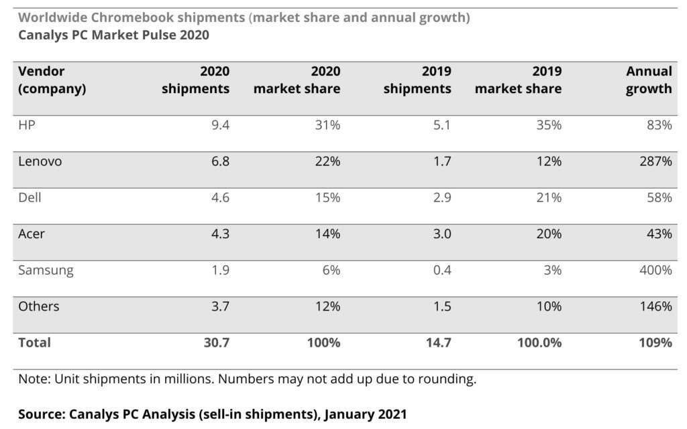

Research firm Canalys shared its estimates of 2020 Chromebook sales and they're up. Way up. [Canalys says that 30.7 million Chromebooks were sold globally in 2020](https://www.canalys.com/newsroom/tablets-chromebooks-q4-2020) amid record demand. In the final quarter of 2020 alone, Chromebook sales were up 287 percent from the fourth quarter of the prior year. While these short term growth spurts are good for the device makers in general, over the long term, they can benefit the entire Chromebook market.

Source: Canalys

People basically two types of takes on Chromebooks, both equally valid. A Chromebook can either meet most of all of someone's computing needs or it can only meet part of them. The latter group, if they understand what a Chromebook can or can't do as compared to what apps they truly need to run, should understand that a Chromebook isn't for them. And that's OK.

The former group can itself be split into to two sub-groups: Those who have tried a Chromebook and those who haven't. And it's in the "those who haven't" slice that might find out that a Chromebook actually can be a full-time computing device. I think that's a very large group.

I agree with Canalys that much of the spike in Chromebooks sales is due to the education market.

As the pandemic hit approximately a year ago, schools are relying heavily on remote learning. And for many districts, that means buying as many Chromebooks as possible to get a 1:1 ratio between students and devices.

Sure, there are low-cost Windows laptops and even iPads being used for this purpose as well. I'm not suggesting that every district is going with Chromebooks. But many are, which created limited Chromebook inventory for much of the second half of last year.

So what happens when these students are working on school work at home with their new Chromebook. Some parents, who aren't Chromebook users, get a first-person view of what a Chromebook can do.

That opens the door to that section of potential Chromebook buyers I mentioned previously: People that haven't experienced Chrome OS and only know it through inaccurate takes like "it's just a browser".

This audience will see that a Chromebook is much more than that, complete with a file system, offline use, fast boot-ups, and seamless updates. They might even see some Android apps in use or the [latest tablet mode interface](https://www.aboutchromebooks.com/news/chrome-os-80-adding-a-tab-strip-tablet-optimized-interface-to-chromebooks/), which is vastly improved since it first arrived.

My point is: Although [Chromebooks have been around for just over a decade](https://www.aboutchromebooks.com/news/chrome-os-is-10-years-old-heres-the-first-demo-from-2009/), a majority of computer users don't really have a good sense of what they offer. Instead, they know (or think they know) what Chromebooks don't offer.

Aside from consistent marketing, the best way to break through to this audience is for them to get a personal look at the Chromebooks of today. I can think of nothing better to help make informed choices on if a Chromebook will suit their needs.

On a related topic, if you're curious about which of Google's hardware partners had a great year for Chromebook sales, Canalys has that estimate too.

HP sold the most but Lenovo jumped from fourth to second overall between 2019 and 2020. I suspect those sales were driven heavily in the consumer market by the [Lenovo Duet Chromebook](https://www.aboutchromebooks.com/news/my-pick-for-2020-chromebook-of-the-year/) and Lenovo Flex 5, which are both solid choices at reasonable prices.

