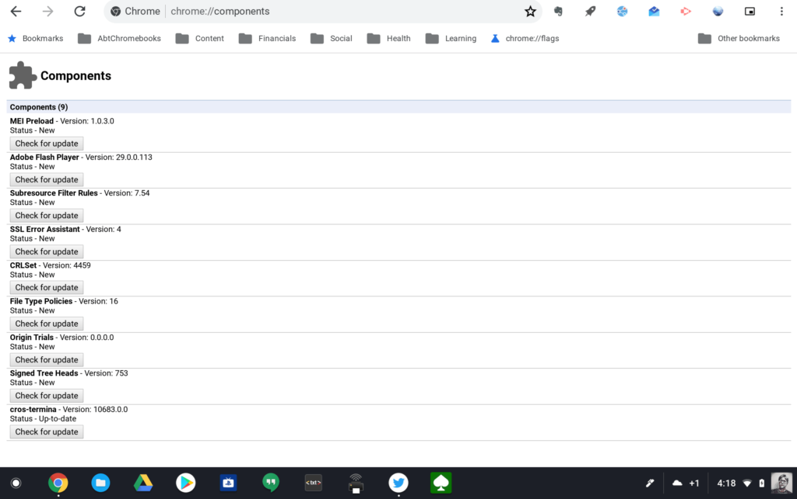
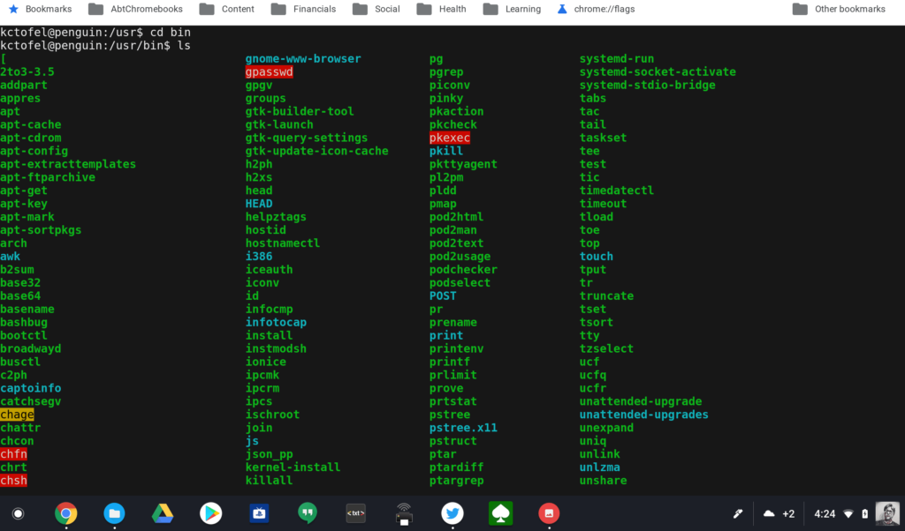

Lo and behold, I made an unintended mistake today and lost the ability to use the Terminal for Linux apps on my Pixelbook. It turns out that you can manually update the Linux container component by typing _chrome://components_ in your browser bar and selecting the Update option for the **cros-termina** component.

Just because you can do something doesn't mean you should. As I, and several others on Reddit found out, the latest version of **cros-termina** sort of breaks the ability to run the Terminal app on a Chromebook. When I click the Terminal app to open it, it appears and then disappears. Fret not because there's a solution. And to be honest, the Chromium team is already working on a fix.

Until that happens, [following these steps will get you back into your Linux apps on Chrome OS](https://www.reddit.com/r/Crostini/comments/8ju1lx/terminal_suddenly_failing_to_start/), which of course is only in the Dev Channel for now.

1. Press _ctrl+alt+t_ to open the standard **crosh** shell in a browser tab.
2. Type _vsh <vm\_name>_, where _vm\_name_ is very likely _termina_ by default.
3. Type  _lxc exec <container\_name> -- /bin/login -f <username>._ The default _container\_name_ should be _penguin_ and the username is whatever user name you used to set up your container in the first place. For me that was _kctofel_.

What should happen -- or at least what happens for me -- is the container opens, but not in the Terminal app. Instead you'll see the Linux environment in **crosh**, however, it works the same as in Terminal.

It's likely we won't need this workaround for long, but I wrote it up because if there's ever a future occurrence of this issue, I suspect this same workaround will do the trick.
