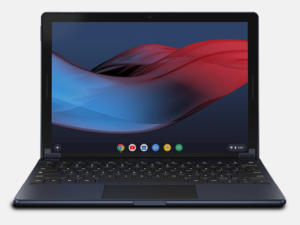
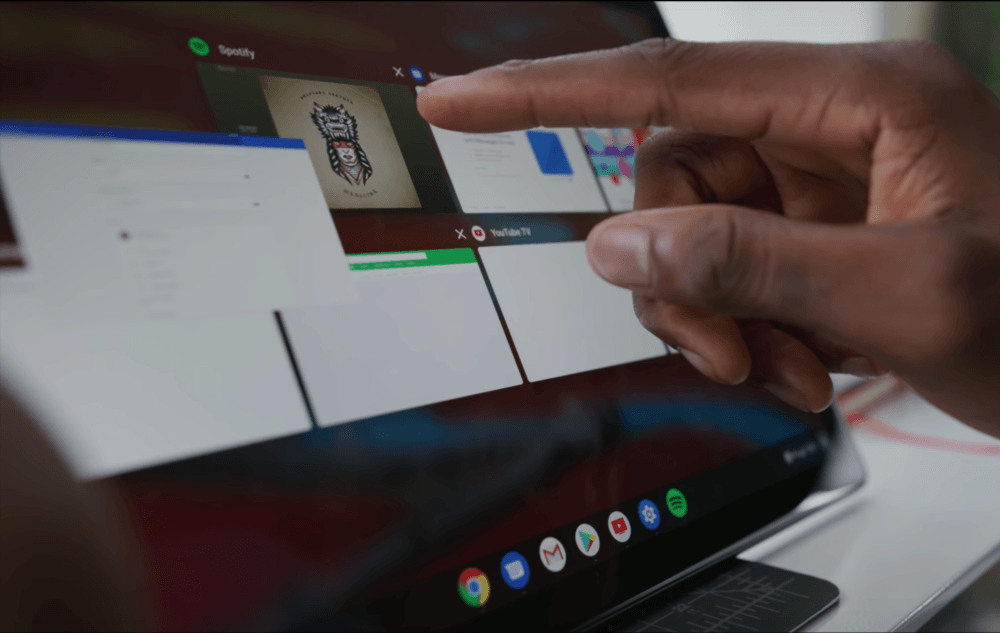

If you haven't seen it yet, one of the best tech reviewers has just reviewed the Pixel Slate. I'm talking about [Marques Brownlee, also known as MKBHD](https://www.youtube.com/channel/UCBJycsmduvYEL83R_U4JriQ). I've long been a subscriber of his YouTube video reviews as they're often top notch. His latest though? It's a bit of a head-scratcher.

Take the 9-ish minutes to watch his video review of the Pixel Slate and then I'll explain why I think this.

\[embed\]https://youtu.be/HOh6d\_r63Bw\[/embed\]

MKBHD bought the Pixel Slate with his own money, which I respect. I generally put more stock in reviews when reviewers outlay their own cash for a device. Here's the thing though: I also put more stock in reviews when the reviewer actually uses the product, service or platform on a regular basis. For example, I wouldn't first go to a Windows-centric site to read an iPad review; instead, I'd go to iOS-related sites because the writers there presumably use iOS quite a bit.

And I don't think MKBHD is a daily Chrome OS user. I could be wrong, but I don't think so. I've only ever seen him review two other Chrome OS devices, [the Google Pixelbook, which he was not a fan of, calling it "$1,000 of weird"](https://www.youtube.com/watch?v=Ja_GMU7-sjs). He also [reviewed the Chromebook Pixel 2 LS](https://www.youtube.com/watch?v=WjUebpBA2AE), saying it's the "most beautiful laptop you shouldn't buy".

I get why he's not a fan: Aside from some of the then-valid software quirks noted in the Pixelbook review, Chrome OS doesn't fit within his daily workflow. MKBHD doesn't have a blog, for example; he churns out super-high quality video reviews, which are fantastic to watch.

What devices does he use for those? Obviously not a Chromebook. Instead, [early this year he was using a first-gen iMac Pro but at that time had ordered a maxed out, iMac Pro that costs $6,999](https://www.youtube.com/watch?v=6UR_H5XJkeM), which makes complete sense for his workflow and the quality of his work. He carries a MacBook Pro when he's on the go. His favorite camera is a Hasselblad X1D, which currently retails for $9,000. Why does this matter? Because MKBHD is what I'd call an "extreme power user" and buys the best devices that do what he needs. Which he should! But clearly, a Chrome OS device isn't one of those.

And that's why I was initially stumped to see that while he bought his own Pixel Slate, he chose the $599 Intel Celeron with 4GB of memory and 32GB of storage. **That's the base model.** After thinking it through, I get why he bought that one though: Why spend more money than needed on a device that's he's really not going to use every day?

He says he thought the Pixel Slate might replace his new iPad Pro, which appears to be (in the video) a 12.9-inch model. Note that the device starts at $999. I really wouldn't expect a $599 tablet to replace a $999 tablet, but that's just me.

Yes, _clearly_ MKBHD's video shows a large amount of what I'd consider unacceptable lag. It's **awful**. But it's not just the device that's part of this equation: It's how the user is actually using it and what the user's expectations are. For many device owners, a Celeron does what they need it to do. However, had you asked me if MKBHD's needs would be met by a Celeron, I could tell you that without even watching this video.

MKBHD says he had high expectations for the Pixel Slate. But the difference between those early expectations and the reality of actually using the device had a very wide delta or difference. As a result, you're left with the impression that nobody should buy the device. I'd argue that a large part of this problem is unrealistic expectations.

What I mean by that the expectation of a Celeron-based computing device to expertly handle the type of multitasking and use cases MKBHD likely experiences with the iPad Pro. In the video, he's got 6 to 8 apps and such running and who knows how many browser tabs. On a Celeron.....With 4GB of memory and a 3000 x 2000 resolution touchscreen display.....

I do agree with MKBHD that perhaps Google shouldn't have made a Celeron version. Or maybe that model should have followed the others a few months later. But Chrome OS is all about choice: A range of devices for different budgets and use cases, so I can see why Google went this route.

As I said in my [Pixel Slate buyers guide](https://www.aboutchromebooks.com/opinion/which-google-pixel-slate-to-buy-guide/), even before I had a device in hand, the Core m3 would be the "sweet spot" when it came to performance and value. As for the Celeron? Here were my thoughts then, which I still believe in today:

> "Is there a market for Celeron options? I’d say yes but those are going to be a tough sell. Why? Because this is entry level performance for the most part and you can get entry-level performance for under $300. Put another way: You really want the tablet form factor if you’re going to spend $600 for a Pixel Slate without a keyboard."

For Chromebook owners that currently use a Celeron-based device, moving to a Celeron-based Pixel Slate is more _a change in form-factor_ than a change in performance and usability. And you'll pay a premium for that different form-factor unless you decide that premium isn't worth it.

Frankly, I think this review does a bit of a disservice to the Pixel Slate because it's not clear until 2/3rds of the way through that this is the Celeron model. This is mentioned in the description but if you get the YouTube link from a social media channel or some other way, the video is likely to begin playing long before you read, if you ever do, the description. You probably will see the video title though, which doesn't mention anything about the lowly Celeron: It's titled "Google Pixel Slate: This Ain't It Chief".

Without a little more clarity up front, or actually buying a higher priced, more comparable model of the Pixel Slate for comparing to the iPad Pro and other devices, people will see this video could assume that the entire Pixel Slate product line is laggy and unusable. That's not my experience with the Core i5 version. And it's not the experience of my podcast co-host and his Core m3 Pixel Slate.

\[caption id="attachment\_2302" align="aligncenter" width="4032"\] Multiple Chrome tabs, a PWA, Google Play Music Android app and Linux humming along.\[/caption\]

Are there still some bugs and issues with my Pixel Slate? Sure. Not enough to keep me from being productive all day and then consuming content on it every night though. I also evaluated my needs _**before**_ choosing my Pixel Slate configuration: The ability to have at least 20 tabs open, some occasional Android apps and a few Linux packages for my CompSci classes. I knew going in that a Celeron with 4GB of memory and 32GB of storage wasn't the answer for me.

To be clear: I don't think the Pixel Slate is the right device for everyone. In fact, I don't think it's the right device for _most_ people. You have to:

- Be satisfied with the Chrome OS platform, or you're already barking up the wrong tree.
- Understand that the primary use case is Chrome OS, not Android or Linux. Both of those latter features need work or are still in development. If you're expecting a great, full-time Android tablet experience, I don't think this is it. Maybe someday it will be, maybe not.
- Want or need a detachable slate enough to justify the premium cost of a thin computing device, otherwise, you should just consider a standard or a 2-in-1 Chromebook, which can be had for the same amount or less and with better performance.
- Have the budget for the configuration that will meet your needs. Hey, I'm sure we'd all like the performance of a Core i7 with 16 GB of memory, but we all don't have $1,599 to spend. And if you only have $599 to drop, then you're likely better off with the new [Dell Inspiron Chromebook 14](https://www.aboutchromebooks.com/news/dell-insipiron-14-chromebook-price-release-date-availability/) or [Lenovo Yoga Chromebook C630](https://www.aboutchromebooks.com/news/4k-lenovo-yoga-chromebook-c630-specs-price-release-date-599/).

Regardless, as much as I do and will continue to love MKBHD's videos, I think on this one, Marques missed the mark.
