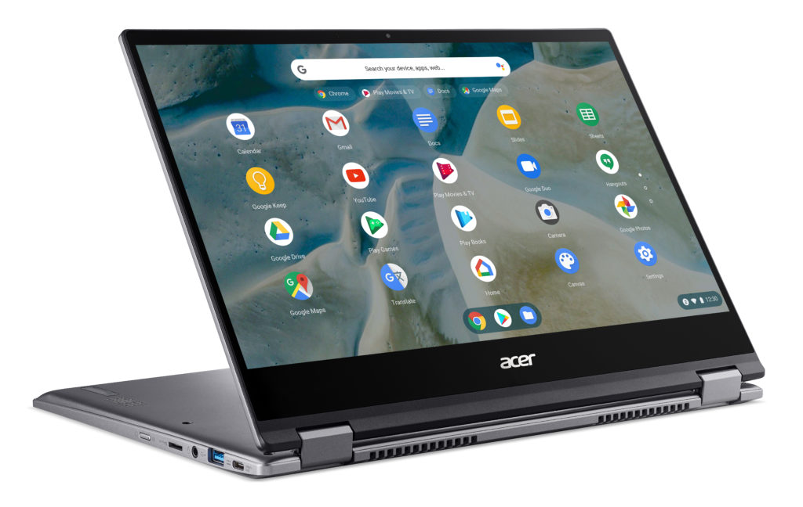
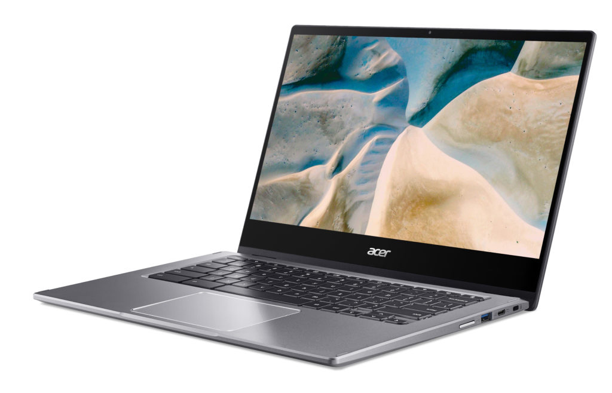
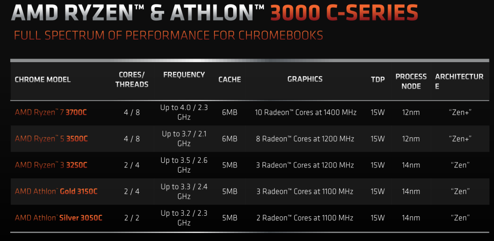
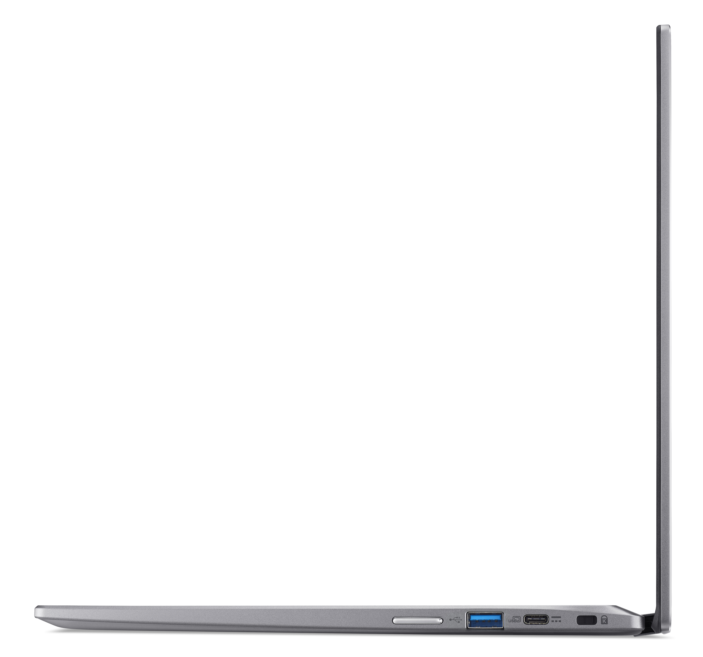

Last September, [AMD introduced its first Zen-based processors specifically for the Chromebook market](https://www.amd.com/en/press-releases/2020-09-22-amd-launches-first-zen-based-chromebook-mobile-processors-for-faster-web). We've seen [a few brands build devices with the Ryzen 3000 C-Series chips](https://www.aboutchromebooks.com/news/hp-pro-c645-chromebook-enterprise-amd-athlon-3000-c-series-ryzen/) and now it's Acer's turn. The [newly announced Acer Chromebook Spin 514 lineup](https://news.acer.com/acer-unveils-chromebook-spin-514-its-first-chromebook-with-amd-ryzen-mobile-processors-and-amd-radeon-graphics) can be had with AMD's Silver 3050C, Gold 3150C, or all the way up to an AMD Ryzen 7 3700C chipset, which includes integrated AMD Radeon Graphics.

By "lineup", I mean that while all of the configurations offer certain features such as the same military-grade (MIL-STD 810H), reinforced aluminum chassis, Corning Gorilla Glass 3, ports, and keyboard. The main difference will be choosing among the several AMD Ryzen processors, storage and memory. There is one notable port exception: Only the Ryzen 5 and 7 configurations include a full-sized HDMI port.

Acer says the Chromebook Spin 514 will start at $479.99, which is presumably powered by the AMD Silver 3050C. A Chromebook Enterprise edition of the convertibles will also be available, which includes a Chromebook Enterprise license and [zero-touch enrollment](https://support.google.com/chrome/a/answer/10130175?hl=en&ref_topic=9028498).

Here's a full rundown on the lineup of specifications:

<table><tbody><tr><td>CPU</td><td>AMD Ryzen Accelerated Processing Unit (APU)</td></tr><tr><td>GPU</td><td>MD Radeon Vega Mobile Graphics</td></tr><tr><td>Display</td><td>14-inch IPS LED 1080p touchscreen</td></tr><tr><td>Memory</td><td>4 to 16 GB DDR4</td></tr><tr><td>Storage</td><td>up to 128 GB (eMMC) or up to 256 GB (NMVe), microSD slot for expansion</td></tr><tr><td>Connectivity</td><td>Wi-Fi5 802.11ac (2x2) <em>Note: No mention of Bluetooth but I'm sure it's there.</em></td></tr><tr><td>Input</td><td>Backlit keyboard, multitouch trackpad, 720p camera, two integrated microphones</td></tr><tr><td>Ports</td><td>Two USB Type-C (3.2), one USB Type-A, HDMI port on select models, combination microphone/headphone jack</td></tr><tr><td>Battery</td><td>Up to 10 hours expected</td></tr><tr><td>Weight</td><td>3.42 pounds</td></tr><tr><td>Software</td><td>Chrome OS automatic update expiration date: TBD</td></tr></tbody></table>

All models have the same 14-inch 1080p IPS touchscreen that can be rotated 360-degrees for tent and tablet modes. A backlit keyboard is available as an option.

Keep in mind that the AMD processors aren't built on the latest Zen architecture from the chip company: They're a bit older than that but should offer solid performance. I'll have to get my hands on one for some testing to compare to the latest Intel processors to have more information on that.

In terms of the processors, the above chart provides details about AMD's Ryzen processor lineup for Chromebooks used in the Acer Chromebook Spin 514.

Acer expects the devices to be available next month in North America, followed by EMEA markets in March.

