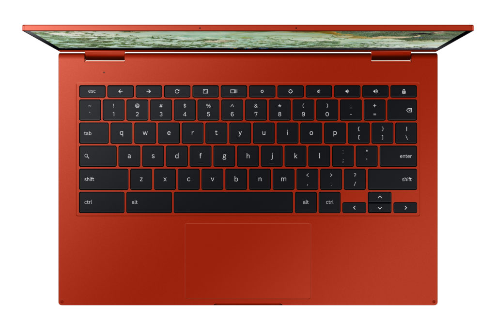
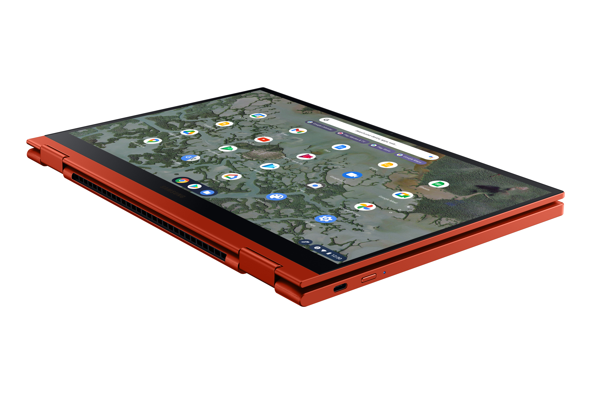

[After leaked images appeared a few weeks ago](https://www.aboutchromebooks.com/news/leaked-samsung-galaxy-chromebook-2-specs-release-date-price/), the Samsung Galaxy Chromebook 2 is now official. On Thursday, this successor convertible debuted with a lower $549 price-tag along with some lesser hardware as compared to last year's $999 flagship Chromebook. When looking at the configuration and features you'll quickly see how Samsung was able to reduce the cost so drastically.

While the Samsung Galaxy Chromebook 2 looks similar to the model it replaces, many of the key hardware components inside have been cut down.

Gone is the 13.3-inch 4K OLED touch display, replaced by a 1080p QLED touch panel of the same size. The base model has half the memory of the original as 4 GB of RAM comes in the lowest configuration. That model is powered by an Intel® Celeron 5205U with 64 GB of storage capacity.

You can bump things up to the only other configuration to get 8 GB of memory, but the processor will only be an Intel® Core i3-10110U chip, along with 128 GB of storage. Say goodbye to any other chipset options such as a Core i5 or Core i7.

In the leaked images, I noted a few other expected changes and Samsung's press announcement confirmed them. There's no longer a "world" camera embedded into the keyboard, although I doubt many will miss that.

Interested customers will, however, likely miss the fingerprint sensor and included stylus of the original model. They're no longer here. Samsung says you can add your own USI stylus and get up to 4,096 levels of pressure sensitivity, so all is not lost for the inkers of the world.

Here's a full run-down of the official specifications:

<table><tbody><tr><td>CPU</td><td>10th-gen Intel Celeron and Core i3 processors</td></tr><tr><td>GPU</td><td>Intel UHD Graphics</td></tr><tr><td>Display</td><td>13.3-inch QLED 1080p touchscreen, 16:9 aspect ratio, with optional USI stylus support</td></tr><tr><td>Memory</td><td>4 or 8 GB</td></tr><tr><td>Storage</td><td>64 or 128 GB, microSD slot for expansion</td></tr><tr><td>Connectivity</td><td>Wi-Fi 6 (Gig+), 802.11 ax 2x2 <em>Note: No mention of Bluetooth but I'm sure it's there.</em></td></tr><tr><td>Input</td><td>Backlit keyboard, multitouch trackpad, 720p camera</td></tr><tr><td>Ports</td><td>Two USB Type-C, combination microphone/headphone jack</td></tr><tr><td>Battery</td><td>45.5 Whr</td></tr><tr><td>Weight</td><td>2.71 pounds</td></tr><tr><td>Software</td><td>Chrome OS automatic update expiration date: Not reported, likely June 2028</td></tr></tbody></table>

Samsung says the speaker output will be much improved thanks to "Smart AMP sound—which runs up to 178% louder than the average amplifier" but we'll have to wait and see... or rather, hear it.

Clearly, Samsung felt that it was missing out on the space between its entry-level devices and the flagship Galaxy Chromebook from last year. The new Galaxy Chromebook 2 slots in nicely from a price perspective then. However, limiting the configurations to a $549 Celeron-powered device and a better Core i3 option (rumored to start at $699) seems like a miss to me. There are plenty of options in this price range that deliver more performance, storage or other features, for example.

I suspect those who want a premium Aluminum build with a QLED display and can live without features such as a fingerprint sensor or less memory capacity might spring for this new convertible. But I don't think it will be as many as Samsung might hope.

Samsung says to expect the new Galaxy Chromebook 2 in both Fiesta Red and Mercury Gray sometime in the first quarter of 2021.

