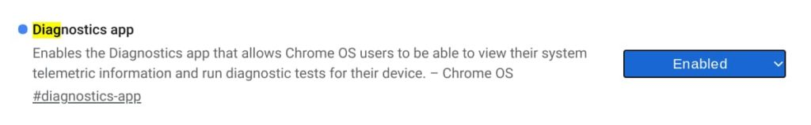
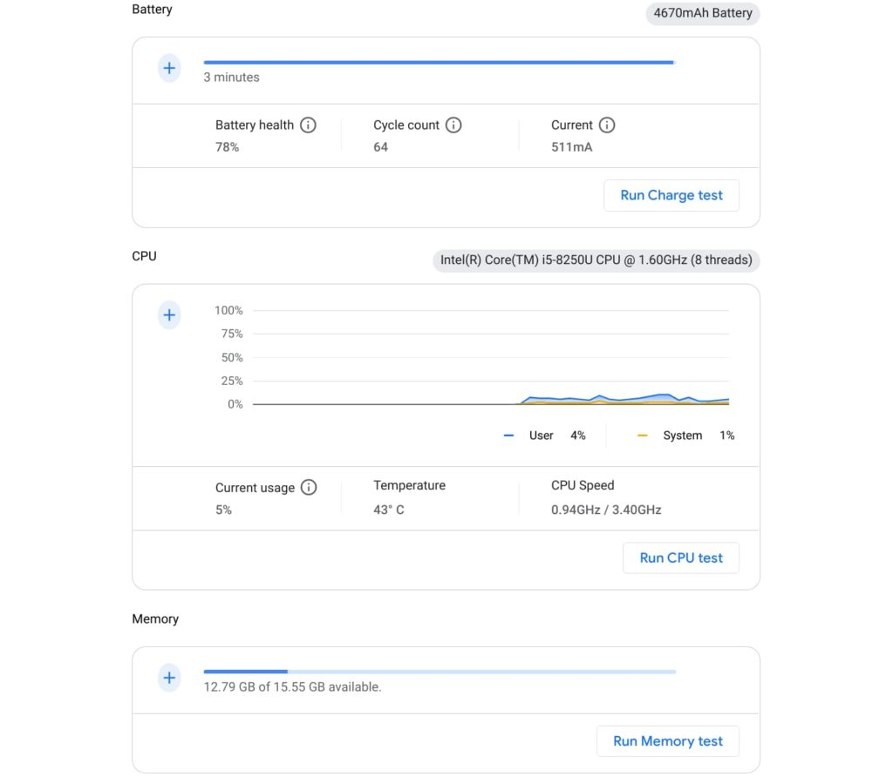
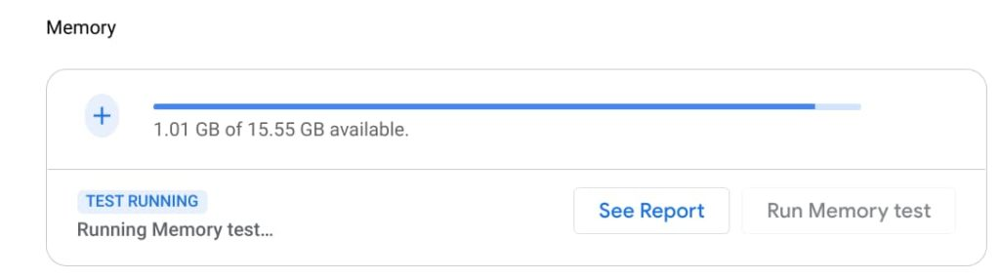

Although it's not completed yet, the Chromebook Diagnostics app in Chrome OS 89 is much improved. This is still an experimental feature, so you'll have to enable a flag to see it. Once you do, you'll see different functionality and a nicer user experience than [when I last looked at it](https://www.aboutchromebooks.com/news/chrome-os-88-adds-native-device-performance-monitoring-to-chromebooks-heres-how-to-use-it/ "Chromebooks getting a network diagnostics app; you can get an early look at it now").

Gaining access to the app, which includes a dedicated Diagnostics icon in your Launcher, navigate to chrome://flags#diagnostics-app, enable it, and restart your browser.

Once you do, you can search for the app, open it, and see information about your Chromebook's battery, CPU, and memory. You'll also find your Chromebook model, the board name, and Chrome OS version at the top of the application.

Here's a view from my Acer Chromebook Spin 13, which indicates that after nearly 18 months of use, my battery has lost some of its charging capacity. That's a little concerning but expected given how much I use this device.

You can also see real-time CPU and memory usage as well as the current CPU temperature and speed.

Currently, the "plus" icons don't work. I anticipate in the coming weeks that tapping those will expand their respective data views. For example, you'd see CPU usage by each individual core and perhaps information about what processes are using the most memory.

The trio of hardware tests are working with this version.

Click the respective test and the Diagnostics app will run various tests depending on the hardware type. These aren't going to provide benchmark numbers; they're specifically meant to validate that your Chromebook doesn't have a hardware problem. Or if there is a problem with the battery, CPU, or memory, the app would indicate an issue.

I wouldn't expect people to use the Diagnostics app on a regular basis, even after it's fully functional. However, if your Chromebook is acting strange or there's some unexplained problem, this app would be a good place to start troubleshooting.
