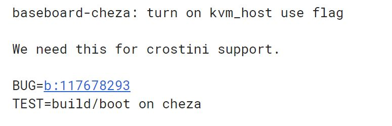

Development work is continuing on [Cheza, the Qualcomm Snapdragon 845 detachable Chromebook](https://www.aboutchromebooks.com/news/cheza-lte-chromebook-detachable-snapdragon-845/) that made an appearance in the Chromium OS code commits back in June. Most of the recent code is aimed at getting Cheza to boot with the proper driver support to run Chrome OS but I noticed an important change recently committed telling us that [Cheza will have Project Crostini support for full Linux apps](https://chromium-review.googlesource.com/c/chromiumos/overlays/board-overlays/+/1309253).

I won't say I'm surprised to see this: Any future Chrome OS devices with the [proper Linux kernel and chipset capabilities should have Project Crostini](https://www.aboutchromebooks.com/news/theres-hope-that-older-chromebooks-will-run-linux-apps-with-crostini/) out of the box at this point. And although this device will run on an ARM processor, Google has made progress bringing Crostini to that chip architecture: The [Acer Chromebook R 13 and its MediaTek ARM chip recently gained Linux app support in the Dev Channel for Chrome OS 72](https://www.aboutchromebooks.com/news/project-crostini-brings-linux-apps-to-the-arm-based-acer-chromebook-r-13/). Still, it's nice to have confirmation. And remember, Linux apps compiled for x86 processors won't run on an ARM device, so app support may be a little more limited than on Chrome OS devices powered by Intel chips.

What else do we know about Cheza? A fair amount although most people are interested in a release date. Keep in mind this is likely a reference device that I suspect Qualcomm to show off in January at the Consumer Electronics Show at the earliest. I'll be there, so if Cheza makes an appearance, either by Qualcomm or a hardware partner that will build and brand the device, I'll get whatever information I can.

For now, we know that [Cheza will be a detachable tablet,](https://www.aboutchromebooks.com/news/cheza-detachable-chrome-tablet-like-pixel-slate-specs/) like the Google Pixel Slate and HP Chromebook X2, is [likely to support a keyboard that includes a second battery](https://www.aboutchromebooks.com/news/why-cheza-snapdragon-845-chromebook-tablet-20-hours-battery-life/) for a longer run time between charges, [have fast UFS storage](https://www.aboutchromebooks.com/news/cheza-chromebook-with-qualcomm-snapdragon-845-will-have-speedy-ufs-storage/), and include an integrated LTE radio since the Qualcomm Snapdragon 845 comes with that capability.

When it arrives, the questions are around the device's performance and the price, which are two very related attributes when it comes to value.

Don't assume since it uses a processor used in current high-end Android phones that it will be cheap though: [Qualcomm has said it was staying out of the Chromebook market until average selling prices for this market segment were above $500](https://chromeunboxed.com/news/qualcomm-chromebook-mobile-world-conference-confirmed). And as far as performance, this chipset powers a few always-on Windows slates such as the HP Envy X2 (pictured above) [and didn't seem to impress many](https://www.cnbc.com/2018/04/13/hp-envy-x2-with-qualcomm-snapdragon-processor-review.html). Chrome OS is very different from Windows though, so I'm cautiously optimistic on the performance front.
