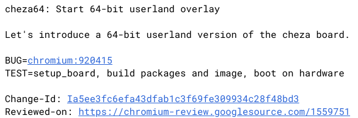

As we get close to the end of the year, I'm reminded that we expected to see the [first Chromebooks with a Qualcomm Snapdragon inside of them](https://www.aboutchromebooks.com/news/cheza-detachable-chrome-tablet-like-pixel-slate-specs/), similar to the HP Envy shown above.

These would be based on the ["Cheza" reference design, which we saw first reported nearly 18 months ago](https://www.aboutchromebooks.com/news/cheza-lte-chromebook-detachable-snapdragon-845/). Chrome Unboxed noted back in February that [Qualcomm said we'd likely see such Chromebooks in the second half of 2019](https://chromeunboxed.com/qualcomm-snapdragon-chromebook-cheza-bright-display-high-res/).

With just a few weeks left before year-end, I don't think that's happening.

To refresh you, here's what I had found when Cheza was first discovered:

- Reference to a 2560 x 1440 display, or [WQHD resolution](https://chromium-review.googlesource.com/c/chromiumos/third_party/kernel/+/1024495/21/Documentation/devicetree/bindings/drm/msm/mdss-dsi-panel.txt), which the integrated Adreno 630 GPU is more than capable of handling; that’s the same resolution pane used on many recent phones such as the LG G7 ThinQ, OnePlus 6 and HTC U12+. That resolution may just be for testing purposes as WQHD would be a 16:9 aspect ratio [as noted by VictoryGoth on Reddit](https://www.reddit.com/r/chromeos/comments/8sw61b/cheza_is_a_qualcomm_845_detachable_chromebook/e12tw7q). The Snapdragon 845 supports on-device resolution up to 4K UHD.
- [A Cheza overlay file for Chrome OS](https://chromium-review.googlesource.com/c/chromiumos/third_party/hdctools/+/1008638/5/servo/data/servo_cheza_overlay.xml) that specifies “detachable”, indicating Cheza’s display can be removed from a keyboard base like the HP Chromebook X2.
- [Various options for USB Type-C, USB 3.0 and DisplayPort](https://chromium-review.googlesource.com/c/chromiumos/third_party/kernel/+/1108193/1/arch/arm64/boot/dts/qcom/sdm845-cheza.dtsi) (DP) support for an external display

Obviously, using the Snapdragon 845 to power a Chromebook doesn’t just bring the processor, GPU, video and other I/O support. The chip also has an integrated Qualcomm X20 modem, capable of theoretical LTE download speeds up to 1.2 Gbps. Essentially, Cheza was expected to bring an always-on, connected Chrome OS experience [with a long battery life](https://www.aboutchromebooks.com/news/why-cheza-snapdragon-845-chromebook-tablet-20-hours-battery-life/).

Work on Cheza has continued, even recently, with [a bug report filed and fixed just 10 days ago](https://bugs.chromium.org/p/chromium/issues/detail?id=1027980).

At this point, however, any devices built from this design would effectively be two-generations behind when it comes to Qualcomm's silicon. Earlier this week, [Qualcomm announced devices with the Snapdragon 865 would arrive this spring](https://www.qualcomm.com/news/releases/2019/12/04/qualcomm-introduces-worlds-most-advanced-5g-mobile-platform), following last year's Snapdragon 850 and 855 system on a chip products.

So I'm not really sure what the point of continuing Cheza development is. Does Google expect its hardware partners to build Chrome OS devices with the Snapdragon 845? I hope not when they can offer [improved performance and better power efficiency with a newer processor like the Snapdragon 865](https://www.qualcomm.com/products/snapdragon-865-5g-mobile-platform).

Curiously, there are code commits not just for the Cheza board but [also for a Cheza64 board](https://chromium-review.googlesource.com/c/chromiumos/overlays/board-overlays/+/1923341).

Cheza64 in the works

The Snapdragon 845 in Cheza is 64-bit, so the addition of the "64" on the new board may mean something else. And, I haven't yet seen which chipset Cheza64 will use, so hopefully, it's something newer than the Snapdragon 845.

Of course, it can easily take 12 to 18 months to develop a Chrome OS reference board, so if and when Cheza64 devices hit the market, we could already see even newer Snapdragon processors by then.
