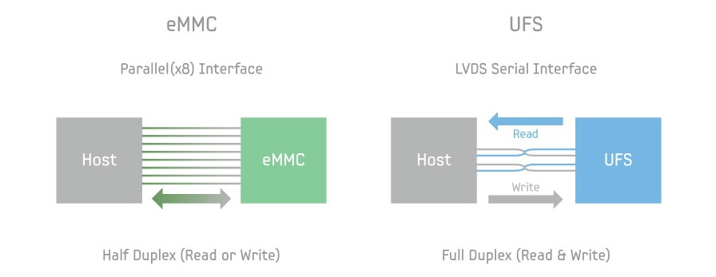

The upcoming [Snapdragon 845 powered Chromebook board known as "Cheza"](https://www.aboutchromebooks.com/news/cheza-lte-chromebook-detachable-snapdragon-845/) will take advantage of a [faster embedded storage method known as UFS](https://chromium-review.googlesource.com/c/chromiumos/platform/depthcharge/+/1030824), or Universal Flash Storage. Not only does UFS bring faster read and write speeds as compared to typical flash storage in computers, it supports full-duplex data transfers meaning the chips can read and write data at the same time. The eMMC storage found in many computers today can only read or write, but not do both simultaneously.

[This development was spotted by XDA Developers](https://www.xda-developers.com/snapdragon-845-chromebook-project-fi-ufs/) who suspects an implementation of the UFS 2.1 standard, which has total bandwidth of 1.2 GB per second using two interface lanes.

The standard started with UFS 1.0 in 2011 and UFS 2.1 was introduced in 2016, so that assumption appears sound to me. Remember that [the Snapdragon 835 supports UFS 2.1(PDF)](https://developer.qualcomm.com/qfile/34682/snapdragon-835-mobile-hdk-product-brief_87-pd100-1.pdf)  so it makes sense for the 845 chip to at least have the same functionality.

This past January, [the standard was updated to UFS 3.0](https://www.jedec.org/news/pressreleases/jedec-publishes-universal-flash-storage-ufs-ufshci-version-30-and-ufs-card) with support for 1.45 Gb per second on each of the two lanes, but I think it's early for that technology to be used for this device. Additionally, I found some code referencing Gear-3: [USF 3.0 supports Gear-4](https://www.jedec.org/news/pressreleases/jedec-publishes-universal-flash-storage-ufs-ufshci-version-30-and-ufs-card), making it more unlikely for Cheza to use the latest and greatest standard:

So what does this mean on a Chromebook with faster flash memory?

Late last year, [Samsung introduced 512 GB UFS embedded chips](https://www.samsung.com/semiconductor/insights/news-events/samsung-starts-producing-first-512-gigabyte-universal-flash-storage-for-next-generation-mobile-devices/) and here's what it says about them:

> The Samsung 512GB eUFS also features strong read and write performance. With its sequential read and writes reaching up to 860 megabytes per second (MB/s) and 255MB/s respectively, the 512GB embedded memory enables transferring a 5GB-equivalent full HD video clip to an SSD in about six seconds, over eight times faster than a typical microSD card.

For large video files, installing applications and other big data transfers then, Cheza looks to be a powerhouse of a detachable Chromebook. Now we just have to see if it's a powerhouse in the performance department when running Chrome OS.

However, I don't think we have to wait to see if Cheza will have a high cost. With support for UFS memory, an eSIM for LTE data, and a high-resolution detachable touchscreen powered by a top-of-the-line Qualcomm chip, I can't see pricing for Cheza under $700 when it arrives.
