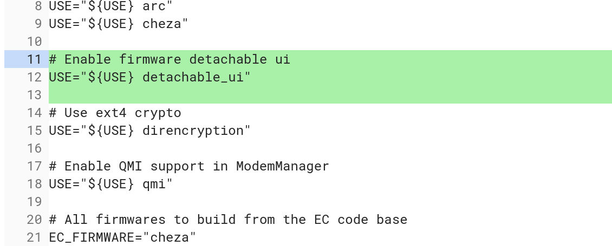

Back [in June, we saw the Cheza board referenced in the Chromium OS code](https://www.aboutchromebooks.com/news/cheza-lte-chromebook-detachable-snapdragon-845/) and although it appeared to mention the word "detachable" in a related file, that wasn't hard proof alone. Today, a code commit confirms it, however: The Cheza device powered by a Qualcomm Snapdragon 845 processor is [a slate device with a removable keyboard](https://chromium-review.googlesource.com/c/chromiumos/overlays/board-overlays/+/1295013), just like the [Google Pixel Slate](https://www.aboutchromebooks.com/tag/pixel-slate) (shown above).

You can also see a "ModemManager" reference, telling us that Cheza will be able to take advantage of the integrated LTE modem on the Snapdragon system on a chip (SOC).

Ironically, even Google knows that the public got a whiff of Cheza's detachable nature as evidenced by the code comment, which got me to chuckle:

> cheza: Add detachable\_ui USE flag: We need this for Cheza. Looks like all other boards define this in their private overlay, not sure why. depthcharge and vboot build without private sources, so it probably belongs in here. (It's not like the lack of a keyboard is a huge secret if you read the public EC sources...)

What else do we know about Cheza?

It looks like the device will have [a 12.3-inch touch display, according to this find by XDA-Developers](https://www.xda-developers.com/snapdragon-845-chromebook-12-3-inch-detachable-display/), with 2160 x 1440 resolution and 3:2 aspect ratio, even though the Snapdragon 845 can handle a higher resolution display.

[Cheza should also support high-speed Univeral Flash Storage (UFS)](https://www.aboutchromebooks.com/news/cheza-chromebook-with-qualcomm-snapdragon-845-will-have-speedy-ufs-storage/), which unlike eMMC memory typically used in many Chrome OS devices these days, can read and write at the same time, and at faster speeds.

Additionally, [Cheza may work with a detachable keyboard that has its own battery](https://www.aboutchromebooks.com/news/why-cheza-snapdragon-845-chromebook-tablet-20-hours-battery-life/). That means we could see the device run for nearly twice as long on a full charge compared to the HP Chromebook X2, Google Pixel Slate or other Chrome tablets that have a single battery in the tablet. That will depend on the battery capacities as well, which are currently unknown. My hope is that Cheza will have a light, non-battery keyboard option as well so users can choose between long run-times and weight, depending on the situation.

It's too early to predict when we'll see Cheza in the flesh but at this point, based on the June start date of the Cheza product, it's possible we see at least an early version at the Consumer Electronics Show in January. I'll be there so if Cheza makes an early appearance, I'll share what I can.
