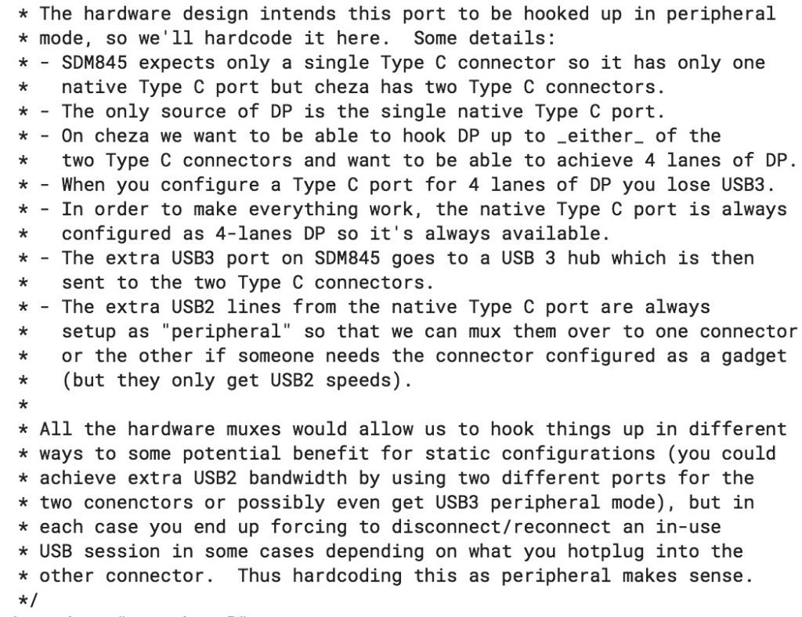

Right after [Qualcomm announced the Snapdragon 845 chip in December](https://www.qualcomm.com/products/snapdragon-845-mobile-platform), XDA Developers found some early code suggesting [a new Chrome OS device code-named Cheza was in the works](https://www.xda-developers.com/chromebook-qualcomm-snapdragon-845/) using the chip. Fast forward six months and there's much more than early code: The Chromium team has been coding away for the last several weeks on Cheza -- 54 code commits today alone! -- so it looks like the real deal.

Based on what I found today over the course of a few hours, it appears that Cheza will be functionally similar to the new Microsoft Always On PCs like the HP Envy X2 shown above. Aside from confirmation that the Snapdragon 845 -- currently the most powerful Qualcomm processor used in high-end Android phones -- is the heart of Cheza, I found the following tidbits:

- Reference to a 2560 x 1440 display, or [WQHD resolution](https://chromium-review.googlesource.com/c/chromiumos/third_party/kernel/+/1024495/21/Documentation/devicetree/bindings/drm/msm/mdss-dsi-panel.txt), which the integrated Adreno 630 GPU is more than capable of handling; that's the same resolution pane used on many recent phones such as the LG G7 ThinQ, OnePlus 6 and HTC U12+. That resolution may just be for testing purposes as WQHD would be a 16:9 aspect ratio [as noted by VictoryGoth on Reddit](https://www.reddit.com/r/chromeos/comments/8sw61b/cheza_is_a_qualcomm_845_detachable_chromebook/e12tw7q). The Snapdragon 845 supports on-device resolution up to 4K UHD.
- [A Cheza overlay file for Chrome OS](https://chromium-review.googlesource.com/c/chromiumos/third_party/hdctools/+/1008638/5/servo/data/servo_cheza_overlay.xml) that specifies "detachable", indicating Cheza's display can be removed from a keyboard base like the HP Chromebook X2.
- [Various options for USB Type-C, USB 3.0 and DisplayPort](https://chromium-review.googlesource.com/c/chromiumos/third_party/kernel/+/1108193/1/arch/arm64/boot/dts/qcom/sdm845-cheza.dtsi) (DP) support for an external display

Obviously, using the Snapdragon 845 to power a Chromebook doesn't just bring the processor, GPU, video and other I/O support. The chip also has an integrated Qualcomm X20 modem, capable of theoretical LTE download speeds up to 1.2 Gbps.

In the real world, network traffic and infrastructure affect wireless speeds so I wouldn't expect even half of that throughput. Still, just the idea of integrated LTE for a Chromebook is exciting; something I wish device makers hadn't gotten away from over the past few years. Note that [Project Hermes is Google's effort to support eSIMs and possibly Project Fi in Chromebooks](https://www.aboutchromebooks.com/news/meet-project-hermes-esims-and-likely-project-fi-on-chromebooks/), so you may not need a SIM card for Cheza.

Keep in mind from a hardware cycle perspective, Microsoft's current "Always On PCs" use the Snapdragon 835, which it says can provide up to 20 hours of battery life. Some reviews are getting close to that while others are [just getting a full day of use](https://www.zdnet.com/article/review-hp-envy-x2-running-windows-10-on-arm/). And [performance of Windows 10 S mode seems lackluster](https://www.thurrott.com/windows/windows-10/157336/hp-envy-x2-qualcomm-review) as well, so [Microsoft is planning to use the Snapdragon 850](https://www.zdnet.com/article/qualcomm-launches-snapdragon-850-platform-boosts-always-connected-windows-10-pcs/) for the next generation of these devices.

I raise this point for a few reasons but mainly because Chrome OS can run quite well on less powerful processors when compared to the same hardware running Windows. So I anticipate solid performance and likely better battery life, just because of the software.

We'll see in the coming months -- I'm thinking we see Cheza as a final product in the fall -- as development continues. Since we've never had a Qualcomm-powered Chromebook, I'm intrigued to find out how well one could work; especially with an always on LTE connection.

_Updated at 8:20pm, June 21 to reflect WQHD panel may be for testing only._
