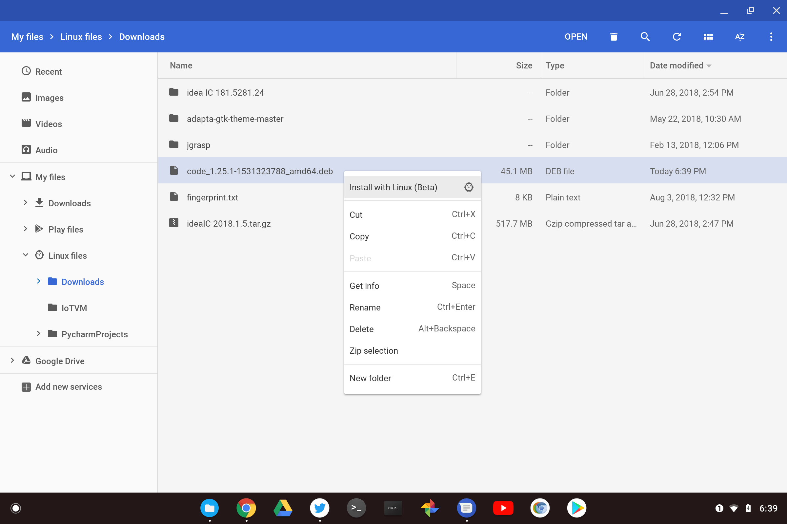

Although at this point it feels like years, I've been [running Linux apps on Chrome OS through Project Crostini](https://www.aboutchromebooks.com/tag/project-crostini) for the past several months. I had to do that in either the Dev or Beta Channels of Chrome OS, but not anymore. I can run Linux apps in the Stable Channel and you can too now, thanks to [today's release of Chrome OS 69](https://chromereleases.googleblog.com/2018/09/stable-channel-update-for-chrome-os.html).

In case you haven't been following this development, the [optional Linux app support is simple to enable in Chrome OS settings](https://www.aboutchromebooks.com/news/linux-apps-project-crostini-option-appears-in-chrome-os-settings-on-dev-channel/). Once enabled, you can use the command line to install packages although it might be easier to do this [directly in the Chrome OS native Files app](https://www.aboutchromebooks.com/news/chromebooks-project-crostini-install-debian-apps-packages-in-chrome-os/).

Coming soon will be [Linux app notifications in Chrome OS](https://www.aboutchromebooks.com/news/project-crostini-getting-linux-app-notifications-in-chrome-os/), as well as [support for GPU acceleration](https://www.aboutchromebooks.com/news/project-crostini-progressing-towards-gpu-acceleration-for-chromebooks-running-linux-apps/) and USB drives. Even without those features, this functionality brings full desktop apps to Chromebooks and Chromeboxes. With traditional web apps, [PWAs](https://www.aboutchromebooks.com/news/heres-what-progressive-web-apps-or-pwas-look-like-on-a-chromebook/), Android and now Linux apps, Chrome OS has likely gone from the platform with the least to the most apps supported.

Google says these additional features are also in Chrome OS 69 Stable:

- Files app UI refresh with new support for accessing Play files
- Native support for Team Drives in Files app
- Save Play app files directly to Files app via the share sheet
- Dictation into any text field, a new feature in accessibility settings
- Power state alerts for Kiosk apps
- Global text-to-speech settings
- Night Light
- Fast Access to Emojis
- OOBE visual improvements
- Swipe to close apps in Overview
- Tablet mode behavior unification
- Video capture service

Even if you never use the Linux containers because you don't want to or you don't have a [supported device](https://chromium.googlesource.com/chromiumos/docs/+/master/containers_and_vms.md#Supported-Now), there's plenty in the newest Stable Channel for everyone.
