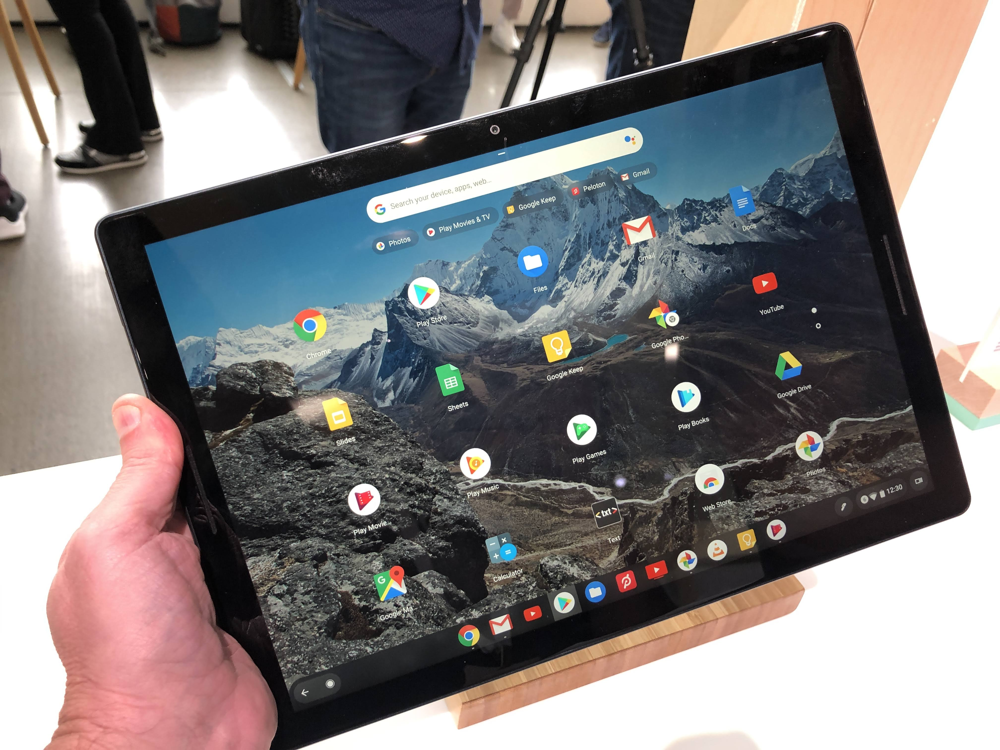
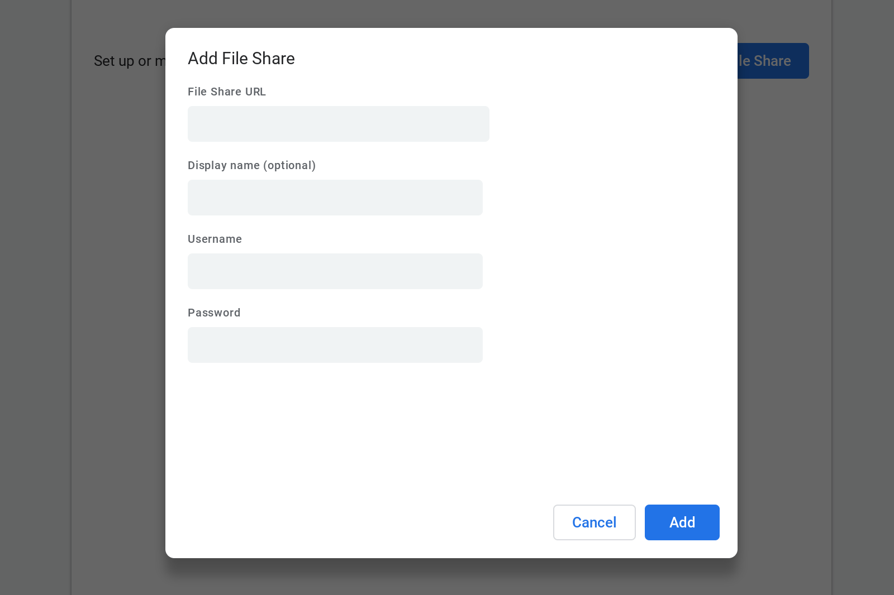

If Chrome OS tablets become hugely successful, we'll look back on Chrome OS 70 as the Stable Channel release that made it happen. [The new version began rolling out on Friday](https://chromereleases.googleblog.com/2018/10/stable-channel-update-for-chrome-os-m70.html) and it brings all of the [tablet interface optimizations we first saw last month in the Dev Channel](https://www.aboutchromebooks.com/news/chrome-os-70-to-transform-tablets-with-an-smart-auto-switch-to-desktop-mode/). Chrome OS for tablets has truly arrived.

Strangely, the Chrome Releases Blog doesn't even mention the tablet features. Instead, there's a list of these four items:

- Allow users to enable Autofill separately for payment methods and addresses.
- User controls for extension site access. [Click for more info](https://blog.chromium.org/2018/10/trustworthy-chrome-extensions-by-default.html).
- Add a search field to the text-to-speech settings page in accessibility settings
- Adds an AV1 decoder to Chrome on x86 platforms. [Click for more info](https://developers.google.com/web/updates/2018/09/chrome-70-media-updates#av1-decoder).

Those are important, of course, and for Chrome OS devices as a whole, so I get why the information is aimed at the Chrome OS community at-large. It seems like a bit of a missed opportunity though: With [Google Pixel Slate availability in the coming weeks](https://www.aboutchromebooks.com/news/google-pixel-slate-release-date-november-22-best-buy/), now would be a good time to highlight the tablet experience of Chrome OS so people can begin to [decide which Pixel Slate best suits their needs and budget](https://www.aboutchromebooks.com/opinion/which-google-pixel-slate-to-buy-guide/).

Regardless, if you have a Chrome tablet or a 2-in-1 device, you can now experience the changes that make the software better for slate situations. You'll see the revamped launcher, for starters, which provides more app icons on the display and moves the search bar to a more prominent position. Also is the updated section under the search bar showing recently used web pages or apps.

Some early users aren't happy about the icons in the system tray, which are now centered and larger. There's [a bug report here if you want to star and follow it](https://bugs.chromium.org/p/chromium/issues/detail?id=898858#c1). Perhaps Google will acquiesce and provide some resizing options in a future release.

Also key to this release is the [smarter switch between Desktop and Tablet modes](https://chromeunboxed.com/news/chromebook-tablets-getting-proper-desktop-mode-video/). Docking a Chrome OS tablet or attaching a USB keyboard will bring the full Chrome OS desktop experience and windowed apps instead of the more finger-friendly tablet mode with its full- or split-screen app limitations. That should boost productivity when using a docked tablet, as should the new [support for SMB file shares if you have a local server with shared folders](https://www.aboutchromebooks.com/news/support-for-native-smb-network-shares-in-chrome-os-is-moving-along-quickly-now/).

By no means is Chrome OS 70 perfect for tablet use. There are still some little nits here and there that people are finding. However, the experience is _far_ better than when the first Chrome tablets arrived on the scene earlier this year, [particularly with the Acer Chromebook Tab 10](https://www.theverge.com/2018/7/18/17582836/chrome-os-tablet-acer-chromebook-tab-10-android-ipad).

Chrome devices are truly becoming all-in-one experiences: A full desktop browser, even on tablets, an Android app device, and even [a heavy-duty Linux machine](https://www.aboutchromebooks.com/tag/project-crostini), provided you have powerful enough hardware. There's work to be done in some of these areas -- Android app optimization by developers, for one thing -- but the future is looking bright in the tablet area, largely thanks to Chrome OS 70.
