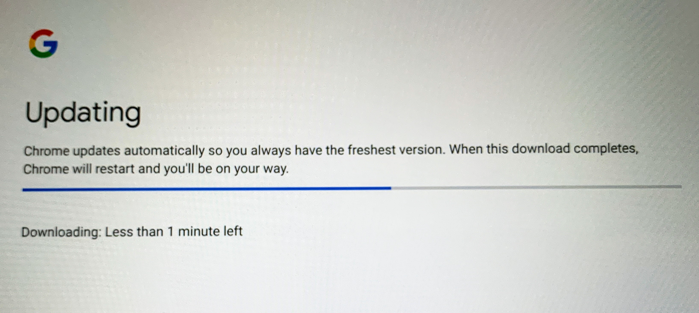

On Friday, [Google announced that the Stable Channel of Chrome OS 71 is available](https://chromereleases.googleblog.com/2018/12/stable-channel-update-for-chrome-os.html), noting that several of the features are for the Pixel Slate, with other Chromebooks to follow. I was a little surprised for two reasons: At the October Pixel Slate launch event, all of the devices were already running Chrome OS 71, and the [review units already had this version as well](https://www.aboutchromebooks.com/reviews/google-pixel-slate-review/). I assumed anyone purchasing a Pixel Slate would get version 71 on their device but apparently, that may not be the case.

In fact, I verified this on my own Pixel Slate that I purchased; this morning I took it out of the box and ran through the initial setup only to find this screen, that likely updated the software to Chrome OS 71.

My guess is that anyone who bought a Pixel Slate likely got the update right out of the box, so what's "new" in Chrome OS 71, isn't really that new to them.

Regardless, here's a rundown of what's in the new Stable version of Chrome OS:

- Refreshed look for Camera app
- Fingerprint and PIN enrollment in Out of Box Experience
- Autocomplete in Launcher search
- Adaptive top UI in Chrome browser based on user scrolling
- Unified setup flow to connect with an Android phone
- Assistant natively integrated into the OS (Pixel Slate first, expanding to more devices later)
- New features for families including app management and screen time limits.
- Ability to create semi-full pages in Launcher for customizations
- Launched Android P on Pixel Slate
- Fingerprint authentication mode on Pixel Slate
- Portrait mode for Camera app on Pixel Slate

Among the key improvements for everyone, at least eventually, are Android P, native Google Assistant integration and the updated flow to connect Android phones, also known [as the "Better Together" feature set](https://www.aboutchromebooks.com/news/better-together-bringing-instant-tethering-voice-calls-and-easy-unlock-to-chromebooks/). In fact, that last one is much nicer to look at and step through, and isn't currently limited to the Pixel Slate:

Getting Android P on the Slate, with other devices to follow, won't really change the look or feel of how Google Play Store apps run. Instead, this adds general OS improvements as Android on Chrome OS moves from Android 7.1.1 to Android 9.0. Think of things like the user interface and navigation as well as features supported by new Android APIs that developers can use.

Native Google Assistant integration is a great step forward as well because it means that you still have full Google Assistant functionality even if you don't have the Google Play Store enabled on your Chromebook or Chrome OS tablet. I generally keep the Play Store enabled for a few apps, but some folks want to stick to the "simplicity" of Chrome OS; soon they can do that with the Assistant built in directly to Chrome OS as this feature moves beyond the Pixel Slate.

This version of Chrome OS ties in directly with the [updated Family Link features Google announced last week](https://www.aboutchromebooks.com/news/family-link-chromebook-parental-controls-for-kids-screen-time-limits-site-whitelisting/) as well, including a number of parental controls such as screen time settings and the ability to block access to certain websites or Google Play Store apps.

Again, many of these features are for the Pixel Slate, at least for now, but the overall look and feel of Chrome OS continues to mature for consistent experiences across different form factors such as tablets, 2-in-1s, and traditional clamshell Chromebooks. Plus, there's plenty [more to look forward to in Chrome OS 72](https://www.aboutchromebooks.com/news/chrome-os-72-dev-channel-preps-crostini-usb-support-easier-linux-package-installs-and-more/)!
