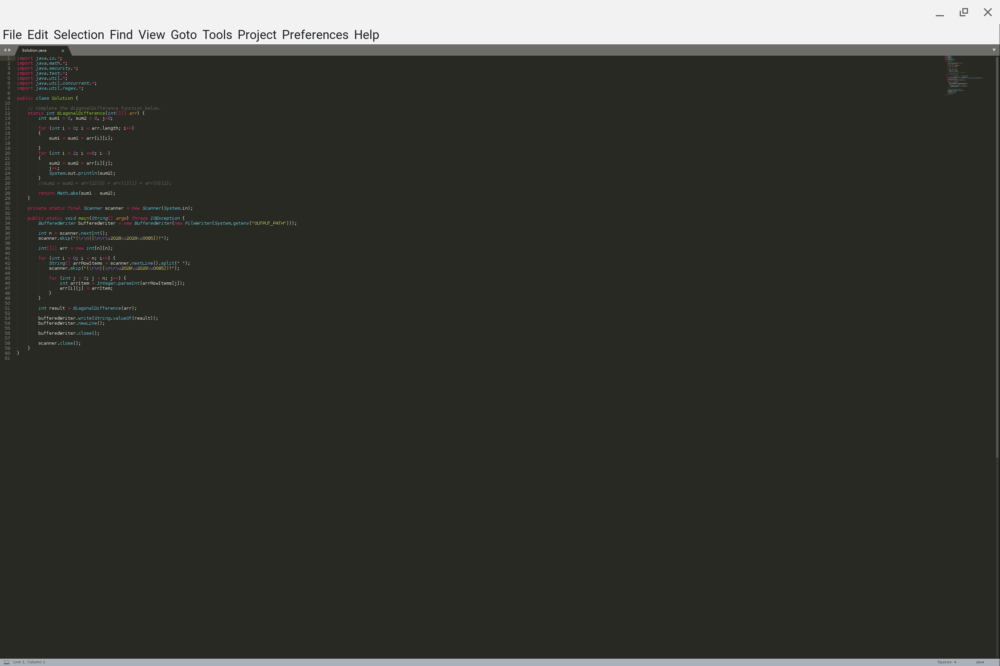
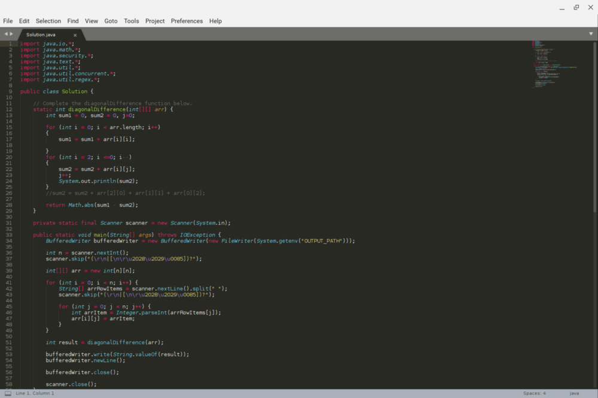
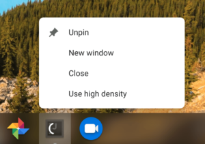

As nice as it is to have full Linux app support on Chromebooks through Project Crostini, the experience still isn't perfect. Aside from the lack of audio support, for example, not every Linux app looks good on a high-resolution display such as the 3000 x 2000 screen of the Pixel Slate or the 2400 x 1600 resolution Pixelbook.

This is partially due to display scaling and older Linux apps but I've even seen it on some recent software: Text and menus are nearly impossible to read because they're so small. [A bug was opened for this issue all the way back in May](https://bugs.chromium.org/p/chromium/issues/detail?id=839242) as Project Crostini was just arriving on early Dev Channel builds of Chrome OS. And Chrome OS 72 adds a nifty feature to help resolve the problem: a display density system tray option for Linux apps.

I've tested this option on the Dev Channel and it definitely improves the experience. Take, for example, the Sublime Text editor on the default "high density" setting: The menu options aren't too bad but my Java code is unreadable. Yes, I could fiddle with the font settings, but again, this is just an example.

Right-clicking on the Sublime Text icon shows a "low density" option, which restarts the app in that mode, making everything easily readable.

Sublime Text may not be the best (or maybe worst?) example because I've seen some other Linux apps that have incredibly small menus and buttons. I'll have to go back and retest those with the new density modes but even if they improve the display scaling marginally, I'll be happy.

Oh, and it looks like there could be less manual per-app display configuration in the future: There's a recent code commit regarding testing with this description:

_Add autotest API for setting a Crostini app scaled. To set a Crostini app scaled is to set the property in the Crostini app registry so that when the app launches it'll use low display density._

I could be reading into this too much, but sounds like app scaling preferences for Linux might be saved so that once you've found the density setting you like, the app will always launch in that default mode.
